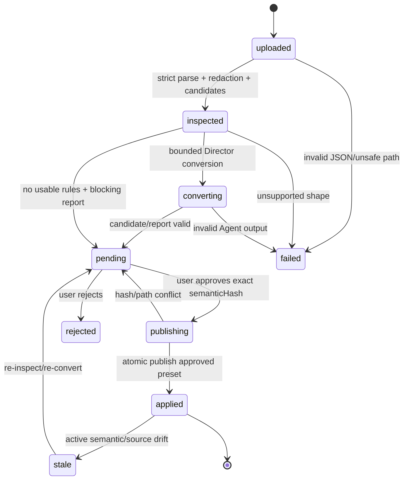
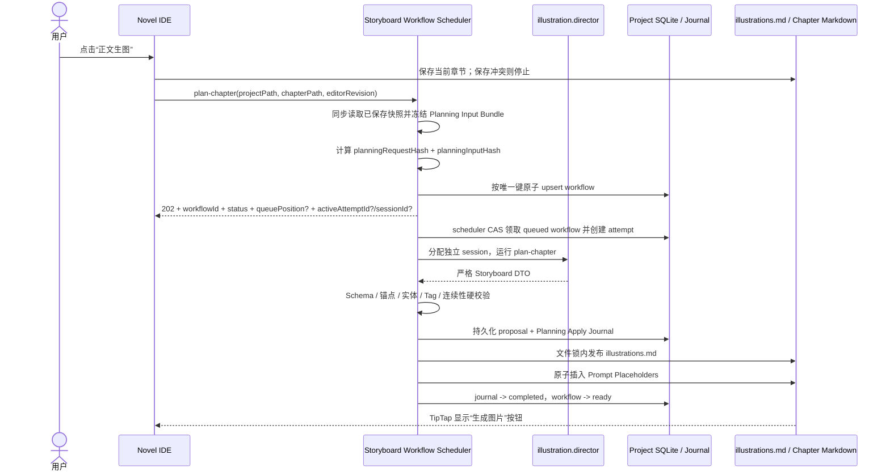
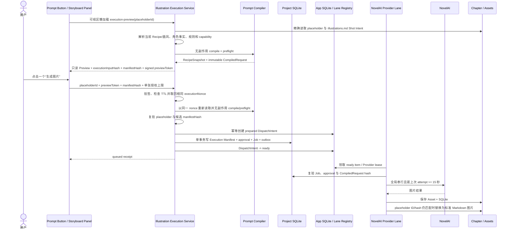
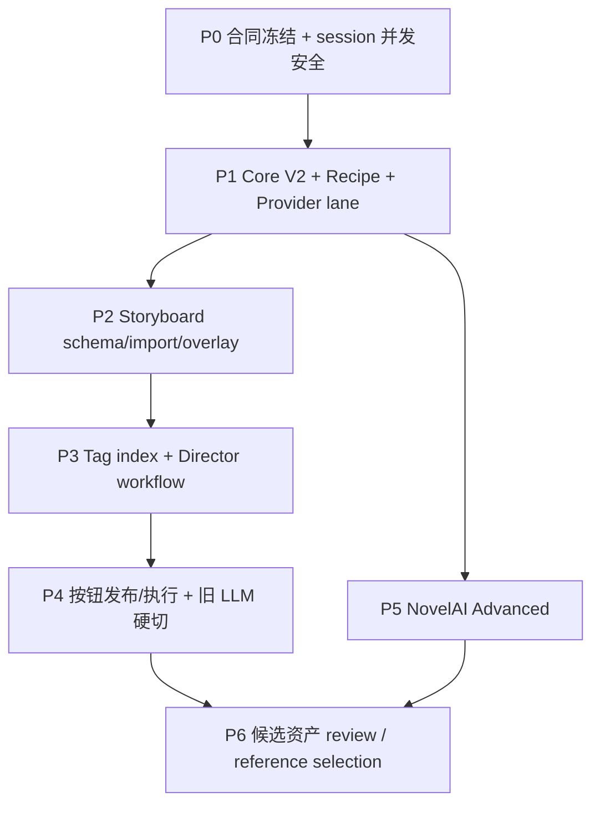

# Route B：Chatu8 分镜预设迁移与 Agent 化章节插图设计

日期：2026-07-17
状态：方案已确认，待实现（implementation-ready design）
修订：2026-07-17 采用 A 方案，加入选区单图、跨章节并发、结构化按钮发布、唯一 NovelAI Provider/API、文生图分页配置归属与 15 秒全局 lane

## 1. 文档定位

本文是下一实现会话的自包含交接规格，描述 Route B 最终目标、领域合同、迁移边界、实施顺序、测试和验收标准。本轮只完成设计，不代表仓库代码已经实现。

本文是 Route B 的总架构规格，不应在一个超大补丁中一次实现。实施会话必须按 P0-P6 分阶段制定计划和验收，但继续维护同一个重大任务 walkthrough，避免合同在多个碎片文档中漂移。

截至 2026-07-17，仓库正文生图仍运行：

```text
body-image.character-detector
  -> 正文专用 LLM completion
  -> body-image.prompt-placer
  -> Prompt Compiler
  -> NovelAI Queue
```

目标链路改为：

```text
illustration.director（单一逻辑 Agent）
  -> 类型化镜头 DTO（绝不直接写正文标记）
  -> 确定性校验并发布 <text-to-image-prompt> 按钮
  -> 用户点击单个按钮或显式批量生成
  -> Prompt Compiler、执行授权与 NovelAI Provider lane
  -> NovelAI
```

“取消 LLM 方案”仅指取消文生图模块自建的 completion/provider/context-preset 运行链路，不表示系统不再使用模型。`illustration.director` 仍由 NeuroBook Agent Runtime 中配置的模型执行。

### 1.1 与既有规格的关系

本文仅在“Chatu8 分镜预设导入、章节语义规划与正文专用 LLM 链路”范围内，部分取代：

- `docs/superpowers/specs/2026-07-10-text-to-image-overhaul-design.md`
- `docs/superpowers/specs/2026-07-15-chapter-illustration-reroll-design.md`

发生冲突时，以本文为准。以下合同继续有效：

- Provider 凭据和 URL/SSRF 安全边界；
- Project SQLite 中的 Job、CompiledRequest、运行结果和 Asset 元数据；
- Project-relative 图片文件与标准 Markdown 图片；
- 服务端共享队列、超时、取消、恢复、幂等和 `outcome_unknown`；
- Prompt Compiler 作为 NovelAI 请求的唯一组装出口；
- `projectPath + chapterPath + chapterFileHash + sourceChapterHash`、文件锁、乐观并发校验和 tracked write；
- reroll 使用清理后的内存工作副本，完整新计划有效后才一次性替换；
- 旧资产不覆盖、不自动删除，迟到结果只进入历史页。

被本文明确取代的旧合同：

| 旧合同 | 新合同 |
| --- | --- |
| 正文 LLM 必须返回 `<image>...</image>` | Director 返回严格类型化 shot/storyboard DTO；服务端统一渲染 `<text-to-image-prompt>` |
| 独立角色检测 Agent | Director 选择角色，但只能引用封闭候选 ID |
| 独立 placer/resolver Agent | Director 选择由代码预生成的稳定正文 block 锚点 |
| `confidence < 0.65` 作为插入门槛 | Schema、ID、枚举、锚点和计划完整性硬校验 |
| 文生图模块单独配置正文 LLM provider/model/context | 规划统一使用 Agent Runtime；现有“文生图”分页继续管理唯一 NovelAI API、Recipe/生成参数和画风串，并增加 Director Profile/分镜预设选择 |
| 再次点击必定盲目完整重跑 | 相同哈希恢复已有 revision；显式“重新规划”才创建新 revision |

## 2. 已确认的产品决策

1. 采用 Route B：迁移 Chatu8 的能力和数据语义，不嵌入或复刻 Chatu8 UI/runtime。
2. 一个 `illustration.director` 逻辑 Agent 负责整章分镜、画面选取、锚点、人物、动作、构图、场景 Tag 和全章连续性复核。
3. Agent 只做语义和审美判断；编译、预算、队列、凭据、持久化、文件写入、哈希和幂等属于确定性控制面。
4. 使用一个固定 Skill `novel-import-chatu8-storyboard-preset` 转换上传 JSON；每份 JSON 生成一份数据型 Markdown 分镜预设候选，不生成动态 Skill。
5. 导入的分镜预设默认发布到全局 `illustration.director` Profile Home，供所有 Project 继承。
6. Project 可按稳定 `ruleId` 增量覆盖全局规则；局部规则优先，未覆盖规则继续继承。
7. 外部 JSON 的转换结果永远先进入 `pending`，用户预览并批准后才激活；pending/stale 候选不能替换上一份已批准预设。
8. Danbooru/NovelAI Tag 词库是本地服务端索引，不进入 Skill、预设或 Agent 整包上下文。
9. Chatu8 角色和服装资料可以导入 NeuroBook，但必须进入对应 Project 的 `lorebook/character/**`，不能进入全局分镜预设。
10. 配置目标是：配置 Agent Runtime 模型、NovelAI Provider、选择 Recipe 与分镜预设后即可使用；不再要求额外配置正文专用 LLM。
11. 采用 A：Agent 永远不返回可直接插入正文的 `<image>`、XML 或 Markdown；它只提交严格 DTO，稳定 ID、哈希、占位符和文件写入全部由确定性服务产生。
12. 用户选中一段正文后，可从现有 TipTap 选区菜单启动 `plan-selection`；Director 只为该选区规划一张图，默认插在选区终点所在顶层正文块（通常是段落）之后。
13. 不同章节的规划是独立 Agent workflow，可并发运行；同章相同 `planningRequestHash` 的重复点击只恢复已有 run，不能重复启动。
14. Agent 规划并发与图片请求限速互不影响。每位用户最多只能配置一个 NovelAI Provider/API；其所有初始请求和重试进入同一全局串行 lane，相邻远端尝试的开始时间至少间隔 15 秒。
15. NovelAI API、连通性测试、模型/采样/尺寸等生成配置、Recipe 和正负向画风串继续集中在现有“文生图”分页；Agent Profile、Skill、正文按钮和 Storyboard 面板只保存引用或展示只读摘要，不复制这些配置。

## 3. 目标、非目标与兼容性承诺

### 3.1 目标

- 将 Chatu8 Context JSON 中可复用的分镜、选景、构图、画幅、连续性和 Tag 策略迁移成可读、可审查、可版本化的 Markdown。
- 让全局预设和 Project 局部规则形成稳定、可解释的增量覆盖，而不是复制整份预设。
- 让 Director 以整章视角统一决策，避免多个 Agent 分别识别角色、选画面和定位导致的画面冲突。
- 让章节从纯正文到带插图 Markdown 的每一步都可恢复、可追踪、可审查且不会重复扣费。
- 让选区单图和整章规划共享同一个 Director、镜头合同、按钮协议和生成控制面。
- 允许用户在两章或更多章节发起独立规划，首版至少支持两个章节同时运行且互不污染。
- 保持 NeuroBook 的 Markdown 真相源、Agent Profile、Skill 工作流和确定性工具边界。
- 支持 Chatu8 角色资产迁入现有角色 Markdown 体系。
- 降低上手门槛，不要求用户理解内部 Prompt Compiler、队列或 Tag 索引。

### 3.2 非目标

- 不原样执行完整 Chatu8 Context Prompt，不继承其中 `system/user/assistant` 权限。
- 不承诺相同模型下逐字、逐镜头或比特级复现 Chatu8 输出。
- 不把用户 JSON 变成 Skill、Profile、脚本或工具权限。
- 不把 Chatu8 Context preset 当成 NovelAI sampler/模型参数 Recipe。
- 不把 Project 角色、服装或剧情事实写进全局预设。
- 不让 Agent 直接保存正文、选择密钥、调用任意网络、删除资产或无限 reroll。
- 不让 Agent 直接输出或修改 `<image>`、`<text-to-image-prompt>`、Markdown 图片或其他正文标记。
- 不把大型 Tag 数据库打包进 Git、Skill 或每次模型上下文。
- 不支持同一用户配置多个 NovelAI API/Provider 或并行多个 NovelAI 账户；本路线固定 singleton。
- 首版不自动自评后重复生图，不自动发布“最佳图”，不自动删除旧图。
- 不保留旧正文 completion、`<image>` 和 detector/placer 主链的运行时兼容层。

### 3.3 “兼容 Chatu8 预设”的精确定义

兼容分为四层：

| 层级 | 承诺 |
| --- | --- |
| JSON 结构兼容 | 识别动态顶层预设名、`entries`、entry ID、role、enabled、triggerMode、triggerWords、andTriggerWords 和原始顺序 |
| 分镜语义迁移 | 把可识别的选景、镜头密度、构图、画幅意图、连续性和 Tag 策略转换成类型化规则 |
| 行为可追踪 | 每条规则保存来源 entry、转换级别、风险、哈希和覆盖 provenance |
| 非等价边界 | 不执行原 role Prompt、任意模板代码、未知宏、越权安全要求或完整 Context 行为 |

因此，产品文案应写“导入并迁移 Chatu8 分镜预设”，不能写“100% 原样运行 Chatu8 Context”。

如果未来遇到真正包含 NovelAI model/sampler/steps/scale/seed/尺寸等字段的生成参数 JSON，应由独立的 Recipe importer 生成 Recipe proposal；它与本文的 storyboard preset importer 共用 intake、脱敏、报告和审批基础设施，但输出类型不同。

## 4. 核心术语和真相源

### 4.1 工件定义

- **Storyboard Preset**：控制 Director 如何选画面和构图的全局 Markdown 规则集。
- **Project Overlay**：针对一个 Project、按 `ruleId` 增量修改 Storyboard Preset 的 Markdown。
- **Effective Preset**：系统保护合同、获批全局 preset 与有效 Project overlay 确定性合并后的只读快照。
- **Planning Run**：绑定 operation、Project、chapterPath、稳定请求哈希、精确模型输入哈希和 revision 的一次有界 Agent workflow；不同 run 不共享 transcript 或可变章节状态。
- **Shot Intent**：Director 提交的单镜头语义 DTO，包含锚点、人物、动作、构图和 Tag intent，不含最终 Prompt、Provider 或正文标记。
- **Chapter Storyboard**：Director 为某章产生且通过硬校验并发布的镜头集合，保存在章节旁的 `illustrations.md`。
- **Prompt Placeholder**：正文中的结构化 `<text-to-image-prompt>` 可执行引用；TipTap 把它显示成“生成图片”按钮。它引用 Shot Intent，不复制最终 Prompt。
- **Recipe**：将语义计划编译为 NovelAI 请求的生成配方，包含模型和可编译参数；它不是分镜预设。
- **CompiledRequest**：Compiler 产生、Job 实际发送的不可变请求快照。
- **Execution Preview**：对一个按钮或一次显式批量选择进行无副作用预编译得到的短生命周期视图；返回请求摘要、`executionInputHash` 与候选 `manifestHash`，但不写数据库、不构成授权或运行真相源。
- **Execution Manifest**：用户确认 Execution Preview 后，在 Project SQLite 与 approval、Job 同一事务中落下的不可变执行清单；保存 CompiledRequest、精确参数、费用/Token 边界、输出上限和 manifestHash。持久化 manifest 即表示该次授权已注册 Job，不存在单独的“待批准 manifest”。
- **DispatchPreparation / DispatchIntent / ProviderLaneItem**：应用数据库中的跨 Project 调度投影；授权 POST 先用带 lease/version/fence 的 preparation 创建 inert `prepared` intents，Project 事务成功后提升为可领取的 `ready` lane items。只有经过持久发送状态机的 item 能调用 adapter，它们都不是 Job/Manifest 真相源。
- **Provider Lane**：按 `(ownerUserId, providerId)` 协调的服务端串行请求通道。产品与数据库共同约束每位用户最多一个 `providerKind=novelai` 的 Provider/API，因此不存在通过创建第二个 NovelAI providerId 绕过 lane 的入口；有效启动间隔不得低于 15 秒。
- **Asset**：Project-local 图片文件和 Project SQLite 元数据。

### 4.2 真相源分域

| 领域 | 真相源 |
| --- | --- |
| 全局分镜偏好 | Workspace Root `.nbook/agents/illustration.director/storyboard-presets/*.md` |
| Project 局部分镜规则 | Project Workspace `agents/illustration.director/storyboard-overrides/*.md` |
| 已发布章节分镜 | 章节目录旁的 `illustrations.md` |
| 正文可执行入口 | 章节 Markdown 中的 Prompt Placeholder；仅是 `illustrations.md` Shot Intent 的引用投影 |
| Project 角色视觉事实 | `lorebook/character/**/image-tags.md` 与 `outfits/*.md` |
| NovelAI Recipe | `lorebook/instruction/text-to-image/<slug>/index.md` |
| Execution Manifest、Job、请求快照、结果、lineage | Project SQLite |
| DispatchPreparation / Intent / ProviderLaneItem、throttle/lease/fence | 应用数据库；仅为可恢复调度投影 |
| 图片二进制 | Project Workspace `assets/text-to-image/**` |
| Provider 凭据 | 应用级加密存储，只以 `providerId` 引用 |
| Tag 检索库 | Workspace Root `.nbook/cache/text-to-image/tags/**`，可重建派生缓存 |
| Agent transcript | 运行证据，不是真相源，不用于跨章恢复 |

“SQLite + 图片文件是唯一真相源”只适用于运行和资产域。创作规则、角色事实与已发布章节分镜继续以 Markdown 为真相源。

## 5. 总体架构

```mermaid
flowchart LR
    subgraph Intake["Chatu8 导入"]
        U["Project Workspace upload/*.json"]
        I["确定性 inspect / 脱敏 / 粗筛"]
        C["Director 转换模式"]
        P["pending Markdown candidate + report"]
        A["用户预览并批准"]
        G["全局 Storyboard Preset"]
        U --> I --> C --> P --> A --> G
    end

    subgraph Project["Agent 规划层"]
        T["整章纯正文快照"]
        ST["选区 + 有界上下文"]
        O["Project ruleId overlay"]
        R["确定性 Effective Preset resolver"]
        D1["plan-chapter 独立 run"]
        D2["plan-selection 独立 run"]
        SP["严格 Shot / Storyboard DTO"]
        T --> D1
        ST --> D2
        G --> R
        O --> R
        R --> D1 --> SP
        R --> D2 --> SP
    end

    subgraph Publish["确定性计划发布"]
        V["Schema / 锚点 / Tag / 连续性校验"]
        AJ["Planning Apply Journal"]
        S["illustrations.md + Prompt Placeholder"]
        SP --> V --> AJ --> S
    end

    subgraph Runtime["用户触发的生成控制面"]
        PC["Prompt Compiler + Preflight"]
        EP["无副作用 Execution Preview"]
        B["单按钮授权 / 批量确认"]
        EM["Execution Manifest + approval + Jobs"]
        Q["持久队列 / 幂等"]
        L["全局 NovelAI Provider Lane >= 15s"]
        N["NovelAI API"]
        AS["Project Asset + SQLite"]
        M["标准 Markdown 图片"]
        S --> PC --> EP --> B --> EM --> Q --> L --> N --> AS --> M
    end
```



### 5.1 单 Agent 不是单无限会话

`illustration.director` 是一个 Profile 身份和一套审美责任，不是一段无限增长的对话。每次运行必须绑定 operation、Project 与 `planningInputHash`，并在有界 run 中完成；付费预算只在确定性预编译后批准。

支持四种隔离 operation：

1. `convert-preset`：只读取已脱敏候选，返回类型化 preset proposal。
2. `plan-chapter`：读取章节快照、角色事实、Effective Preset 和窄 Tag 查询，返回完整章节计划，并在同一 bounded run 内完成强制全章连续性复核。
3. `plan-selection`：读取精确选区、选区前后有界上下文、当前章节镜头摘要和同一批只读事实，只返回一条 Shot Intent。
4. `review-candidates`（P6 增强）：只读比较已生成候选资产并提交建议；不得自动生图、改正文或 reroll。

四种 operation 可以使用同一个 Profile，但工具白名单、输入 Schema、最大 turn、token 和输出 Schema 分开配置。任何 operation 都不获得 shell、任意文件写入、Provider 密钥、删除或任意网络能力。

### 5.2 两层并发模型

并发必须按职责分成两层，不能共用一个全局 `bodyImageGenerating` 布尔锁：

- **Agent workflow 层**：以 `projectPath + chapterPath + operation + planningRequestHash` 为运行键。不同章节拥有独立 Agent session、transcript、revision、取消信号和结果写回，可同时执行。
- **NovelAI 请求层**：以唯一 `(ownerUserId, providerId)` 为 lane key。应用数据库对 NovelAI Provider 建每用户唯一约束，设置页是“配置/替换唯一 API”而不是可新增列表；无论 Job 来自哪个 Project、章节、选区、批量操作或 retry，都严格进入这一 lane 并执行 15 秒最小启动间隔。

首版 Agent scheduler 默认允许每位用户同时运行 2 个章节规划，满足两个章节同时点击；可配置到 4，更多 workflow 保持 `queued` 并显示 `queuePosition`。该限制只控制 Agent 推理资源，不阻止用户继续打开章节或点击生成按钮。取消某一 workflow 不能取消另一章，也不能清空另一章结果。

同章同 operation 且 `planningRequestHash` 相同的请求返回已有 run/结果；Project SQLite 必须以 `(projectId, chapterPath, operation, planningRequestHash)` 建唯一约束，并在任何 Agent session 分配前完成 workflow upsert。显式“重新规划”通过新的 revision reason/nonce 产生新 requestHash。不同章节的 apply 只锁各自 `illustrations.md` 和章节文件；选择规划与整章规划若竞争同一章，则通过 expected hashes 冲突而不是最后写入者覆盖。

应用重启时，运行中的 Planning Attempt 转为 `interrupted`。若 Project、章节、planningRequestHash 和 planningInputHash 仍一致，所属 workflow 回到 `queued` 并创建新 attempt/隔离 Agent session，不能续用部分输出；输入已变则 workflow -> `stale`。

## 6. 目录布局

```text
Workspace Root/
└─ .nbook/
   ├─ agents/
   │  └─ illustration.director/
   │     ├─ storyboard-presets/
   │     │  ├─ default.md
   │     │  └─ <presetId>.md
   │     └─ imports/
   │        └─ chatu8-storyboard/
   │           └─ <importId>/
   │              ├─ source.sanitized.json
   │              ├─ inspect.json
   │              ├─ candidate.md
   │              ├─ report.md
   │              └─ journal.json
   └─ cache/
      └─ text-to-image/
         └─ tags/<indexVersion>/
            ├─ tags.sqlite
            └─ manifest.json

Project Workspace/
├─ upload/
│  └─ <user-file>.json
├─ agents/
│  └─ illustration.director/
│     └─ storyboard-overrides/
│        └─ <presetId>.md
├─ lorebook/
│  ├─ character/<character>/
│  │  ├─ index.md
│  │  ├─ image-tags.md
│  │  └─ outfits/*.md
│  └─ instruction/text-to-image/<recipe>/index.md
├─ manuscript/<volume>/<chapter>/
│  ├─ index.md
│  └─ illustrations.md
└─ assets/text-to-image/YYYY/MM/<assetId>.<ext>
```

规则：

- `upload/` 只是 intake，不是长期真相源；原上传文件保持不变。
- 因为预设默认全局生效，导入证据归档在全局 Profile Home，避免来源 Project 删除后失去 provenance。
- 持久化前先脱敏；不保存原始 secret。原始字节 SHA-256 只在内存计算。
- `storyboard-presets/` 保持平铺 `.md`，以兼容现有 `resource-preset`；嵌套 import journal 不注册为 resource-preset。
- Project overlay 由专用 resolver 读取，不能依赖 Profile Home “同路径整文件遮蔽”语义实现增量合并。

## 7. Storyboard Preset Markdown 合同

### 7.1 设计原则

- Markdown 是用户可查看、编辑、版本化的规则工件。
- 运行时只读取严格 frontmatter typed contract，不把 Markdown 正文当 Agent 指令。
- JSON 中原始角色、role 和大段提示词只保存在脱敏证据/报告，不复制到激活 preset。
- `kind` 和 `effect` 必须是代码注册的 discriminated union；禁止自由执行字段，如 `systemMessage`、`instruction`、`prompt`、`tool`。
- YAML parser 拒绝重复 key、anchor、alias、merge key、自定义 tag 和非预期字段。
- `presetId`、`ruleId`、`overlayId` 使用有长度上限的 ASCII 稳定标识；标题和说明可以使用 Unicode，但不参与执行。

### 7.2 示例

```markdown
---
schema: nbook.storyboard-preset/v1
presetId: cinematic-chapter
title: 章节电影化分镜
enabled: true
source:
  kind: chatu8
  importId: c8s_01J...
  rawSourceHash: sha256:...
  sanitizedSourceHash: sha256:...
  converterVersion: "1"
review:
  status: approved
  approvedSemanticHash: sha256:...
  approvedDiagnosticHash: sha256:...
matching:
  normalization: nfkc-casefold
defaults:
  preferredShotCount:
    min: 5
    max: 7
  minimumParagraphGap: 2
macros:
  bindings:
    正文: chapter.markdown
    上下文: chapter.compiledContext
    用户需求: invocation.request
  unresolved: []
rules:
  - ruleId: c8.089bf996.shot-selection.even-distribution
    sourceEntryId: 089bf996-72cd-49f9-908c-e51f63152e84
    order: 100
    enabled: true
    kind: shot-selection
    when:
      mode: always
      any: []
      andAny: []
    effect:
      operation: prefer
      beatTypes: [establishing, action, reaction, reveal]
      distribution: even
      scoreDelta: 20
    provenance:
      conversion: normalized
      sourcePaths: [entries.2.content]
  - ruleId: c8.00be1a4a.composition.single-instant
    sourceEntryId: 00be1a4a-7121-4a75-895c-482c352ddf27
    order: 200
    enabled: true
    kind: composition
    when:
      mode: always
      any: []
      andAny: []
    effect:
      temporalMode: single-instant
      maxSubjects: 4
      avoidCompoundActions: true
    provenance:
      conversion: direct
      sourcePaths: [entries.4.content]
risks: []
---

# 章节电影化分镜

这是一份可编辑的全局分镜规则。运行时只读取并校验 frontmatter；本段用于向人解释来源、效果和维护方式。
```

### 7.3 第一版规则类型

| `kind` | 作用 | 允许的典型 effect |
| --- | --- | --- |
| `shot-selection` | 哪些剧情瞬间值得画 | beatTypes、prefer/require/avoid、scoreDelta、distribution、minimumGap |
| `shot-density` | 整章图片数量倾向 | preferredMin、preferredMax、charactersPerShot 等偏好；最终受系统预算上限约束 |
| `composition` | 构图与镜头语义 | shotSize、cameraAngle、viewpoint、subjectPlacement、depth、lighting、single-instant |
| `canvas-intent` | 语义画幅选择 | portrait、landscape、square、character-showcase；由 Recipe 映射为实际尺寸 |
| `continuity` | 跨镜头一致性 | lockCharacterTraits、lockOutfit、palette、timeOfDay、axisPolicy |
| `tag-policy` | Tag 生成与限制 | require、prefer、avoid、forbid 的 tag/category；必须通过本地索引校验 |
| `constraint` | 计划级硬限制 | maxSubjects、forbidDuplicateBeat、requireValidAnchor；不能放宽系统安全上限 |

预设只能表达“语义意图”。实际 model、sampler、steps、scale、seed、凭据、输出数量和任意宽高必须来自 Recipe、Provider capability 和预算策略。

### 7.4 Trigger 语义

- `triggerMode: always` 转为 `when.mode: always`。
- `triggerMode: trigger` 转为字面 trigger。
- `triggerWords` 内部是 OR；`andTriggerWords` 内部也是 OR；两组同时存在时为 `any(triggerWords) AND any(andTriggerWords)`。
- 字面匹配使用 Unicode NFKC + case fold；保留原字符串用于审查。
- 外部正则或疑似正则只作为证据保留，不在批准前自动编译执行。
- entry 的 `enabled`、稳定 ID 和源顺序必须保留；源 role 仅作为 provenance，不继承权限。

### 7.5 宏与双大括号

样例中 `{{...}}` 同时可能表示运行宏、随机表达式、Tag 片段或普通文本，不能把所有双大括号都当宏。

分类规则：

1. 白名单数据宏：如 `{{正文}}`、`{{上下文}}`、`{{用户需求}}`，映射到只读具名槽位。
2. 身份宏：如 `{{user}}`，只能映射为显示名称数据，不能提升权限。
3. 随机宏：如 `{{roll 1d4}}`，首版不执行；记录为 unsupported stochastic token。
4. Tag/权重片段：如果内容符合 Tag 列表而非宏名，作为候选 Tag 证据交给 converter，并通过 Tag validator。
5. 未知歧义 token：保留 token、JSON path、是否影响规则；若激活规则依赖它，则阻止批准，不能猜值或静默替换为空。

## 8. Project 增量覆盖合同

### 8.1 Overlay 示例

```markdown
---
schema: nbook.storyboard-overlay/v1
overlayId: my-project-cinematic
presetId: cinematic-chapter
enabled: true
baseSemanticHash: sha256:...
review:
  status: approved
  approvedSemanticHash: sha256:...
macroBindings: {}
operations:
  - op: replace
    ruleId: c8.089bf996.shot-selection.even-distribution
    rule:
      ruleId: c8.089bf996.shot-selection.even-distribution
      order: 100
      enabled: true
      kind: shot-selection
      when:
        mode: trigger
        any: [港口, 海战]
        andAny: []
      effect:
        operation: require
        beatTypes: [establishing, action]
        distribution: front-loaded
        scoreDelta: 30
  - op: disable
    ruleId: c8.00be1a4a.composition.single-instant
  - op: append
    ruleId: project-silver-blue-palette
    rule:
      ruleId: project-silver-blue-palette
      order: 300
      enabled: true
      kind: continuity
      when:
        mode: always
        any: []
        andAny: []
      effect:
        palette: silver-blue
---

# 本 Project 的局部分镜覆盖
```

### 8.2 合并语义

1. Base 与 overlay 内部 `ruleId` 必须唯一。
2. `replace` 的目标必须存在，并整条替换；不做隐式字段深合并。
3. `disable` 的目标必须存在；保留来源追踪，不从结果中物理删除。
4. `append` 只能添加一个全新的 `ruleId`；已有同名 ID 即冲突。
5. `replace/append` 内嵌 rule 的 `ruleId` 必须与 operation 外层 `ruleId` 完全一致。
6. 不支持隐式删除或 last-write-wins。
7. 任一 operation 冲突时整份 overlay 拒绝应用，不能部分生效。
8. 最终顺序固定为 `order ASC, ruleId ASC`。
9. `baseSemanticHash` 不匹配时 overlay 进入 `stale`，全局 base 仍可运行，但 UI 必须显示局部规则未应用。
10. 系统服务、Profile Schema 和 Agent Runtime 工具/预算策略的安全与输出合同优先级高于 preset/overlay，且不可覆盖。Skill 只描述流程，不能作为唯一安全边界或扩大 Profile 权限。

通用 Config 合并器不承担 `ruleId` 深合并，以免改变所有 Profile 的配置语义。增量覆盖只在 `storyboard-rule-resolver` 领域服务中实现。

### 8.3 激活状态和哈希

状态：

- `pending`：外部导入或编辑尚未批准，或存在 blocking issue。
- `approved`：批准哈希与当前语义哈希一致，且无阻断问题。
- `stale`：批准后语义、raw/sanitized source provenance 或 baseSemanticHash 漂移。
- `rejected`：用户明确拒绝该候选；保留报告，不发布。

Project overlay 虽然是用户自建数据，也采用“保存草稿/应用规则”语义：编辑器在一次“保存并应用”操作中完成 schema 校验并写入 `approvedSemanticHash`；直接从文件系统修改会使其 stale。它不需要重复外部 JSON 风险确认，但不能让未校验的文件修改立即影响生成。

哈希：

- `rawSourceHash`：上传文件原始字节 SHA-256；批准前可从仍在 `upload/` 的原文件复验，批准后只作不可变 provenance。
- `sanitizedSourceHash`：`source.sanitized.json` 的规范 UTF-8 字节 SHA-256，可从全局 archive 随时复验。
- `fileHash`：完整 Markdown UTF-8 字节哈希，用于编辑冲突。
- `semanticHash`：只对规范化 typed semantic fields 做 canonical JSON + SHA-256；排除时间、报告正文、诊断顺序和解释文本。
- `diagnosticHash`：对规范化 blocking issues、risks、未解析 token 和转换级别做 canonical hash，确保批准时看到的风险集合没有漂移。
- `effectivePresetHash`：获批 base 与有效 overlay 合并后规则的 canonical hash。
- `planHash`：章节 storyboard 的语义哈希。
- `compiledRequestHash`：实际上游请求快照的语义哈希。

数组顺序属于语义；对象 key 使用固定排序。重复导入相同 `rawSourceHash + converterVersion` 返回已有 import，不生成重复候选。

`semanticHash` 纳入 presetId、enabled、matching、macro bindings、defaults 与规范化 rules；排除 source、review、provenance、risks、时间和 Markdown 解释正文。批准字段因此不会形成自引用哈希，来源完整性由独立 raw/sanitized source hashes 检查。

## 9. 固定 Chatu8 转换 Skill

### 9.1 Skill 与核心服务的边界

固定 Skill：

```text
assets/workspace/.nbook/agent/skills/
└─ novel-import-chatu8-storyboard-preset/
   └─ SKILL.md
```

Skill 负责：

- 说明用户如何从当前 Project 的 `upload/` 选择 JSON；
- 调用窄的 inspect/convert 工具；
- 展示 report、风险、兼容范围和批准入口；
- 在阻断条件下停止，不自行猜测或修改规则。

核心服务负责：

- 路径限制、读取、大小限制、raw hash 和 secret redaction；
- 严格 JSON/schema 检查、entry 归一化、候选粗筛、宏词法分析；
- 稳定 ID、canonical hash、状态机、文件写入和幂等；
- 调用 Director 的 `convert-preset` operation，并验证其类型化输出；
- 生成 candidate/report/journal，审批时原子发布。

固定语义不能只写在可被用户覆盖的 Skill 文件中。Skill 是工作流入口，parser、schema、merge 和 approval 必须在共享/服务端领域代码中实现。UI、Skill、API 和测试 CLI 必须复用同一服务，不能复制 parser。

### 9.2 Import 状态机



严格来说，即使没有提取出可用规则，每份可解析 JSON 仍生成一个 `rules: []` 的 pending candidate 和 report，以满足“一份 JSON 对应一份 Markdown 候选”；`NO_USABLE_STORYBOARD_RULE` 是 blocking issue，空候选不能批准。

### 9.3 Inspect 算法

1. 用户显式选择一个 `upload/*.json`；服务不得递归扫描整个 Project。
2. 将 Project-relative path 解析并验证仍位于当前 Project Workspace `upload/`。
3. 推荐首版文件上限 16 MiB；超限返回稳定错误，不截断。
4. 读取原始 bytes，在内存计算 `rawSourceHash`；任何落盘前完成 secret redaction，再对规范化脱敏 bytes 计算 `sanitizedSourceHash`。
5. 严格解析 JSON，拒绝 duplicate keys、原型污染键和超深嵌套。
6. 支持两种入口：顶层直接含 `entries`，或顶层只有一个动态预设名且其 value 含 `entries`。
7. entry 只读取 allowlist 字段；未知字段记录到 inspect，不自动注入 Agent。
8. entry identity 优先使用显式 `id` 或 map key；缺失时使用 `sourcePresetKey + canonicalEntryHash`，不使用数组序号或可变 replacement 生成 ID。
9. 保留 enabled、role、triggerMode、triggerWords、andTriggerWords、sourceOrder 和 JSON Pointer。
10. 对 content 做确定性分类：分镜、构图、画幅、Tag 策略、角色/服装、输出模板、越权/安全声明、无关内容。
11. 只把分镜相关候选交给 Director。推荐每次最多 64 entries、80,000 字符；超出时按 sourceOrder 确定性分片，再由同一 operation 做结构化汇总，不能静默丢弃。
12. Director 只能输出第一版注册的 rule kinds、`semanticSlot`、macro proposal 和 conversion note，不得决定最终 `ruleId`。
13. 服务端按 `sourceEntryId + ruleKind + semanticSlot` 分配稳定 `ruleId`，把映射写入 journal；同一 entry/kind/slot 重复时拒绝修复，不用 effect 内容或 Agent 文案参与身份计算。
14. 服务端重新验证、去重、排序、计算 semanticHash，生成 pending candidate。

`semanticSlot` 必须来自每种 rule kind 注册的稳定槽位，不是自由字符串。建议 final ID 形态为 `c8.<entryIdHash>.<ruleKind>.<semanticSlot>`；显式 source entry ID 未变且语义仍落在同一槽位时，重转换继续得到同一 ruleId。缺少显式 ID 的 entry 一旦内容变化可能获得新 identity，report 必须说明相关 Project overlay 会 stale，不能假装稳定。

### 9.4 审批与发布

- Preview 必须展示 candidate Markdown、规则表、来源 entry、已忽略内容、未知宏、风险和 semantic diff。
- 批准请求携带 `importId + candidateSemanticHash + diagnosticHash + expectedActiveFileHash + expectedGlobalConfigHash + targetScope: global + confirmGlobal: true`。
- presetId 与现有 active preset 冲突时，用户必须明确选择“替换此 preset”或“另存为新 presetId”；不能自动覆盖。
- 批准时重新读取 candidate、原 `upload/` 文件、sanitized archive 与 active target：原文件复验 `rawSourceHash`，archive 复验 `sanitizedSourceHash`，再进入 journaled publish。原 upload 已删除或改变时要求重新 inspect。
- 新 candidate pending、转换失败或用户关闭窗口时，上一份 approved preset 继续有效。
- 原 upload 文件不删除、不改名；全局 archive 保存脱敏副本，使 active preset 不依赖 Project 存续。
- approved preset 被手工编辑后 semanticHash 漂移即 stale；再次点击“应用”会重新校验并写入新的 approvedSemanticHash。
- 当前选中的全局 base preset 为 pending/stale 时阻止新计划，不静默改用其他视觉规则；导入新 candidate 不影响仍未被替换的上一份 approved base。

publish `completed` 后不再读取原 upload 参与运行；用户随后删除来源文件不会使 active preset stale。运行时只验证 active semanticHash 与全局 sanitized archive provenance，新的源文件必须作为新 import 进入 pending。

从 Project `upload/` 发布到 Workspace Root `.nbook` 是显式跨 scope 操作：inspect/convert 需要来源 ProjectSession；approve 还必须由服务端校验全局配置写权限和用户的 `confirmGlobal`，再通过受限 Profile Home/ConfigService 写入。Agent 与 Skill 都不获得任意全局文件写权限。

“发布 preset + 切换全局默认”使用独立 global publish journal：

```text
prepared -> preset_published -> selector_updated -> completed
```

每阶段保存 preset/config expected hashes 和必要备份引用。`preset_published` 后配置更新失败时，previous selector 继续有效，状态明确为 `published_not_selected`，用户重试只更新 selector，不重复转换或覆盖；不能把两个文件写入伪装成原子事务。

### 9.5 Import report 最低内容

- importId、源 Project、源相对路径、rawSourceHash、sanitizedSourceHash、converterVersion；
- 顶层形态、entry 数量、roles、trigger modes、enabled 统计；
- candidate 分类、转换成功/忽略/report-only 数量；
- 每条规则的 source entry、JSON Pointer 和 direct/normalized/report-only 级别；
- 已识别宏、随机 token、歧义双大括号和未解析 required token；
- secrets 删除的 JSON Pointer，只记录路径，不记录 secret 值；
- 风险、blocking issues、candidate path、semanticHash、diagnosticHash；
- 明确声明结果为 pending，且“兼容”不等于原 Context 行为等价。

report 默认只保存字段统计、JSON Pointer、分类理由和有长度上限的脱敏摘要，不复制完整外部 Prompt；完整脱敏内容只存在 `source.sanitized.json`，且运行时永不读取它作为指令。

converter 的候选分类、规则映射或风险判定语义发生变化时必须提升 `converterVersion`；不能在相同版本下改变 diagnostic/semantic 结果后复用旧批准。

### 9.6 用户样例基线

用户样例：`st_chatu8_test_context_llm万古至尊天下无敌修改版（开词库） (1).json`。

只读检查得到：

- 动态顶层预设名包裹 `entries`；
- 512 个 entries：501 system、6 user、5 assistant；
- 72 always、440 trigger；506 enabled、6 disabled；
- 所有 entry 都有 `triggerWords`，6 个有非空 `andTriggerWords`；
- content 总量约 506,428 字符；
- 粗筛命中数量远小于总量：`<image>` 相关 7 条、分镜/镜头/画面选取相关 5 条、构图相关 16 条、尺寸相关 4 条、结构化角色字段相关 3 条。

该基线证明实现必须使用“确定性 inspect/粗筛 -> 有界 Agent 语义转换”，不能把 50 万字符与 500 多条 role message 整包放入 Agent system context。完整用户样例不应提交到仓库；测试使用最小脱敏合成 fixture，本地可做不入库的兼容 smoke。

## 10. Chatu8 角色与服装导入

角色导入是 Route B 的 Project migration 能力，与全局 storyboard preset 分开：

```text
Chatu8/SillyTavern 角色数据
  -> 确定性解析和脱敏
  -> Project character proposal
  -> 用户逐项确认
  -> lorebook/character/<slug>/index.md
  -> image-tags.md
  -> outfits/*.md
```

合同：

- 标准 SillyTavern character card/PNG 优先复用现有 `novel-import-silly-tavern-card` 工作流；Chatu8 自有 character group/export 由同一确定性 staging/apply 基础设施增加 adapter。
- Context JSON 中发现的角色列表/字段只进入 import report，并提供“作为 Project 角色继续导入”的入口。
- 全局 preset 不保存角色姓名、外貌、服装、剧情关系或 Project 路径。
- 复用现有角色 `image-tags.md` 与 outfit Markdown codec，不建立第二套角色 schema。
- 角色 identity 先做确定性精确匹配，再把歧义项交给封闭候选 Agent；Agent 不生成任意路径或直接 apply。
- apply 请求包含 proposal hash、target base hashes 和 idempotency key；所有目标先在内存 render/validate，再使用 tracked write 与 journal。
- 默认补全空字段并保留用户已有负面词/服装；覆盖视觉字段必须单独确认。
- 图片附件在 P5 的 Project reference asset 合同完成前只作为脱敏证据，不直接写入运行时 Vibe/Character Reference。

这使产品同时满足：导入 Chatu8 分镜预设、导入 Chatu8 已有角色、并保持 NeuroBook 的 Project Markdown 结构。

## 11. 本地 Tag 索引

### 11.1 为什么不把词库放进 Skill

大型 Danbooru/NovelAI Tag 集合放进 Skill 会导致：

- Skill 文件巨大、上下文成本高、每次运行重复注入；
- Agent 只能凭记忆匹配，无法验证 alias、deprecated、category 和 provider/model 支持；
- 更新词库会污染 Skill 版本，并使计划不可复现。

正确形态是 Workspace Root 共享、版本化、可重建的本地索引。Skill 只教 Agent 何时调用查询工具。

### 11.2 索引字段

- canonical tag；
- aliases；
- category；
- usage/count 或排序权重；
- implications/related tags；
- deprecated/blocked 标志；
- 可选中文概念映射；
- provider/model compatibility；
- source、snapshot date、license、checksum 和 indexVersion。

不提交图片数据。下载或内置快照必须在实现时核验来源许可与再分发条件；如果许可不允许随应用分发，则提供用户触发的 downloader/index builder。

### 11.3 Agent 窄工具

- `search_tags(query, category?, provider?, limit<=30)`
- `resolve_tag_alias(tag)`
- `validate_tags(tags[], provider, model)`
- `related_tags(tag, relation?, limit<=30)`

工具只返回结构化数据；Tag 描述、alias 和来源文本都视为不可信数据。每个 plan 记录 `tagIndexVersion`，Compiler 再校验一次，不允许 Agent 用自由文本绕过 validator。

首版优先 SQLite FTS5/前缀/alias 检索，不必先引入向量数据库。只有中文概念召回质量经测量不足时，再增加小型本地 embedding/translation 层。

## 12. Chapter Storyboard Markdown 合同

### 12.1 路径、来源与状态

每章最多一个当前语义真相文件：

```text
manuscript/<volume>/<chapter>/illustrations.md
```

Agent proposal 和 Planning Run 状态先保存在 Project SQLite；只有 proposal 通过严格校验后，确定性服务才把 Shot Intent 合并进 `illustrations.md` 并在章节中发布 Prompt Placeholder。此时不编译最终 Prompt、不创建图片 Job，也不调用 NovelAI。

Planning Workflow 与一次模型调用 Attempt 分层，不能用一个 status 同时表达排队、重试和 session：

```text
Workflow: queued -> running -> validating -> applying -> ready
          error/resting: failed | canceled
          terminal: stale
          failed/canceled -- explicit retry（输入仍一致）--> queued

Attempt:  created -> running -> succeeded
          terminal: failed | interrupted | canceled
```

workflow 保存 `planningRequestHash/planningInputHash`、`activeAttemptId?` 和 `attempts[]`；`sessionId` 属于 attempt，queued 时可以为空。相同 requestHash 只复用 active/ready workflow；retryable failed/canceled workflow 通过显式 retry 回到 queued，并在 scheduler 领取后新建 attempt；非 retryable failure 保持 failed；输入变化或显式 replan 创建新 workflow/revision。客户端未保存编辑统一表达为 `workflow.status=stale` 与 `staleReason=client_edit`，不增加另一套状态。

`illustrations.md` 是可增量合并的 aggregate，顶层 `revisionId/planHash` 只描述当前整份文件，不充当所有按钮的执行闸。发布状态必须落在每条 planning source 与 shot：

- `publication.status: pending`：该 planning source/shot 已写入 storyboard，但对应章节 placeholder 尚未一致发布；只拒绝这一批新 shot。
- `publication.status: applied`：该 shot 的 Planning Apply Journal 已 `completed`，对应按钮可预编译或授权。
- `state: stale`：正文、锚点、Effective Preset 或视觉规划事实变化，该 Shot Intent 需要重新规划。
- `state: superseded`：显式重新规划后被新 shot 取代；历史由 Workspace History 和 Planning Run 证据保留。

执行端必须同时校验目标 shot 的 `publication.status=applied` 与其 `publication.journalId` 在 Project SQLite 中已 `completed`。新 selection apply 中断时，既有 applied shots 仍可执行，不能因整份文件出现一个 pending shot 而全章停用。

每条 shot 必须标记 `origin.kind: chapter-plan | selection`。整章重规划默认只替换旧的 `chapter-plan` 镜头和未生成按钮；用户主动选区创建的 `selection` 镜头与已生成图片保留。清除选区插图或已生成图片必须是单独、显式确认的操作。

### 12.2 示例

```markdown
---
schema: nbook.chapter-illustrations/v2
chapterPath: manuscript/001-volume/003-chapter/index.md
revisionId: sb_01J...
sourceChapterHash: sha256:...
planHash: sha256:...
planningSources:
  - planningRunId: workflow_01J...
    operation: plan-chapter
    state: active
    publication:
      journalId: illustration_plan_apply_01J...
      status: applied
    chapterFileHashAtPlan: sha256:...
    planningRequestHash: sha256:...
    planningInputHash: sha256:...
    planningEvidenceHash: sha256:...
    sourceChapterHashAtPlan: sha256:...
    effectivePreset:
      presetId: cinematic-chapter
      semanticHash: sha256:...
    recipePlanningConstraints:
      key: lorebook/instruction/text-to-image/default/index.md
      constraintsHash: sha256:...
      capabilitySummaryHash: sha256:...
    tagQuerySnapshot:
      indexVersion: danbooru-nai-2026-07
      resultHash: sha256:...
    director:
      profileVersion: "1"
      operationVersion: "1"
      modelConfigFingerprint: sha256:...
    contentBlockParserVersion: "1"
    planValidatorVersion: "1"
    systemPolicyVersion: "1"
    visualPlanningFactsHash: sha256:...
    contextSnapshotHash: sha256:...
    planPolicyHash: sha256:...
shots:
  - shotId: shot_sb01_01
    state: active
    shotIntentHash: sha256:...
    placeholderId: image_prompt_01J...
    publication:
      journalId: illustration_plan_apply_01J...
      status: applied
      appliedAt: 2026-07-17T12:00:01.000Z
    origin:
      kind: chapter-plan
      planningRunId: workflow_01J...
    anchorId: p_0003_8f31a2c4
    insertAfterAnchorId: p_0003_8f31a2c4
    storyBeat: reveal
    purpose: 建立港口规模并呈现主角第一次看见舰队
    characterIds: [hero]
    outfitRefs: [lorebook/character/hero/outfits/travel.md]
    action:
      hero: standing-at-railing
    composition:
      shotSize: wide
      cameraAngle: high
      viewpoint: third-person
      canvasIntent: landscape
      subjectPlacement: lower-right
    continuity:
      timeOfDay: dawn
      palette: silver-blue
    tagIntent:
      positive: [wide_shot, harbor, fleet, dawn, volumetric_lighting]
      negative: []
---

# 本章插图计划

本文件正文用于作者阅读、审阅与记录理由；运行时只消费严格 frontmatter。
```

一个 `illustrations.md` 可以由一次整章 run 和后续多个 selection run 增量组成，所以规划 fingerprint 和 publication 按 `planningSources[]`/shot 保存，shot 通过 `origin.planningRunId` 引用对应快照，不能用一个顶层 `planningInputHash` 或 status 覆盖所有镜头。`operation: plan-selection` 的 planning source 还必须保存 `selectionHash` 与可信首尾 anchor；shot 保存服务端固定的 `insertAfterAnchorId`，但不把完整选区复制进 frontmatter。

### 12.3 Agent DTO 与硬约束

Director 只能提交类似以下的语义 DTO：

```ts
interface ShotIntentCore {
    purpose: string;
    characterIds: string[];
    outfitRefs: string[];
    action: Record<string, string>;
    composition: {
        shotSize: "close-up" | "medium" | "wide";
        cameraAngle: "low" | "eye-level" | "high";
        viewpoint: "first-person" | "third-person";
        canvasIntent: "portrait" | "landscape" | "square";
        subjectPlacement: string;
    };
    continuity: {
        timeOfDay: string;
        palette: string;
    };
    tagIntent: {
        positive: string[];
        negative: string[];
    };
}

interface ChapterShotIntentProposal extends ShotIntentCore {
    anchorCandidateId: string;
}

type SelectionShotIntentProposal = ShotIntentCore;
```

这是概念合同，实施时使用项目严格 schema；不得以 `Record<string, unknown>` 绕过外部边界。硬约束如下：

- `plan-chapter` 的 `anchorCandidateId` 候选由确定性章节 parser 根据清理后快照生成，Agent 只能引用候选。
- `plan-selection` 输出 schema 完全不含 anchor 字段；服务端在校验后注入预先固定的 `anchorId/insertAfterAnchorId`，不要求模型回显可信位置。
- `shotId`、`placeholderId`、`shotIntentHash` 和所有文件标记由服务端在校验后分配；Agent 返回这些字段、XML、Markdown 或 HTML 均视为无效输出。
- `plan-selection` 必须且只能返回一个 shot；`plan-chapter` 必须通过全章完整性与连续性校验。空输出、两个 selection shots 或截断计划均为整次失败，正文零写入。
- `characterIds` 必须来自本次封闭候选；`outfitRefs` 必须是当前 Project 中存在且允许的 Project-relative 路径。
- shotSize、angle、viewpoint、canvasIntent、rating 等使用固定枚举；action、palette、lighting 等使用有长度上限的受控概念 ID 或注册词表。
- Tag Intent 必须通过本地索引校验；未知 Tag 依据 Effective Preset/Recipe policy 产生 warning 或 blocking issue，Compiler 仍会再次校验。
- Shot Intent 不得携带 providerId、secret、绝对路径、Data URL、最终 Prompt、NovelAI 参数或任意工具调用。
- `purpose` 与 Markdown 解释正文不参与执行；它们不能绕过类型化字段。

### 12.4 哈希分层

- `chapterFileHash`：规划开始和 apply 前的章节原始 UTF-8 bytes hash，只用于乐观并发；生成图片后自然变化，不能作为 plan 缓存键。
- `sourceChapterHash`：精确移除 NeuroBook 受管 Prompt Placeholder，以及 Project SQLite 明确归属本章的正文生成图片后，对规范化正文 AST 计算的 hash；同一纯正文在生成前后保持稳定。
- `selectedTextHash`：只对规范化选中文字计算，用于证明 Agent 看到的场景文本未变。
- `selectionHash`：对 selectedTextHash、清理后 AST 的稳定首尾 block anchor 与 block-local 规范 offset 计算；只在 `plan-selection` 中存在。客户端 line/global text offset 只用于定位，绝不进入 hash，所以插入按钮/图片或行号变化不会改变同一选区身份。
- `planningRequestHash`：Planning Workflow 的稳定幂等身份。canonical fields 固定为 schemaVersion、projectId、chapterPath、operation、sourceChapterHash、selectionHash（仅选区）、规范化用户意图/replan nonce、Effective Preset semantic hash、visualPlanningFactsHash、Recipe planningConstraintsHash、冻结后的 continuityBaselineHash、Tag index manifest、plan policy，以及 parser、Director Profile、非敏感 model config、system policy 和 validator versions。`plan-chapter` 的 continuity baseline 排除将被替换的旧 `chapter-plan` shots，只保留 selection 连续性摘要；`plan-selection` 先按 `selectionHash` 查找现有 pending/applied shot，并从 baseline 排除同一 selection。secret、client 临时坐标、queue 状态、sessionId、Agent 输出和本 operation 将替换/新增的 shots 永不进入该 hash；显式 replan 才加入新的 revision reason/nonce。
- `planningInputHash`：属于一条 `planningSources[]`，对启动前冻结的完整类型化 Planning Input Bundle 计算，覆盖 planningRequestHash、规范化正文/可信锚点、封闭角色/服装视觉候选、continuity baseline、Effective Preset、Recipe planning constraints、Tag index manifest 与查询工具合同、检索上下文、用户请求和上述全部 policy/version。Agent 运行中实际 Tag 查询的参数与返回值另外进入 attempt evidence，不反向改变 workflow 幂等身份。
- `planningEvidenceHash`：在 attempt 完成后，对 planningInputHash、按序工具调用参数/返回值、非敏感 invocation 元数据与输出 DTO 计算；用于审计和复现诊断，不参与 workflow 幂等，也不能在下一次请求中自反馈。
- `shotIntentHash`：对服务端分配身份之前的规范化镜头语义、可信锚点和 origin 计算；添加另一个 selection shot 不会改变已有 shot 的 hash。
- `planHash`：对 chapterPath、sourceChapterHash、规范化 planningSources、当前 shots 和各 shotIntentHash 计算；排除 revisionId、status、publication 和 Markdown 解释正文。
- `executionInputHash`：覆盖 Project/chapter/placeholder、目标 shotId/shotIntentHash、已完成的 publication journal、当前完整角色/服装渲染 Tag hashes、完整 Recipe source/style/model/sampling hash、有效 tag-policy 与 replacement rules、唯一 Provider ID/owner/credentialRevision/capability snapshot、Tag index manifest、reference asset hashes、compiler/execution policy versions、variant/output count、短期 `executionNonce`、逐输出已解析 seed 和授权限制；排除 secret 明文。
- `executionManifestHash`：对 executionInputHash、规范化 RecipeSnapshot、逐输出 CompiledRequest、精确参数和已知费用/Token 信息计算。
- `approvalHash`：对 executionManifestHash、授权输出数/费用/Token 上限、actor 和 time 计算。executionInputHash/候选 executionManifestHash 可在无副作用 preview 中计算；approvalHash 只在用户授权事务中产生，三者都不能提前写入 planning placeholder。

模型配置 fingerprint 不含 API key/secret。`planningRequestHash` 负责重复请求幂等，`planningInputHash` 负责精确运行证据，二者不能混用。selection 发布自身不会改变其 planningRequestHash；整章发布的新 chapter-plan shots 也不会进入下一次默认请求身份。只改变执行域字段时可以保留 Shot Intent，但缓存的 Execution Preview 立即失效；已落库 manifest 只保留作审计证据，不得据此追加或重发 Job。

字段变化的处理固定为：

| 变化 | 结果 |
| --- | --- |
| 正文/选区、可信锚点、Effective Preset、角色/服装身份或剪影等视觉规划事实、Recipe/capability 的画幅与硬规划约束 | Shot Intent `stale`，必须重规划 |
| 角色/服装的渲染 Tag/权重、Recipe 画风/quality/negative/model/sampler 参数、Tag index、replacement rules、compiler/execution policy、同规划约束内的 capability 细节 | 保留 Shot Intent；缓存 preview 失效，已有 manifest 仅保留历史，重新 compile + 授权 |
| 同一 token 仅重新加密/迁移存储，providerId、credentialRevision 与 capability 不变 | secret 明文不进入语义 hash；已编译请求不变 |
| 用户替换唯一 NovelAI API/token | credentialRevision 递增，缓存 preview 失效；旧 revision 的 queued Job 停为 `provider_configuration_stale`，不得静默改用新账户扣费 |
| variant/output count、reference asset 或预算上限 | 生成新的 Execution Preview；确认后落新的 Manifest 与授权 |

为支持该分层，角色/服装 codec 必须分别产生 `visualPlanningFactsHash` 与 `renderTagFactsHash`；Recipe codec 必须分别产生 `planningConstraintsHash` 与完整 `recipeSourceHash`。不得用一个“整个文件 hash”同时驱动重规划和执行失效。

## 13. 从正文规划到“生成图片”按钮

### 13.1 整章规划流程



不同章节各自创建 Planning Run 和 Agent session。用户在章节 A、B 连续点击时，两条 run 可同时处于 `running`；完成顺序不决定写回目标。UI 状态必须按 `workflowId + chapterPath` 保存，切换当前章节不会中止后台 run，也不会把结果写进后来选中的章节。双击同一入口时，两次请求在数据库唯一约束处汇合为同一 workflow；scheduler 只为它创建一个 active attempt/session。

Agent 运行期间不持有章节文件锁。apply 前重新读取 `chapterFileHash`、`sourceChapterHash` 和 workflow 取消状态；正文已变、浏览器保存冲突或另一 run 已改写同章时，本 run 进入 `stale`，不能模糊寻找一个“差不多”的位置。

服务端 hash 只能看到已保存文件。前端必须记录 workflow 启动时的 editor revision；用户在同章产生新的未保存编辑时，立即请求取消，并把该 workflow 记录为 `stale`、`staleReason=client_edit`。若取消与 apply 竞态，Workspace 的 dirty/external-write 冲突机制必须阻止本地文字被静默覆盖，用户解决冲突后重新规划；文档不能声称服务端能感知尚未保存的内存文本。

### 13.2 选区单图流程

Markdown Studio 复用现有 TipTap `MarkdownSelectionMenu.vue`。当且仅当当前文件是可编辑 manuscript、编辑器聚焦且选区非空时，菜单显示“生成图片”。点击后同步捕获选区再保存章节；ProseMirror `from/to` 不能直接当作 Markdown 字节 offset。

这次选区菜单点击只授权 Agent 规划该场景并在默认位置发布按钮，不授权 NovelAI 远端请求；实际图片仍在用户点击新插入的“生成图片”按钮后产生，并原位替换该按钮。这样与整章流程共用同一付费边界。

客户端请求至少携带：

```ts
interface IllustrationSelectionInput {
    projectPath: string;
    chapterPath: string;
    selectedText: string;
    lineRange: {startLine: number; endLine: number};
    textRange?: {startOffset: number; endOffset: number};
    chapterFileHash: string;
}
```

这些坐标只是定位提示。服务端必须在已保存快照上重新解析，并产生可信 `selectedTextHash/selectionHash`、首尾 block fingerprint、anchorId 和 `insertAfterAnchorId`：

1. 找出与选区实际相交且包含非空文字的顶层正文 block。
2. 取最后一个相交 block；若选区末端恰好位于下一段开头，则仍取前一个有实际选中文字的 block。
3. 默认把图片按钮插在该顶层 block 之后。跨段选择因此插在最后一段之后；列表或引用中选择则插在其最外层顶级 block 之后。
4. line range、纯文本 offset、selected text 和 block fingerprint 共同消歧；仍不唯一时返回 `ILLUSTRATION_SELECTION_AMBIGUOUS`。
5. frontmatter、代码块、HTML block 或只含受管节点的选区首版拒绝，不猜测插入语义。

Director 获得精确选区、默认前后各最多两个正文 block 的有界上下文、当前角色/服装事实、Effective Preset、Recipe/capability 摘要、当前章节已有 shot 的连续性摘要和窄 Tag 工具。它只判断“这一幕画什么”，必须返回一条 Shot Intent；插入位置由代码锁定。

校验通过后，服务在同一 Planning Apply Journal 中把 selection shot 增量合并进 `illustrations.md`，并把按钮插到固定 block 之后。既有 chapter-plan/selection shots、占位符和图片均保留。服务在重新组装 continuity baseline 前先按 selectionHash 查找现有 pending/applied shot；相同 planningRequestHash 的双击返回已有 workflow/placeholder，用户明确选择“换一个构图”才创建新 revision。

### 13.3 A 方案占位符合同

Agent 返回 DTO 后，服务端 canonical renderer 生成 V2 占位符；Agent 和前端都不能拼接它：

```markdown
<text-to-image-prompt id="image_prompt_01J...">
{"schema":"nbook.text-to-image-prompt/v2","shotId":"shot_01J...","shotIntentHash":"sha256:...","sourceChapterHash":"sha256:...","anchorId":"p_0003_8f31a2c4","origin":"selection"}
</text-to-image-prompt>
```

V2 payload 只保存执行引用与防漂移 hash，不保存场景 tags、画风串、negative prompt、完整 CompiledRequest、providerId、jobId 或 secret。Shot Intent 的唯一语义真相是 `illustrations.md`；Job/manifest 的唯一运行真相是 Project SQLite。

TipTap 严格解析该块并显示“生成图片”按钮。按钮状态从服务端按 placeholderId 查询为 `ready | stale | compiling | queued | running | failed | outcome_unknown`，不能只依赖页面内存 Map。最终成功时仍替换为标准 Markdown：

```markdown

```

### 13.4 清理、重复规划与 Planning Apply Journal

规划只在内存副本中移除当前章节的 NeuroBook 受管 Prompt Placeholder，以及 Project SQLite 明确确认属于当前章节的正文生成图片。不得按 alt 文本或路径前缀宽泛删除；手动图、外链图和其他章节资产保留。真实章节在完整新 proposal 通过校验前不改变。

显式“重新规划整章”只替换旧 `origin=chapter-plan` 的未生成 placeholders，默认保留 selection shots 和已生成标准图片。旧 Job 的迟到结果保存到历史；placeholder ID/hash 不再匹配时不得插回正文。

`illustrations.md`、章节 Markdown 与 Project SQLite journal 不能依靠连续写入假装事务。Planning Apply Journal 阶段固定为：

```text
prepared -> storyboard_written -> chapter_written -> storyboard_applied -> completed
prepared/storyboard_written -> rolled_back | apply_conflict
```

- `prepared` 保存 workflowId、expected chapter/illustrations hashes、sourceChapterHash、planHash、placeholder IDs，以及 storyboard before、仅新增 batch 为 `publication.pending` 的 staged 版、最终 applied/superseded 版与章节 after content/hash。
- 每步先验证上一阶段与 before/after hash；重复调用返回已有结果，不重新调用 Director。
- staged storyboard 必须保留全部旧 applied shots；selection 只追加 pending shot，整章 replan 也先保留旧 active chapter-plan shots，不能在 placeholder 成功写入前抢先 supersede 它们。
- `storyboard_written` 后中断可继续写章节；生成端只拒绝该 journal 下的 pending shots，旧 applied shots 仍可执行。
- `chapter_written` 后把新 batch 切为 `publication.applied`，整章 replan 同时把被替换的旧 chapter-plan shots 切为 `superseded`，并记录 `storyboard_applied`；该文件已写但 journal 尚未完成时，恢复逻辑只补 journal 状态，不重复写正文。
- 若写章节前发生不可恢复冲突且 storyboard 仍精确等于 staged hash，执行补偿 tracked write 恢复 before content并置 `rolled_back`。若 storyboard 已被外部修改，则不覆盖它，journal -> `apply_conflict`；新 batch 保持 pending/inert，旧 applied shots 仍按自己的 journal 可执行，UI 提供清理 pending batch 或基于最新正文重新规划。
- Journal 完成只意味着按钮发布完成，不代表已产生 Execution Manifest、付费 Job 或远端图片请求。

## 14. 点击按钮后的确定性生成控制面

### 14.1 单按钮与批量执行



单按钮点击是对“当前 UI 已展示的 Recipe/Provider、一个输出和单张 hard cap”进行的一次明确授权。`GET execution-preview` 只产生短生命周期 Execution Preview：它可以在客户端缓存，但不得写 Project/App SQLite、文件或队列，也不创建 pending manifest。响应带随机 `executionNonce` 与服务端签名、短 TTL 的 `previewToken`；token 只封装 nonce、目标引用、候选 hash 和 expiresAt，不含 secret 或完整 Prompt。点击命令携带 previewToken、已展示 manifestHash/授权上限；服务端验签后使用同一 nonce 重新读取当前事实并 compile/preflight，只有候选 hash 仍一致时才生成稳定 manifest/job/dispatch IDs，先建立无发送能力的 App `prepared` intent，再在一个 Project SQLite 事务中原子记录 Execution Manifest、approval、全部 Job 与 dispatch outbox。绝不能先入队后补编译。token 过期、executionInputHash 漂移、费用/Token 超过已展示上限或 capability 产生新警告时，返回 `confirmation_required` 与新 preview，不创建 manifest/approval/Job；用户确认新 manifestHash 后才入队。

为保持“一次点击生成”，NodeView/Storyboard Panel 在按钮进入可视区或配置变化后，无副作用地懒加载 `execution-preview`，展示 Recipe 名、Provider、一个输出、尺寸和可得的费用/Token 信息，并缓存 `executionInputHash/manifestHash`。preview 尚未就绪时按钮显示“准备中”而不是发送；hash 漂移时先刷新摘要，不得把未展示的新请求直接送出。

“生成全部”或多选批量生成不是逐个模拟按钮点击。服务端先对选中的全部 ready placeholders 无副作用 compile/preflight，形成共享一个 executionNonce/signed previewToken 的只读 batch preview；每个输出 seed 还按 source/variant/output index 分离。任一 blocking error 时零写入、零 Job。UI 展示逐 shot 请求摘要、输出数、已知费用/Token 下限和授权上限，用户一次确认 manifestHash 后，服务端按相同 nonce 复验规则在一个 Project SQLite 事务中注册整批 Execution Manifest、approval、Jobs 与 outbox；不允许出现半批已注册。

用户可以连续点击多个按钮；按钮立即进入 `queued`，不需要在前端等待 15 秒。15 秒只由服务端 Provider lane 控制真实上游尝试。

### 14.2 Prompt 与画风组合合同

这是 Route B 的新增目标合同，不是当前正文路径的既有事实：当前 body Job 只携带 prompt、negativePrompt 与基础 NovelAI 参数，尚未把独立画风串可靠并入正文生成。P4 必须把组合逻辑收敛到服务端 Prompt Compiler 后，才能宣称按钮会使用当前 Recipe 画风。

```text
Shot Intent 场景 Tag
  + Character image-tags.md
  + Outfit Markdown
  + Storyboard tag-policy / Project 增量规则
  + Project prompt replacement rules
  + Recipe 画风 positive prefix/suffix 与 quality tags
  + Recipe negative preset/prefix/suffix
  + Recipe model/sampler/尺寸策略
  + Provider capability snapshot
  -> RecipeSnapshot
  -> CompiledRequest
  -> Execution Manifest（一个按钮或一次批量选择）
  -> approval
  -> Job
  -> Asset
```

- Director 只提交镜头语义、实体引用、构图和 Tag Intent。
- Prompt Compiler 是场景 tags 与“画风串预设”组合的唯一出口；前端只提交 placeholder/manifest 引用，不能提交自由 prompt/style/NovelAI 参数绕过服务端。
- Storyboard Preset 控制选景、构图与 Tag policy；NovelAI Recipe 保存最终画风 tags、negative tags、模型和采样参数。两者不能混成一个含 secret 的“大预设”。
- Compiler 唯一负责角色正/背面、身体范围、服装、negative prompt、replacement rules、去重、Tag 顺序和 Provider 参数。
- Queue 不补 Tag、改画风、换模型或修改高级标量；adapter 只发送已批准 CompiledRequest。
- manifest preview、Job request snapshot 与 adapter 实际 payload 必须可证明等价。
- 用户在按钮点击前修改 Recipe/画风，新的预编译使用当前 Recipe；Job 入队后即使 Recipe 再变化，已固化的 CompiledRequest 也不能漂移。
- Effective Preset、锚点、Shot Intent、visualPlanningFacts 或 planningConstraints 变化使按钮进入 `stale` 并要求重规划。renderTagFacts、Recipe 执行字段、Tag index、replacement rules、非规划 capability 或 compiler 变化只使旧 execution preview/manifest 失效；必须重新预编译并重新授权，不能静默发送不同请求。

### 14.3 Recipe、Job、幂等和付费安全

- NovelAI model 属于 Recipe，不属于凭据 Provider。
- Shot Intent 的 `canvasIntent` 只表达 portrait/landscape/square；Recipe 定义允许尺寸，Compiler 结合 capability registry 选择实际 width/height。
- 外部 storyboard preset 不能直接设置 providerId、token、官方 endpoint 或超出 capability/budget 的输出数量。

Preview 与授权重编译的 seed 合同固定为：

```text
seedPolicy = fixed  -> 使用 Recipe 固定 seed；多输出按受控 provider 规则确定性展开
seedPolicy = random -> seed = providerRange(
    SHA-256(executionNonce + sourceIdentityHash + variantIndex + outputIndex + compilerVersion)
)
```

`executionNonce` 由 preview 服务产生并受 signed previewToken 保护；同一 token 的任意次重算得到相同逐输出 seed，不得在授权 POST 中再次调用随机数。新 preview 使用新 nonce，因此显式 reroll/刷新可得到新 seed；nonce、seedPolicy 和已解析 seeds 均进入 executionInputHash/CompiledRequest。previewToken 只负责防篡改与 TTL，不作为长期幂等真相，授权后的 manifest/job ID 才负责重复点击恢复。

Job 至少保存：

- discriminated `origin` 与稳定 `sourceIdentityHash`；
- 唯一 NovelAI providerId、不可变 `providerOwnerUserId` 与 `providerCredentialRevision`，retry/reroll 沿用原 owner/lane；
- Execution Manifest/approval ID；
- RecipeSnapshot、recipeHash、CompiledRequest 与 compiledRequestHash；
- compilerVersion、tagIndexVersion、effectivePresetHash；
- idempotencyKey、parentJobId/parentAssetId；
- status、outcome、sourceInsertStatus 和稳定错误码。

`origin` 不能强迫所有来源伪造 placeholder：

```text
button    -> chapterPath + placeholderId + shotId + shotOrigin(chapter-plan|selection)
manual    -> manualRequestId
character -> characterId + characterRevisionHash + purpose
retry     -> parentJobId + retryOrdinal
reroll    -> parentAssetId + variantIndex + reason
```

各 origin 由严格 discriminated union 计算 `sourceIdentityHash`；它们共享 Compiler、Execution Manifest、Job、Provider lane 与 Asset 合同，但拥有各自稳定来源字段。

生成幂等键至少包含：

```text
providerOwnerUserId + providerId + providerCredentialRevision + projectPath + sourceIdentityHash + variantIndex + compiledRequestHash
```

相同 key 返回已有 receipt，不发第二次远端请求。显式 reroll 必须分配新的 variantIndex/reason 并重新授权。进程崩溃、网络断开或运行中强制取消且无法确认上游结果时进入 `outcome_unknown`，不得自动重试造成重复扣费。

Execution Preview 没有数据库状态。Execution Manifest 只在授权 POST 通过复验后，与 approval、全部 Jobs 和 Project dispatch outbox 同一事务落库；持久化 manifest 的固定不变量是 `registrationState=jobs_registered`，不再维护待批准/已批准/已应用/已过期等可变状态，运行生命周期由 Job 表达。批准记录绑定 `executionManifestHash + authorizedOutputCount + authorizedCostOrTokenLimit + actor + time`。任一 CompiledRequest、variant、capability 或 compiler version 变化都会产生新的 preview/hash 并要求新授权；旧 manifest 仅作不可变审计证据，不能追加新 Job 或被重新发送。

### 14.4 NovelAI 全局 15 秒 Provider lane

当前实现的 `requestIntervalMs` 默认值和 Provider UI 新建值均为 0，lane key 也是 `projectPath:providerId`；因此“固定 15 秒锁”是本路线必须补齐的目标合同，不能写成当前已经默认存在。

目标固定为：

```sql
CREATE UNIQUE INDEX "one_novelai_provider_per_owner"
ON "TextToImageProvider" ("ownerUserId")
WHERE "kind" = 'novelai';
```

```text
laneKey = ownerUserId + providerId
effectiveIntervalMs = max(15_000, configuredRequestIntervalMs)
laneItem = projectPath + jobId
```

NovelAI Provider 设置采用 singleton：首次保存创建唯一记录，后续操作只更新/替换该记录；目标应用数据库使用上面的 partial unique index，而不是伪 `UNIQUE(owner, kind=value)` 表达式。服务层在同一事务内把唯一约束冲突映射为稳定错误，不能只依赖前端隐藏“新增”按钮。若未来产品要支持多 NovelAI 账户，必须重新做账户级 lane 设计，不在本路线中预留隐式并行。

升级前先运行只读 preflight。每位 owner 为 0/1 条旧 NovelAI Provider 时可直接迁移；若发现多条，P1 分两步发布：先在现有“文生图”分页显示一次性选择/确认界面并停用所有 NovelAI worker，用户明确保留一条后，事务性处理其余配置与关联中的未完成 Job，再应用 partial unique index 和 singleton UI。不得由迁移脚本按最早/最新记录猜选；未解决时返回 `TEXT_TO_IMAGE_PROVIDER_SELECTION_REQUIRED` 并阻止 NovelAI 请求。未选 Provider 的 queued Jobs 转为 configuration stale，运行中无法确认的 attempt 转为 outcome unknown；已完成 Asset/Job 保留去 FK 的不可变 provider snapshot。硬切完成后删除一次性迁移路径，不保留多 Provider runtime adapter。

替换 API/token 与同值重加密必须区分：真正替换 token 时保留 providerId 和 throttle row，但原子递增 `credentialRevision`。未开始的旧 revision Jobs 转为 `provider_configuration_stale` 并要求基于新 preview 重新授权；已在途 attempt 按原结果收尾，不能重发。这样 singleton 更新不会清空 15 秒时钟，也不会让已批准 Job 静默改用另一个账户扣费。

- 同一用户的唯一 NovelAI Provider 最多一个远端请求在途；来自不同章节、Project、单按钮、批量、初次请求、自动 retry 或手动 retry 的每次 attempt 都走同一 lane。
- 相邻远端 attempt 的开始时间至少相隔 15,000ms；用户可以配置更长间隔，不能把 NovelAI 间隔降到 15 秒以下。
- lane 完整串行。若前一次请求本身超过 15 秒，下一次只能在它结束后开始，实际间隔自然更长。
- 本路线不允许同一用户配置第二个 NovelAI Provider 并行；Agent Planning Run 的并发不受此 lane 影响，其他 provider kind 另按自己的策略处理。
- 应用数据库为唯一 `(ownerUserId, providerId)` 保存 throttle row：`nextAllowedAt + activeAttemptId + leaseUntil + fencingVersion`。两个 coordinator 必须通过事务/CAS 领取 attempt、递增 fence 并更新下一允许时间；完成/失败后按 attemptId 释放。lease 覆盖硬请求 timeout 与安全余量，旧 worker 超时即 abort，不允许 adapter 隐藏自动 retry。
- 进程崩溃后的远端结果视为 unknown，恢复至少等待 `max(nextAllowedAt, leaseUntil)`；服务重启只能造成额外等待，不能清空内存时间戳后突破间隔或立即与未知上游请求重叠。每次显式 retry 都重新领取 lane attempt。
- 跨 Project lane 的 item 必须携带 projectPath；单个 Project 关闭、任务损坏或取消不得让整条用户/provider lane 停摆。空 lane 应可清理。

Project Job 与应用级 lane item 分属两个数据库，不能假装一次事务，也不能让恢复依赖用户再次打开 Project。跨库准备和发送采用两个显式状态机：

```text
Preparation:
prepared -> project_committed -> ready
prepared -- prepare lease 到期、CAS 接管且 Project 无匹配提交 --> abandoned
abandoned -- 显式 retry/CAS，复用 dispatchKey+jobId、prepareVersion++ --> prepared

ProviderLaneItem:
ready -> leased -> attempt_started -> completed | failed | outcome_unknown | quarantined
leased -- send lease 到期且从未 attempt_started --> ready
failed -- 明确 retry policy、新 sendAttemptId/CAS --> ready
attempt_started -- lease 到期/worker 丢失/上游结果不明 --> outcome_unknown
```

授权服务先生成稳定 jobId/dispatchKey，并在一个 App 事务中写 `DispatchPreparation` 与全部 inert intents。最低字段为 `prepareAttemptId + prepareLeaseUntil + prepareVersion + stateVersion + ownerUserId + providerId + providerCredentialRevision + projectPath + jobId + manifestHash`；单按钮一条，批量要么全部 prepared 要么全无。随后一个 Project SQLite 事务写 Execution Manifest、approval、全部 Jobs 与 dispatch outbox，outbox 固化相同 prepareAttemptId/version；提交成功后 App CAS 为 `project_committed/ready`。Project 事务有小于 prepare lease 的硬 timeout，worker 丢失 lease 必须停止提交。

Preparation 恢复规则：

- Reconciler 只有在 prepare lease 到期后通过 CAS/fence 取得接管权，才能判断 abandoned，不能只依赖“TTL 时暂时没看到 Job”。
- Project 已有匹配 outbox/Job/approval/manifestHash 时提升为 ready；这覆盖“Project 已提交、App 尚未 ready”的崩溃窗口，且无需 Project 被用户重新打开。
- Project 事务已提交但 ready CAS 暂时失败时，授权 API 返回同一幂等 receipt 与 `dispatch_pending`，不能谎报零写入或反向删除已批准 Job；客户端轮询/重试和 reconciler 都恢复同一 dispatchKey。
- Project 暂不可达、被移动或删除时转为可重试 quarantined，绝不发送、误删或宣告 abandoned；路径恢复/重定位后再复核。
- 若旧 worker 在失去 prepare lease 后仍迟到提交，其 outbox 携带旧 prepareVersion，消费者绝不发送。Reconciler 或显式 retry 复用同一 dispatchKey/jobId，CAS rearm 原 intent 并递增 version；确认 immutable manifest/approval/idempotency 完全相同后，可把迟到 outbox 重新绑定当前 version，而不是创建第二个付费 Job。
- 重复授权命中唯一 dispatchKey；abandoned 不是删除态，显式 retry 必须走上述 rearm 合同。Project dispatch outbox 是 Project 侧审计/重放证据，App preparation 是跨库可发现根。

发送状态规则：

- Worker 先把 ready CAS 为 leased；leased 仅表示本地领取，尚未允许调用 adapter。leased 的 lease 到期且没有 attempt_started 证据时才可安全回到 ready。
- 真正调用 adapter 之前，必须在同一个 App 事务中把 lane item 写为 `attempt_started`，并同步领取 throttle `activeAttemptId`、递增 fencingVersion、写 `startedAt/leaseUntil/nextAllowedAt`；adapter 不得早于该事务。
- 一旦持久化 attempt_started，lease 到期或 worker 崩溃只能转为 outcome_unknown/quarantined，绝不能自动回 ready。即使崩溃发生在 adapter 调用前一瞬，也宁可让用户确认重试，不冒重复扣费风险。
- 收到明确结果后先以 matching attempt/fence 写 Project Job/Asset，再把 App item 置 completed/failed；若 Project 已终态而 App 仍 attempt_started，reconciler 可补终态。若远端可能已响应但 Project 未留下可信结果，则 outcome_unknown。
- `failed` 只有在上游结果明确且策略允许时，才可由 Queue 创建新的 sendAttemptId 并 CAS 回 ready；该 retry 重新经过 15 秒 lane/attempt_started 合同。adapter 内部不得隐藏 retry，outcome_unknown 永远不能自动 rearm。
- 每次发送前复验 Project Job、approval、CompiledRequest hash、providerCredentialRevision、prepareVersion 与 send fence；任一不一致立即隔离。Job/Manifest 仍以 Project SQLite 为运行真相源，DispatchPreparation/ProviderLaneItem 只是应用级可恢复调度投影。

### 14.5 预算边界

- plan、placeholder publish 与 compile/preflight 都没有远端图片副作用。
- 单按钮默认只授权 1 个输出；批量确认绑定实际 shot 数、每 shot variant 数、已知费用/Token 下限和授权上限。
- 用户修改 shot、Recipe、variant 或 output count 时，服务端先返回新的 Execution Preview；确认后才落新的 manifest/approval/Jobs。旧持久化 manifest/approval 只保留历史证据，不能在前端局部改参数后沿用或追加 Job。
- 推荐首版系统 hard cap：每章最多 12 个未完成 shots、每 shot 最多 2 variants；preset 的 5~7 张只是偏好，不是越权指令。
- Reviewer 不得自动 reroll；任何新 variant 都需要新 reason 和明确授权。
- 无合格候选时停止并给出修改建议，不能自循环生图。

## 15. Profile、Skills 与工具权限

### 15.1 Profile

新增：

```text
assets/workspace/.nbook/agent/profiles/builtin/illustration.director.profile.tsx
```

Profile 负责：

- Agent Runtime 模型和 operation-specific settings；
- 输入/输出 Zod Schema；
- Profile Home 初始化与全局默认 preset；
- operation 对应的工具白名单、turn/token/tool-call/time 限制；
- 读取 Effective Preset 的类型化摘要，而不是原 Markdown 正文。

Profile settings 建议包含：

- `storyboardPresetKey`：全局选择的 base resource key；Project 可只覆盖选择值。
- `chapterPlanPolicy`：用户偏好的 shot 上限、Tag strictness 和 selection 上下文范围；任何设置值仍受服务端 hard cap 限制。
- `planningConcurrency`：首版默认 2、允许 1–4；只限制并发 Agent workflow，不影响 Provider lane。
- 不包含正文专用 LLM base URL、API key、model 或 Context JSON。

Profile Home 初始化时创建并批准安全的 `storyboard-presets/default.md`，全局设置默认选择它。导入 Dialog 的“批准并设为全局默认”会同时发布 preset 并更新全局选择；Project 只在明确选择其他 base 时覆盖该 key，普通 Project 无需额外配置。

选择器的持久化真相源固定为：

- Global：Workspace Root `.nbook/config.json` 的 `agent.profiles["illustration.director"].settings.storyboardPresetKey`。
- Project override：Project Workspace `.nbook/config.json` 的同字段；缺失时继承 Global。

该 key 只解析 Workspace Root `.nbook/agents/illustration.director/storyboard-presets/` 中的获批全局 base；Project 不通过同名文件整体遮蔽 base。Project overlay 不写进 Config 数组，resolver 根据 effective presetId 读取 `agents/illustration.director/storyboard-overrides/<presetId>.md`。

### 15.2 Skills

新增两份固定 Skill：

- `novel-import-chatu8-storyboard-preset`：从 upload 导入 pending preset、预览、批准。
- `chapter-illustration-direction`：读取章节或可信选区、全局 preset、Project overlay 和角色事实，调用 Director 执行 `plan-chapter` 或 `plan-selection`。

Skill 只描述工作流，不保存 preset 内容、Project 角色、Tag 数据库或唯一 parser。如果由 `leader.assets` 触发导入 Skill，需要加入其 skill whitelist 并更新 profile contract test。

### 15.3 工具权限矩阵

| operation | 可读 | 可调用 | 明确禁止 |
| --- | --- | --- | --- |
| convert-preset | 脱敏候选、typed schema、最小 Tag validator | submit preset proposal | 原 JSON role 权限、任意文件写入、网络、Provider |
| plan-chapter | 清理章节、锚点、角色事实、Effective Preset | Tag 查询、submit plan | 写章节、调用 NovelAI、选密钥、删除 |
| plan-selection | 精确选区、有界上下文、固定插入锚点、当前 shot 摘要 | Tag 查询、submit one shot | 改锚点、返回多个 shot、写标记、调用 NovelAI |
| review-candidates（P6） | 同 revision 的只读候选资产与约束 | submit recommendation | 自动改写正文、自动生成、自动 reroll |
| deterministic publish | 已校验 proposal、expected file hashes | 分配 ID、canonical render、journaled tracked write | 由 Agent 自由调用 |
| deterministic execute | 已应用 Shot Intent、当前 Recipe/事实、用户授权 | compile、preflight、manifest、queue | 由 Agent 自由调用或前端提交最终 prompt |

## 16. API 与前端工作

### 16.1 建议 API

NovelAI singleton（应用级）：

- `GET /api/text-to-image/providers/novelai`
- `PUT /api/text-to-image/providers/novelai`：首次创建或更新同一 singleton；真正替换 token 时递增 credentialRevision。
- `POST /api/text-to-image/providers/novelai/test`
- P1 硬切前临时提供只读 duplicate preflight 与显式 select/confirm migration endpoint；partial unique index 生效后删除该迁移入口。正式 runtime 不提供 collection `POST` 或第二个 NovelAI providerId。

导入：

- `POST /api/text-to-image/storyboard-imports/inspect`
- `GET /api/text-to-image/storyboard-imports/:id`
- `POST /api/text-to-image/storyboard-imports/:id/convert`
- `POST /api/text-to-image/storyboard-imports/:id/approve`
- `POST /api/text-to-image/storyboard-imports/:id/reject`

预设与 overlay：

- `GET /api/text-to-image/storyboard-presets`
- `GET/PATCH /api/text-to-image/storyboard-presets/:presetId`
- `GET/PATCH /api/text-to-image/storyboard-overlays/:presetId`
- `GET /api/text-to-image/storyboard-presets/:presetId/effective`

Planning workflow：

- `POST /api/text-to-image/illustration-workflows`：启动 `plan-chapter | plan-selection`；同步冻结 Planning Input Bundle、计算两个 planning hash 并按唯一键 upsert 后，返回 `202 + workflowId + status + queuePosition? + activeAttemptId?/sessionId?`。queued workflow 的 attempt/session 可以为空。
- `GET /api/text-to-image/illustration-workflows/:workflowId`
- `POST /api/text-to-image/illustration-workflows/:workflowId/cancel`
- `POST /api/text-to-image/chapter-storyboards/:revisionId/replan`

按钮执行：

- `GET /api/text-to-image/prompt-placeholders/:placeholderId/execution-preview`
- `POST /api/text-to-image/prompt-placeholders/execution-preview-batch`（只读语义；因选择列表较大使用 POST，但禁止任何持久化副作用）
- `POST /api/text-to-image/prompt-placeholders/:placeholderId/generate`
- `POST /api/text-to-image/prompt-placeholders/generate-batch`
- `GET /api/text-to-image/prompt-placeholders/:placeholderId/status`

精确路由名可按现有 Nitro 组织调整，但必须保留 inspect/convert/approve、effective resolve、异步 Planning Run、plan publish、单按钮授权和批量 manifest 确认的状态边界。所有 Project API 使用 ProjectSession 守卫。

`execution-preview` 是严格只读 GET：服务端读取 Shot Intent、Recipe、画风和角色事实，产生 executionNonce，并返回短生命周期 Execution Preview、executionInputHash/候选 manifestHash 与 signed previewToken，零数据库/文件写入。`generate` 只接受路由中的 placeholderId、previewToken、已展示 manifestHash 与授权上限，并在服务端以 token 中同一 nonce 重算一致后才落 Execution Manifest/approval/Job。不得接受前端提交 seed、最终 prompt/style/CompiledRequest。`generate-batch` 先返回或确认全量 batch preview/token，再在单个 Project 事务注册整批 manifest/approval/Jobs/outbox。全局 preset approve 除来源 ProjectSession 外还执行第 9.4 节的 global scope 授权与 config expected-hash 校验。

### 16.2 快速上手 UI

现有“文生图”分页仍是图片生成设置的唯一入口，不能因 Agent 化迁移而拆散：

- **NovelAI Provider 区**：配置、替换和测试每用户唯一的 NovelAI API；不提供“新增第二个 NovelAI Provider”。替换 token 前提示未开始 Job 将停止并需重新授权，替换后保留同一 providerId/lane 节流状态并递增 credentialRevision。
- **Recipe / 生成参数区**：维护模型、sampler、steps、scale、seed/随机策略、尺寸、SMEA 等基础或高级参数。
- **画风串区**：维护 positive/negative prefix、suffix、quality tags 与默认画风 Recipe，并提供最终组合顺序预览。
- **分镜 Agent 区**：选择 Director Profile、全局 Storyboard Preset、Project overlay 状态和默认 Recipe 引用；它不复制 API、生成参数或画风串正文。

“分页是唯一编辑入口”不改变真相源分域：Provider secret 仍写应用级加密存储，Recipe/画风串仍通过服务写 Project Markdown，页面 store 只保存加载态/草稿态，禁止重新引入 localStorage 或 Pinia 持久双真相。

正文按钮与 Storyboard Panel 只展示当前文生图配置的 Recipe 名、画风摘要、Provider 状态、尺寸与预算；编辑操作统一跳转/聚焦“文生图”分页对应区域，避免出现第二套配置真相源。

首次使用向导只要求：

1. 选择/配置 Agent Runtime provider 与 model；
2. 在“文生图”分页保存唯一 NovelAI token/API 并通过连通性测试；
3. 选择或导入 Storyboard Preset；
4. 在“文生图”分页选择 Project 默认 Recipe/画风串；
5. 可选导入角色资料。

Tag 索引自动检测并初始化；如果需要下载，UI 显示来源、版本、体积、license 和 checksum，一次下载全局复用。

导入 Dialog：

- 选择当前 Project `upload/` 中的 JSON；
- 展示结构统计、候选规则、宏、风险、忽略原因和 Markdown diff；
- 选择 presetId；
- “批准并设为全局默认”主操作；
- 不把“上传完成”误报成“已激活”。

正文与章节工作区：

- 整章“正文生图”只启动 Planning Run；校验通过后自动发布 `illustrations.md` 与“生成图片”按钮，不自动产生 NovelAI Job。
- TipTap 现有选区 BubbleMenu 新增“生成图片”；点击后显示该 selection workflow 的排队、规划、应用或 stale 状态。
- 后台 workflow 状态按章节显示；用户同时点两章时可看到两条独立进度，切换章节不丢失状态，取消一章不影响另一章。
- Storyboard 工作区显示 shot 来源、锚点、角色、构图、Tag、当前 Recipe 与按钮状态；调整 shot 会产生新的 shotIntentHash/planHash。
- 单个“生成图片”按钮授权一张；“生成全部”先展示全量 manifest 与预算，再一次确认入队。
- ready 按钮进入可视区时懒加载无副作用 execution preview；配置未漂移时用户一次点击即 queued，漂移时先刷新摘要并要求确认。
- 生成中按 shot 显示 ready、stale、compiling、queued、running、成功、失败、未插入和 outcome unknown。
- 多次快速点击不会被 15 秒 UI 锁挡住；按钮立即显示 queued，服务端 lane 决定实际开始时间。

错误通知遵循项目既有 `useNotification()` 与 `resolveApiErrorMessage()` 规范；表单内可恢复错误使用局部 error state。

## 17. 安全、失败与恢复

### 17.1 信任边界

以下全部视为数据，而不是指令：

- 外部 JSON 的 content、role、宏和输出模板；
- 章节正文和 Project overlay 的自由文本；
- Tag 索引记录；
- 图片 metadata 和历史 prompt；
- import report 的解释正文。

运行时只向 Agent 提供经过 allowlist/schema 归一化的 typed input。原始 role 不能重新注入 system 层；上传内容不能创建 Skill、Profile、脚本、工具权限或覆盖系统安全合同。

### 17.2 资源限制

- JSON size/depth/entry 数和单 entry 长度限制；
- import 分片大小和总 Agent token 上限；
- 每次 Director run 的 max turn、tool calls、Tag queries、wall time；
- selection 默认前后各最多两个 block、选区最大长度和总上下文 token hard cap；超限时引导使用整章规划；
- 每用户 Agent Planning Run 默认并发 2、最大配置 4；超出者持久排队而不是创建失控 Promise；
- 每章 shot/variant/cost hard cap；
- 无状态变化的重复 tool call 触发熔断；
- 不允许递归调用自身或用输出再次自动启动新 run。

### 17.3 稳定错误码

- `STORYBOARD_IMPORT_INVALID_JSON`
- `STORYBOARD_IMPORT_UNSUPPORTED_SHAPE`
- `STORYBOARD_IMPORT_TOO_LARGE`
- `STORYBOARD_IMPORT_SOURCE_CHANGED`
- `STORYBOARD_IMPORT_REVIEW_REQUIRED`
- `STORYBOARD_PRESET_STALE`
- `STORYBOARD_PRESET_ID_CONFLICT`
- `STORYBOARD_OVERLAY_CONFLICT`
- `STORYBOARD_REQUIRED_TOKEN_UNRESOLVED`
- `ILLUSTRATION_PLAN_INVALID`
- `ILLUSTRATION_PLAN_INCOMPLETE`
- `ILLUSTRATION_PLAN_STALE`
- `ILLUSTRATION_SELECTION_INVALID`
- `ILLUSTRATION_SELECTION_AMBIGUOUS`
- `ILLUSTRATION_WORKFLOW_STALE`
- `ILLUSTRATION_PREVIEW_STALE`
- `ILLUSTRATION_CONFIRMATION_REQUIRED`
- `ILLUSTRATION_PLACEHOLDER_STALE`
- `ILLUSTRATION_APPLY_CONFLICT`
- `TEXT_TO_IMAGE_CHAPTER_CONFLICT`
- `TEXT_TO_IMAGE_BUDGET_REQUIRED`
- `TEXT_TO_IMAGE_PROVIDER_SELECTION_REQUIRED`
- `TEXT_TO_IMAGE_PROVIDER_CONFIGURATION_STALE`
- `TEXT_TO_IMAGE_OUTCOME_UNKNOWN`

失败语义：

- inspect/convert 失败：不发布 preset，保留可读诊断。
- approval hash 冲突：409，不覆盖用户新编辑。
- Director 空计划、截断或无有效锚点：不写章节，不替换旧计划。
- Director selection 返回零条/多条 shot、未知实体或改写锚点：不写 `illustrations.md` 或章节。
- Agent 运行期间章节改变或同章竞争 apply：workflow -> stale，不做模糊重定位。
- compile/preflight 或 Execution Preview 生成失败：保留现有 plan/placeholder，不创建 manifest/approval/Job。
- executionInputHash 漂移：返回新 preview 和 `ILLUSTRATION_CONFIRMATION_REQUIRED`，不能静默发送新画风或参数。
- singleton 迁移发现多条旧 NovelAI Provider：返回 `TEXT_TO_IMAGE_PROVIDER_SELECTION_REQUIRED`、停用 worker，并在“文生图”分页要求用户明确保留一条；迁移脚本不得猜选。
- 唯一 NovelAI API/token 被替换：未开始的旧 credentialRevision Job 停为 `TEXT_TO_IMAGE_PROVIDER_CONFIGURATION_STALE`，不静默改用新凭据；用户查看新 preview 后显式重试。
- Project overlay stale：跳过 overlay、运行获批 base，并明显告警；用户可选择阻止生成的严格模式。
- 章节 hash 冲突：不写 `illustrations.md` 或正文，要求基于最新章节重规划。
- 图片成功但 placeholder 缺失：Asset 保留在历史，`sourceInsertStatus=missing`。
- apply 进程中断：分别通过 global publish、Planning Apply Journal 和 execution manifest/idempotency 恢复；不重复发布 preset、切 selector、插按钮或提交相同 Job。

## 18. 对现有代码的迁移与清理

### 18.1 保留并强化

- `server/text-to-image/provider.service.ts`
- `server/text-to-image/provider-url-policy.ts`
- `server/text-to-image/asset.service.ts`
- `server/text-to-image/chapter.service.ts`
- `server/text-to-image/queue.service.ts`
- `server/text-to-image/prompt-compiler.ts`
- `server/text-to-image/character-image-tags.ts`
- `shared/text-to-image-markdown.ts`
- `MarkdownSelectionMenu.vue`、`TipTapMarkdownEditor.vue` 与 `MarkdownStudio.vue` 的选区事件链
- `TextToImageHistoryWorkspace.vue` 与标准资产历史能力

### 18.2 重构

- `app/utils/text-to-image-st-chatu8-import.ts`：把 parser/ID/转换语义移到 shared/server，前端只做 DTO/UI。
- `server/text-to-image/body-prompt.service.ts`：硬切为 Director 编排门面或由新的 chapter storyboard service 取代。
- `shared/text-to-image-markdown.ts` 与 `TextToImagePrompt.ts`：从保存完整 prompt 的 V1 payload 硬切为只引用 Shot Intent 的 V2 payload，并把状态恢复改为服务端查询。
- `server/text-to-image/queue.service.ts`：从 Project-local lane 改成跨 Project `(ownerUserId, providerId)` lane item，持久化 throttle/lease/fence；Provider 服务以数据库唯一约束保证每用户只有一个 NovelAI API，有效间隔至少 15 秒。
- Agent session allocator：修复并发创建顶层 session 时 `session-seq.json` read/write 竞态；优先使用原子自增或统一 creation tail，不能只在插图 scheduler 中 sleep 错峰。
- `app/utils/text-to-image-tag-vocabulary.ts`：从浏览器 IndexedDB 迁移为服务端全局索引与窄工具。
- `NovelTextToImagePanel.vue`：拆出 preset import、chapter storyboard preview、budget 和 queue 状态组件。
- `app/stores/text-to-image.ts`：删除 Context、任务 Prompt、角色/服装和生成结果的浏览器双真相，只保留 UI 偏好或服务端资源引用。
- Job/Asset schema：增加 immutable snapshot、hash、lineage、outcome 和 idempotency。

### 18.3 删除正文旧主链

当 Director plan-only 与生成集成验收通过后删除：

- `server/api/text-to-image/llm-completion.post.ts`
- `server/api/text-to-image/llm-models.post.ts`
- `server/api/text-to-image/body-character-tags.post.ts`
- `server/api/text-to-image/body-prompt-placements.post.ts`
- `assets/workspace/.nbook/agent/profiles/builtin/body-image.character-detector.profile.tsx`
- `assets/workspace/.nbook/agent/profiles/builtin/body-image.prompt-placer.profile.tsx`
- `assets/workspace/.nbook/agent/skills/body-image-character-detection/`
- `assets/workspace/.nbook/agent/skills/body-image-prompt-placement/`
- 只服务 `<image>` completion 解析的 helper/tests。

现有 V1 `<text-to-image-prompt>` 包含完整 prompt，不能伪装成 V2 Shot Intent 引用。实施时一次硬切：旧按钮标为不可执行并要求重新规划；不保留 V1 runtime adapter。标准 Markdown 图片和 Asset 历史不受影响。

`character-image-tag.extractor` 和 `character-image-tag-generation` 仍服务角色资料生成，可保留；不要因正文主链合并误删。

项目处于快速开发阶段，不建立 legacy adapter。旧链消费者全部迁移后一次硬切，并同步删除失效测试和设置字段。

## 19. Route B 实施路线

### 19.1 依赖图



P5 NovelAI Advanced 可以与 Storyboard/Director 主线在 P1 后并行；基础正文 Agent 化不应被 Vibe/CharRef/Inpaint 阻塞。只有 reference selector/reviewer 需要同时依赖两边。

### 19.2 P0：合同冻结与实施任务建立

- 新建/续写 `docs/tasks/<order>-text-to-image-route-b/README.md`，记录需求、阶段、决策、文件、验证和实际偏差。
- 复核 `PROJECT-STATUS.md` 和 2026-07-10/15 规格，标注本文的 supersession 范围。
- 冻结 storyboard preset、overlay、chapter illustrations、selection、Planning Run、Prompt Placeholder V2、Execution Preview/previewToken/seed 派生、RecipeSnapshot、Execution Manifest、CompiledRequest、Job、DispatchPreparation/Intent、ProviderLaneItem、dispatch outbox 与 throttle/prepare/send lease/fence schema/state machine。
- 系统性修复 Agent 顶层 session 并发创建的 ID allocator 竞态；两个并行 session 的 ID、目录、transcript 与事件必须隔离。
- 先写 schema/hash/merge/validator 测试，再写实现。

验收门：所有跨层 DTO 有版本号、严格 parser、canonical renderer 和稳定 hash fixture；不存在 `any` 或用 `unknown` 绕过外部边界后的未收窄数据；并发创建 session 的测试稳定得到不同 ID。

### 19.3 P1：Text-to-Image Core V2 与 Recipe Markdown

- 建立 `RecipeSource -> RecipeSnapshot -> CompiledRequest -> Job -> Asset`。
- NovelAI model 归 Recipe；Provider 只保存凭据、官方 endpoint、安全和限速。
- Queue/adapter 只消费已编译请求；补齐 timeout、cancel、recovery、outcome_unknown、lineage、idempotency。
- NovelAI Provider 改为每用户 singleton：先处理多旧记录的显式选择，再应用 partial unique index；token 替换递增 credentialRevision、保留 throttle 并隔离旧 revision queued Jobs。Queue lane 使用唯一 `(ownerUserId, providerId)`，NovelAI 使用 `max(15_000, configuredInterval)`，throttle row 持久化 `nextAllowedAt/activeAttemptId/leaseUntil/fencingVersion` 并以 CAS 领取。
- 建立带 prepareAttemptId/lease/version/fence 的 App `prepared DispatchIntent` -> Project 单事务 manifest/approval/Jobs/outbox -> App `ready` 协议，以及 `ready -> leased -> attempt_started -> terminal` 发送状态机与常驻 reconciler；恢复发现不依赖用户再次打开 Project，post-send unknown 永不自动重发。
- 把 queued/running recovery 接入应用启动与常驻 reconciler；它通过 App `prepared` intent 自带的 projectPath 使用内部只读 opener，不依赖用户打开 Project。一个 Project 无法读取时只隔离其 item，不终止同 lane 的其他 Project。
- Recipe Markdown 成为 Project 真相源；删除 localStorage/Pinia Recipe 双真相。
- button/manual/character/retry/reroll 使用严格 origin union 和各自 sourceIdentityHash，统一走同一 compiler/job service，不伪造 placeholder。

验收门：同 signed previewToken/nonce 的 preview、持久化 snapshot 与实际 adapter payload（含 seed）等价；相同 idempotency key 不发第二个远端请求；秘密、绝对路径和 Data URL 不进入 Job；每用户只能保存一个 NovelAI Provider/API。prepared 两侧崩溃、迟到 Project commit、abandoned rearm、Project 从未再打开、批量全有或全无、adapter 调用前后崩溃均有测试；post-send unknown 不自动重发；跨 Project 初始请求和 retry 串行且开始间隔不小于 15 秒，重启后仍成立。

### 19.4 P2：Storyboard schema、Importer、全局 preset 与 Project overlay

- 新增 shared schema/canonical hash/Markdown codec。
- 新增确定性 Chatu8 inspect/converter/import journal 和固定 Skill。
- 在本阶段创建最小 `illustration.director` Profile 与 `convert-preset` operation；只开放脱敏候选读取和 proposal submit。
- 建立 Tag manifest/语法/alias validator 的最小基础，保证可批准 `tag-policy` 不含未验证 Tag；不在本阶段开放章节查询工具。
- 新增 `illustration.director` Profile Home 与默认全局 preset。
- 新增 pending preview/approve UI 和 resource-preset 管理。
- 新增 Project overlay editor、ruleId resolver、stale/conflict diagnostics。
- 把角色/服装候选分流到 Project migration，不写全局 preset。

验收门：用户样例可生成 pending Markdown/report；批准前不影响运行；批准后全局生效；Project replace/append/disable 结果稳定；base 更新后 overlay stale，不发生静默错误合并。

### 19.5 P3：Tag Index、Director 与 Planning Workflow

- 扩展为完整版本化 tags.sqlite、更新/校验和 Agent 窄查询工具。
- 升级既有 `illustration.director` Profile，加入 `plan-chapter`、`plan-selection` operation 和 `chapter-illustration-direction` Skill。
- 章节 parser 生成稳定 block 锚点、选区 fingerprint、默认 selection 插入点和封闭角色/服装候选。
- Director 在同一 bounded run 中完成全章计划与强制连续性复核，输出严格 DTO；这是 P3 基线，不延后到 P6。
- 新增持久 Storyboard Workflow Scheduler：同步冻结输入并计算两个 planning hash，以数据库唯一键先 upsert workflow、返回 202，scheduler CAS 领取后才分配 attempt/session；每条 run 独立 session，默认并发 2、可配置 1–4、第三条排队，支持显式 retry、取消和恢复。
- 新增 `illustrations.md` codec、plan/selection validator、preview UI 和 plan-only harness。

验收门：plan-only 不产生远端图片或章节写入；整章输出完整计划，选区恰好输出一条 shot；两个章节的真实 faux invocation 同时运行且 session/transcript/result 不串线；恶意正文、选区或 preset fixture 不能越权。

### 19.6 P4：Planning 发布、按钮执行与旧链硬切

- 建立 Planning Apply Journal，按 expected hashes 发布 planning source/shot 的 `publication.pending -> applied` 与 Prompt Placeholder V2；既有 applied shots 不被新 pending batch 阻断，此阶段零图片 Job。
- 在现有 TipTap selection BubbleMenu 接入 `plan-selection`，严格处理跨段、列表/引用、重复文本、未保存编辑与固定插入锚点。
- 单按钮进入可视区时读取服务端 Shot Intent + 当前 Recipe/画风，先做零持久化副作用的 compile/preflight one-shot preview；点击只绑定已展示 manifestHash 与单张授权，重算一致后在 Project 单事务落 manifest/approval/Job/outbox。
- 批量动作先无副作用编译全部 selected placeholders、显示 preview/预算，确认后以一个 Project 事务注册完整 manifest/approval/Jobs/outbox，不允许半批。
- Queue 成功时按 placeholder ID/hash 精确替换；实现重复点击恢复、显式 replan、章节冲突、迟到结果和部分失败 UI。
- 删除 detector + completion + placer 正文主链及其设置/API/测试。

验收门：整章或选区规划只发布按钮；单按钮可在当前配置未漂移时一键入队一张，批量只确认一次 manifest；画风组合在服务端 Compiler 发生且 manifest = Job = adapter payload；跨文件中断可恢复；成功 placeholder 精确替换为标准 Markdown 图片，未授权/失败 shot 可保留合法 V2 placeholder；空/截断计划不清空旧内容；相同点击不重复扣费。

### 19.7 P5：NovelAI Advanced

- capability registry、preflight、稳定错误码、Token/费用下限。
- 先贯通 SMEA/DYN、Variety、Decrisp、AQT/UCP、Furry 等无图片高级参数。
- 再建立 Project reference asset、Vibe cache、Character Reference、Inpaint 和 lineage。
- 真实付费 smoke 只在用户明确授权的小预算下进行，不进入默认 CI。

验收门：高级标量从 Recipe 经 snapshot/Compiler 原样到 adapter；reference data 内容寻址，Job 无 Base64；衍生资产 lineage 可追溯。

### 19.8 P6：有界候选资产 review 与 reference selection

- 候选资产 Reviewer 仍是 `illustration.director` 的 `review-candidates` operation，不新增相互争执的第二 Agent；它不替代 P3 已完成的计划级连续性复核。
- 候选图选择记录评分、理由和 selected asset；首版只读建议，由用户决定应用。
- 无合格图时结束，不自动重画。
- 只有评测证明稳定并再次做产品决策后，才考虑一次有硬预算上限的自动改进。

## 20. 预计文件影响

建议新增：

- `shared/text-to-image-storyboard-preset.ts`
- `shared/text-to-image-chapter-illustrations.ts`
- `shared/text-to-image-selection.ts`
- `shared/text-to-image-workflow.ts`
- `server/text-to-image/chatu8-storyboard-converter.ts`
- `server/text-to-image/storyboard-import.service.ts`
- `server/text-to-image/storyboard-preset.service.ts`
- `server/text-to-image/storyboard-rule-resolver.ts`
- `server/text-to-image/chapter-storyboard.service.ts`
- `server/text-to-image/storyboard-workflow.service.ts`
- `server/text-to-image/storyboard-workflow.scheduler.ts`
- `server/text-to-image/selection-anchor.service.ts`
- `server/text-to-image/illustration-execution.service.ts`
- `server/text-to-image/tag-index.service.ts`
- `server/text-to-image/illustration-director.service.ts`
- `assets/workspace/.nbook/agent/profiles/builtin/illustration.director.profile.tsx`
- `assets/workspace/.nbook/agent/skills/novel-import-chatu8-storyboard-preset/SKILL.md`
- `assets/workspace/.nbook/agent/skills/chapter-illustration-direction/SKILL.md`
- `NovelTextToImagePanel.vue` 与 `TextToImageProviderSection.vue`：保留“文生图”分页为唯一 NovelAI API、Recipe/生成参数和画风串设置入口，并把 NovelAI Provider UI 收敛为 singleton 编辑器。
- `MarkdownSelectionMenu.vue`、`TipTapMarkdownEditor.vue`、`MarkdownStudio.vue`、Prompt Placeholder NodeView 和按章 workflow 状态 store/composable 的修改。
- App/Project Prisma 中 Planning Run、Execution Manifest、DispatchPreparation/Intent、dispatch outbox/ProviderLaneItem、NovelAI Provider singleton 约束、throttle/prepare/send lease/fence state 及对应 API、tests 和 synthetic fixtures。

具体文件名可按实现时的模块边界调整，但不能把 shared schema 放回 Pinia、把 merge 放进通用 Config、把唯一 parser 放进 Skill，或让前端承担安全/持久化语义。

## 21. 测试计划

### 21.1 Converter 与 Markdown

- 动态顶层 key、直接 `entries`、非法/多根 shape；
- entry allowlist、显式 ID/fallback ID、sourceOrder、disabled；
- triggerWords/andTriggerWords 组合语义；
- duplicate JSON/YAML key、alias/anchor/custom tag 拒绝；
- macro/随机 token/Tag 双大括号分类；
- secret redaction 发生在任何持久化前；
- rawSourceHash 与 sanitizedSourceHash 分离，批准前分别从 upload/archive 复验；
- 一个 entry 转多规则时由 sourceEntryId + kind + semanticSlot 得到稳定 ruleId，Agent 改写文案不改变 identity；
- 大文件/深嵌套/分片/无候选；
- 同 rawSourceHash 幂等、不同 converterVersion 新 proposal；
- semanticHash/diagnosticHash 任一漂移都会使旧批准失效；
- preset/overlay/illustrations Markdown canonical round-trip 和 hash 稳定；
- Prompt Placeholder V2 严格 round-trip，只含 shot 引用/hash；V1 完整 prompt payload 不会被误当 V2 执行。

### 21.2 Overlay resolver

- replace、append、disable；
- unknown target、duplicate ID、append collision；
- 任一冲突整份拒绝；
- order + ruleId 确定性排序；
- baseSemanticHash stale；
- 系统保护合同不能被 overlay 放宽；
- provenance 指向 base/project/source entry。

### 21.3 Director harness

- 只引用封闭 anchor/character/outfit；
- 整章 shot 分布、去重和连续性；
- 空输出、截断、非法枚举、未知 Tag、重复 anchor；
- `plan-selection` 零条/两条 shot、改插入锚点、伪造 shotId/markup 时整次拒绝且零写入；
- 超长章节的确定性分段和最终全章 review；
- 恶意正文、外部 JSON、overlay、Tag 数据提示注入；
- max turn/tool calls/tag queries 和重复调用熔断；
- plan-only 无 NovelAI/文件写入副作用；
- visualPlanningFacts、context、model config、parser/profile/validator version 任一变化都会改变 planningInputHash；只改变 renderTagFacts、Recipe 执行字段、Tag index 或 compilerVersion 时 Shot Intent 可复用，但缓存 preview 失效且必须重新编译、授权。
- 两章使用两个 session 的 faux Agent invocation 确实重叠运行，sessionId/invocation/transcript/SSE/DTO 不串线；第三条 run 排队，取消/失败一章不影响另一章。
- plan-chapter 排除将被替换的自身 shots，plan-selection 先按 selectionHash 去重并排除同 selection；发布前后 planningRequestHash 稳定。
- 相同入口双击在任一 session 分配前以数据库唯一键汇合，只产生一个 workflow；202 对 queued workflow 正确返回空 activeAttemptId/sessionId，scheduler CAS 后才创建唯一 active attempt/session。
- failed/canceled workflow 仅在显式 retry 且输入未变时回到 queued 并新建 attempt；stale 不可原地 retry；并发创建不同顶层 session 永远分配不同 ID；应用重启把 running attempt 安全恢复为 interrupted，并把 workflow 恢复为 queued 或 stale。

### 21.4 选区、Compiler、Queue 与章节事务

- effective rules 只应用一次；
- 选区末端、跨段、重复文字、CRLF、Unicode、列表、引用、frontmatter/code/HTML 和选区刚落下一段开头的锚点 fixture；
- line/global offset 只用于定位；selectionHash 只用稳定 block anchor + block-local offset，插入按钮/图片后保持稳定；仍无法消歧时拒绝，绝不模糊插入；
- character/outfit/Storyboard rule/replacement/Recipe 画风 positive/negative 组合只在服务端 Compiler 发生；
- Planning Run 成功只发布 Shot Intent/placeholder；blocking compile error 保留按钮且不创建 Job；
- Execution Preview 候选内容 = 授权后持久化 Manifest = Job snapshot = adapter request；preview 漂移必须重新展示并批准，单按钮 GET 和 batch preview 均为零持久化副作用；
- fixed/random seed 策略、previewToken 验签/TTL/篡改、同 executionNonce 二次 compile 完全相等、批量 source/variant/output seed 不碰撞、新 preview/reroll 产生新 seed；前端自报 seed 被拒绝；
- 单按钮授权在一个 Project 事务写 manifest/approval/Job/outbox；批量授权在一个事务写完整批次，任一步失败均零 manifest/approval/Job，不出现半批；前端伪造 prompt/style/NovelAI 参数不能绕过服务端读取；
- button/manual/character/retry/reroll origin union、sourceIdentityHash、幂等 Job、timeout/cancel/recovery/outcome_unknown；点击前切 Recipe 使用新画风，入队后切 Recipe 不改变 CompiledRequest；
- 同章、跨章、跨 Project、retry 共用唯一 `(ownerUserId, providerId)` lane；前端与服务端都拒绝创建第二个 NovelAI Provider/API，配置 0 仍为 15 秒、配置 30 秒使用 30 秒；
- 两个 coordinator 同时 CAS 只允许一个 activeAttempt；每次远端 attempt 开始间隔均不小于 15 秒，长请求不重叠，重启后仍遵守持久 throttle/lease，adapter 无隐藏 retry，空 lane 可清理；
- 批量 App prepared intents 要么全部建立要么全无；prepare lease 有效期内 reconciler 不误判 abandoned；lease 到期后的 CAS 接管、Project 未提交、迟到提交旧 version、abandoned 显式 rearm 与相同 dispatchKey/jobId 恢复均不丢 Job、不产生第二个 Job；
- Project 已提交但 intent 未 ready 时，即使 Project 从未再次打开也可由应用自身扫描恢复；Project 暂不可达/移动/删除时隔离且不发送、不误删；
- Project commit 后 ready CAS 失败返回同一 receipt/dispatch_pending；客户端重试与 reconciler 恢复同一 dispatchKey，不重复授权或建 Job；
- `ready -> leased` 后、`attempt_started` 事务前崩溃可安全回 ready；attempt_started 写入后在 adapter 调用前一瞬、调用后、响应后但 Project 未落结果等窗口崩溃均转 outcome_unknown/quarantined，绝不自动回 ready 或重复请求；Project 已终态/App 未终态可补完成；
- chapterFileHash/sourceChapterHash 分离、expected hash/文件锁/409；生成前后清理正文的 planningRequestHash 保持稳定；
- selection incremental merge 保留现有 shots；整章 replan 默认不清理 selection 图片；
- Planning Apply Journal 在 prepared/storyboard_written/chapter_written/storyboard_applied 后中断与 completed 重放均幂等；新 pending batch 不阻断旧 applied shots，冲突时可条件回滚或保持 inert；
- 同章 selection/whole-chapter 竞争只允许一个 expected-hash apply 成功，另一 run -> stale；两个不同章节可同时 apply；
- late asset、placeholder missing、retry/reroll lineage；
- 成功结果是 Project-relative 标准 Markdown 图片；未授权/失败/待重试项只允许合法 V2 placeholder，二者都不含绝对路径、Base64 或正文结果 JSON。

### 21.5 UI 与回归

- pending 导入不激活，批准后全局默认生效；
- 跨 scope global publish journal 与 config expected hash；preset 已发布但 selector 更新失败时旧默认继续有效并可重试；
- Project overlay 优先并显示 stale/conflict；
- onboarding 不要求正文专用 LLM 设置；
- NovelAI API、连通性测试、Recipe/生成参数和画风串仍只在“文生图”分页编辑；Agent/Profile/Storyboard UI 不产生第二份可编辑副本，正文摘要可正确跳转回该分页；
- NovelAI Provider 首次保存创建、后续保存更新同一记录；前端无新增第二条入口，直接调用 API 创建第二条也被数据库/服务端唯一约束拒绝；
- 旧库 0/1 条 NovelAI Provider 的迁移与多条时的 fail-closed/显式选择；partial unique index 可实际创建，选择完成前 worker 不启动，迁移不静默猜选且硬切后无多 Provider adapter；
- 替换唯一 API/token 会递增 credentialRevision、保留 throttle 状态并阻止旧 revision queued Job；同值重加密不误判为账户替换；
- BubbleMenu 只对非空、可编辑 manuscript 选区开放“生成图片”；
- 按 chapterPath/workflowId 展示并发规划，切换章节后仍写回原章；全局 `bodyImageGenerating` 语义删除；
- plan、单按钮、批量预算确认、Provider 排队和逐 shot 状态错误出口；多个快速点击立即 queued，不做 15 秒 UI 禁用；
- 旧 detector/placer/completion 设置、API、store 和隐藏模板引用搜索为零；
- 聚焦 Vitest、profile artifact compile、`bun run typecheck`；
- 按项目规则不自动做浏览器验证，可在用户后续授权后执行。

## 22. 用户目标验收矩阵

| 用户目标 | 完成证据 |
| --- | --- |
| 1. 使用 Chatu8 文生图/分镜预设 | 用户样例经固定 Skill 生成 pending Markdown；report 解释兼容范围；批准后 Director plan fixture 明确受到规则影响 |
| 2. 导入 Chatu8 已生成角色 | 角色 proposal 经确认写入 Project `index.md + image-tags.md + outfits/*.md`，已有用户字段不被静默覆盖 |
| 3. 配置 API 和预设即可上手 | 清空用户环境后，只配置 Agent Runtime，并在“文生图”分页填写唯一 NovelAI API、选择 preset/Recipe/画风串，即可整章或选区规划按钮；单按钮一键生成，批量只确认一次 manifest |
| 选区一键规划单图 | 选中文字后 BubbleMenu 可启动独立 `plan-selection`；Agent 只返回一条 Shot Intent，按钮默认插在选区最后一个顶层 block 之后，点击后生成一张 |
| 两章并发规划 | 两个章节各有独立 workflow/session 并同时运行，状态、transcript、结果和文件写回不串线；第三条按上限排队 |
| A：Agent 不写正文标记 | 恶意/错误 DTO 中的 `<image>`、placeholder、shotId 或路径被 schema 拒绝；正文节点只来自 canonical renderer |
| 画风按点击时组合 | 按钮只引用 Shot Intent；Compiler 在点击时组合当前 Recipe 画风与场景/角色 Tag，Job 入队后请求不可漂移 |
| NAI 固定 15 秒闸 | 每用户只允许一个 NovelAI Provider/API；它的跨章、跨 Project 和 retry attempt 全局串行，开始间隔至少 15 秒，用户仍可连续点击并立即排队 |
| 全局默认 + Project 增量覆盖 | 无 overlay 时所有 Project 继承；replace/append/disable 精确生效；未覆盖规则保留 |
| 单 Agent 避免画面混乱 | 同一 revision 的所有 shot 由 Director 完成全章 review，重复剧情、角色服装、光线/时段和画幅冲突被计划校验发现 |
| Markdown/Agent/Skill 风格 | preset、overlay、Recipe、角色和章节计划有明确 Markdown 真相源；Profile 管权限；Skill 管工作流；服务管执行 |
| 不重复扣费 | 相同幂等键只有一次远端请求；unknown outcome 不自动重试；重复点击恢复现有 revision |
| 不破坏正文 | 空/非法/冲突计划不写；迟到结果不插回；成功项写 Project-relative 标准 Markdown 图片，未完成项可保留合法 V2 按钮 |

## 23. 性能、复杂度与建议

### 23.1 一次 Director 的成本

单 Agent 整章规划比 detector/placer 分工更一致，但输入更大、推理更贵。建议：

- 代码先抽取段落、实体和候选视觉 beat，减少无关上下文；
- 普通章节使用一次 plan + 一次结构化 self-review；
- 超长章节由代码确定性分段，同一逻辑 Director 分片处理后做一次全章 merge/review；
- 按 source/effectivePreset/Recipe/tagIndex/Director version/plan policy hashes 缓存 plan，避免重复调用；
- 不把 transcript 当缓存或真相源。

选区单图输入更小，适合低延迟操作；只提供选区前后有界 block 和当前连续性摘要，不把整章再次完整注入。并发的复杂度主要在 session allocator、持久 workflow 与同章写冲突，而不是多建一个 Agent Profile。

首版推荐默认并发 2、最大 4：2 能直接满足“两章同时规划”，又不会让本地/远端 Agent provider 瞬间放大四倍以上成本；需要更高吞吐时由用户显式调高到 4。该取舍不会改变同一 NAI Provider 的 15 秒串行规则。

### 23.2 Tag 索引

SQLite FTS 索引启动快、更新简单且无需把数据送进模型。初期不建议加入向量服务；先用 alias、category、frequency、中文映射和 provider compatibility 测试召回率。

### 23.3 严格审批与易用性的平衡

外部 JSON 首次批准是必要的信任边界；Planning Run 只发布按钮，不要求在规划后再做一次付费确认。真正的付费边界位于按钮执行：

- 导入批准后全局复用，不要求每 Project 重复审批；
- Project overlay 只有在用户创建时才出现；
- 相同章节 revision 可一键恢复；
- Tag index 自动维护；
- UI 提供安全的默认 Recipe 和 preset；
- 单按钮固定一个输出且配置未漂移时，一次点击即可授权并 queued；
- 批量生成只对完整预编译 manifest 确认一次；
- 多按钮点击立即排队，15 秒等待发生在后台 Provider lane。

不建议首版提供“完全无人值守自动重新规划 + 自动生图 + 自动重绘”，它会同时放大一致性、费用和不可恢复风险。

## 24. 实现会话启动清单

新会话应按顺序执行：

1. 阅读本文、`PROJECT-STATUS.md`、2026-07-10/15 规格和相关 `docs/tasks/**/README.md`。
2. 新建或续写一个重大任务 walkthrough，不把 Route B 拆成互不关联的碎片任务文档。
3. 检查当前工作树和近期实现事实；本文中的“预计文件”不是跳过代码检索的理由。
4. 先完成 P0 schema、hash、state machine、Agent session allocator 并发修复和测试，再修改 UI 或 Agent Prompt。
5. 每个阶段只在自己的验收门通过后进入下一阶段；P0/P1 未稳定前不接付费 Agent 自动执行。
6. 复杂实现采用测试驱动，优先覆盖 converter、merge、hash、selection anchor、workflow scheduler、plan validator、compiler、Provider lane 和 queue 幂等。
7. 不提交用户完整样例、secret、大型 Tag DB 或上游提示词；使用 clean-room 行为实现与最小脱敏 fixture。
8. 每次硬切同步删除旧消费者、旧测试、旧设置和文档陈述，不保留 `legacy`。
9. 完成后更新任务 walkthrough 与 `PROJECT-STATUS.md`，记录实际结果与本文计划的偏差。
10. 在声称完成前运行聚焦测试、profile artifact compile 和 typecheck；浏览器验证等待用户明确授权。

## 25. 最终完成定义

只有同时满足以下条件，Route B 的本阶段才算完成：

- Chatu8 Context JSON 能经固定 Skill 产出可审查 Markdown，而不是动态 Skill 或原 Prompt 注入；
- pending/approved/stale、hash、journal 和原子发布经过测试；
- 全局 preset 与 Project ruleId overlay 确定性合并；
- Director 在 plan-only 模式完成整章分镜或恰好一条 selection shot，并通过硬校验；
- 两个章节使用独立 session 并发规划，重复 run 幂等、第三条排队、取消/写回互不污染；
- 角色导入进入 Project Markdown，不污染全局规则；
- Tag 通过版本化本地窄索引检索和编译时复验；
- 章节 Shot Intent、Prompt Placeholder、Recipe、CompiledRequest、Job、Asset 各自只有一个明确真相源；Agent 从不写正文标记；
- Planning Apply Journal 只发布 plan/按钮且不产生图片 Job；
- 单按钮或批量授权发生在对应 compile/preflight 之后；signed previewToken/同一 executionNonce 保证随机 seed 的预览、授权重算、Manifest、Job 与 adapter payload 完全一致，并绑定不可变 Execution Manifest；
- chapterFileHash/sourceChapterHash、planningInputHash/executionInputHash 分工明确，生成后的重复点击不会误判正文已变化；
- global publish journal 与 Planning Apply Journal 可从每个中断阶段幂等恢复；
- 用户批准预算后才产生付费 Job，重复操作不会重复请求；
- Prompt Compiler 在服务端组合场景、角色/服装、Storyboard policy 与当前 Recipe 画风；前端不能伪造最终 Prompt；
- 每位用户只能配置一个 NovelAI Provider/API，多旧记录经过 fail-closed 显式选择并由 partial unique index 硬约束；API、Recipe/生成参数和画风串仍只在“文生图”分页编辑；
- DispatchPreparation 的 prepare lease/version/fence、abandoned rearm、迟到 Project commit 和未打开 Project 恢复经过测试；批量 prepared 与 Project 注册各自全有或全无；
- ProviderLaneItem 在 adapter 前持久化 attempt_started；调用前后崩溃的 unknown outcome 不自动回 ready 或重发；其跨章、跨 Project、初次与 retry 请求全局串行，启动间隔下限 15 秒且重启后不失效；
- 旧正文 completion/detector/placer 主链和双真相已删除；
- 成功完成的 placeholder 精确替换为标准 Markdown 图片；未授权、失败或待重试 shot 可保留合法 V2 placeholder，且失败、冲突和迟到结果不破坏正文；
- 文档、测试和当前实现状态一致，没有把设计目标提前写成已实现事实。
