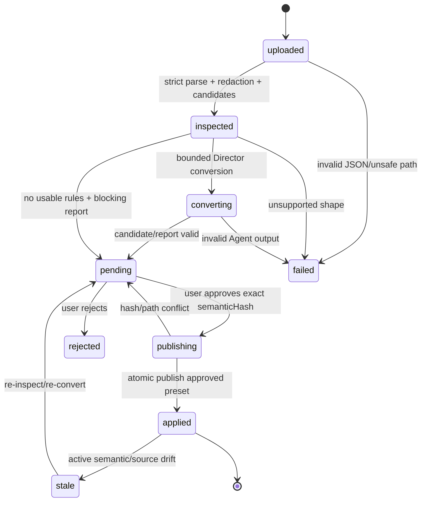
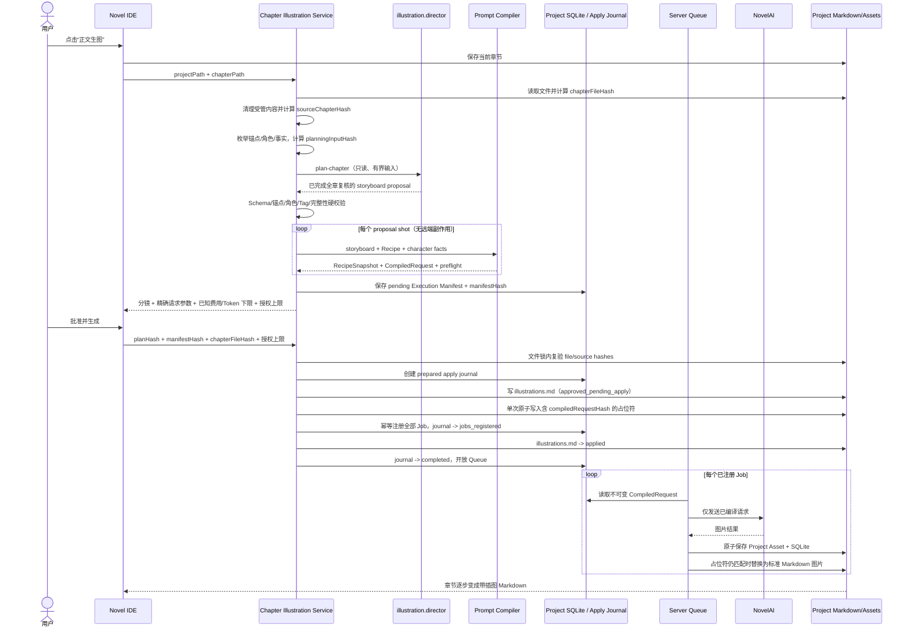
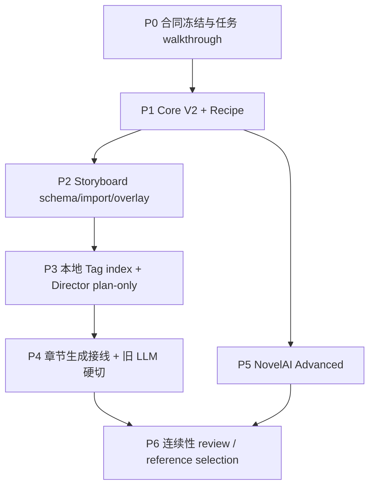

# Route B：Chatu8 分镜预设迁移与 Agent 化章节插图设计

日期：2026-07-17
状态：方案已确认，待实现（implementation-ready design）

## 1. 文档定位

本文是下一实现会话的自包含交接规格，描述 Route B 最终目标、领域合同、迁移边界、实施顺序、测试和验收标准。本轮只完成设计，不代表仓库代码已经实现。

本文是 Route B 的总架构规格，不应在一个超大补丁中一次实现。实施会话必须按 P0-P6 分阶段制定计划和验收，但继续维护同一个重大任务 walkthrough，避免合同在多个碎片文档中漂移。

截至 2026-07-17，仓库正文生图仍运行：

```text
body-image.character-detector
  -> 正文专用 LLM completion
  -> body-image.prompt-placer
  -> Prompt Compiler
  -> NovelAI Queue
```

目标链路改为：

```text
illustration.director（单一逻辑 Agent）
  -> 类型化章节分镜计划
  -> 确定性校验、编译、预算与队列
  -> NovelAI
```

“取消 LLM 方案”仅指取消文生图模块自建的 completion/provider/context-preset 运行链路，不表示系统不再使用模型。`illustration.director` 仍由 NeuroBook Agent Runtime 中配置的模型执行。

### 1.1 与既有规格的关系

本文仅在“Chatu8 分镜预设导入、章节语义规划与正文专用 LLM 链路”范围内，部分取代：

- `docs/superpowers/specs/2026-07-10-text-to-image-overhaul-design.md`
- `docs/superpowers/specs/2026-07-15-chapter-illustration-reroll-design.md`

发生冲突时，以本文为准。以下合同继续有效：

- Provider 凭据和 URL/SSRF 安全边界；
- Project SQLite 中的 Job、CompiledRequest、运行结果和 Asset 元数据；
- Project-relative 图片文件与标准 Markdown 图片；
- 服务端共享队列、超时、取消、恢复、幂等和 `outcome_unknown`；
- Prompt Compiler 作为 NovelAI 请求的唯一组装出口；
- `projectPath + chapterPath + chapterFileHash + sourceChapterHash`、文件锁、乐观并发校验和 tracked write；
- reroll 使用清理后的内存工作副本，完整新计划有效后才一次性替换；
- 旧资产不覆盖、不自动删除，迟到结果只进入历史页。

被本文明确取代的旧合同：

| 旧合同 | 新合同 |
| --- | --- |
| 正文 LLM 必须返回 `<image>...</image>` | Director 返回严格类型化章节 storyboard |
| 独立角色检测 Agent | Director 选择角色，但只能引用封闭候选 ID |
| 独立 placer/resolver Agent | Director 选择由代码预生成的稳定段落锚点 |
| `confidence < 0.65` 作为插入门槛 | Schema、ID、枚举、锚点和计划完整性硬校验 |
| 文生图模块单独配置 LLM provider/model/context | 统一使用 Agent Runtime；文生图只选择 Director Profile 与预设 |
| 再次点击必定盲目完整重跑 | 相同哈希恢复已有 revision；显式“重新规划”才创建新 revision |

## 2. 已确认的产品决策

1. 采用 Route B：迁移 Chatu8 的能力和数据语义，不嵌入或复刻 Chatu8 UI/runtime。
2. 一个 `illustration.director` 逻辑 Agent 负责整章分镜、画面选取、锚点、人物、动作、构图、场景 Tag 和全章连续性复核。
3. Agent 只做语义和审美判断；编译、预算、队列、凭据、持久化、文件写入、哈希和幂等属于确定性控制面。
4. 使用一个固定 Skill `novel-import-chatu8-storyboard-preset` 转换上传 JSON；每份 JSON 生成一份数据型 Markdown 分镜预设候选，不生成动态 Skill。
5. 导入的分镜预设默认发布到全局 `illustration.director` Profile Home，供所有 Project 继承。
6. Project 可按稳定 `ruleId` 增量覆盖全局规则；局部规则优先，未覆盖规则继续继承。
7. 外部 JSON 的转换结果永远先进入 `pending`，用户预览并批准后才激活；pending/stale 候选不能替换上一份已批准预设。
8. Danbooru/NovelAI Tag 词库是本地服务端索引，不进入 Skill、预设或 Agent 整包上下文。
9. Chatu8 角色和服装资料可以导入 NeuroBook，但必须进入对应 Project 的 `lorebook/character/**`，不能进入全局分镜预设。
10. 配置目标是：配置 Agent Runtime 模型、NovelAI Provider、选择 Recipe 与分镜预设后即可使用；不再要求额外配置正文专用 LLM。

## 3. 目标、非目标与兼容性承诺

### 3.1 目标

- 将 Chatu8 Context JSON 中可复用的分镜、选景、构图、画幅、连续性和 Tag 策略迁移成可读、可审查、可版本化的 Markdown。
- 让全局预设和 Project 局部规则形成稳定、可解释的增量覆盖，而不是复制整份预设。
- 让 Director 以整章视角统一决策，避免多个 Agent 分别识别角色、选画面和定位导致的画面冲突。
- 让章节从纯正文到带插图 Markdown 的每一步都可恢复、可追踪、可审查且不会重复扣费。
- 保持 NeuroBook 的 Markdown 真相源、Agent Profile、Skill 工作流和确定性工具边界。
- 支持 Chatu8 角色资产迁入现有角色 Markdown 体系。
- 降低上手门槛，不要求用户理解内部 Prompt Compiler、队列或 Tag 索引。

### 3.2 非目标

- 不原样执行完整 Chatu8 Context Prompt，不继承其中 `system/user/assistant` 权限。
- 不承诺相同模型下逐字、逐镜头或比特级复现 Chatu8 输出。
- 不把用户 JSON 变成 Skill、Profile、脚本或工具权限。
- 不把 Chatu8 Context preset 当成 NovelAI sampler/模型参数 Recipe。
- 不把 Project 角色、服装或剧情事实写进全局预设。
- 不让 Agent 直接保存正文、选择密钥、调用任意网络、删除资产或无限 reroll。
- 不把大型 Tag 数据库打包进 Git、Skill 或每次模型上下文。
- 首版不自动自评后重复生图，不自动发布“最佳图”，不自动删除旧图。
- 不保留旧正文 completion、`<image>` 和 detector/placer 主链的运行时兼容层。

### 3.3 “兼容 Chatu8 预设”的精确定义

兼容分为四层：

| 层级 | 承诺 |
| --- | --- |
| JSON 结构兼容 | 识别动态顶层预设名、`entries`、entry ID、role、enabled、triggerMode、triggerWords、andTriggerWords 和原始顺序 |
| 分镜语义迁移 | 把可识别的选景、镜头密度、构图、画幅意图、连续性和 Tag 策略转换成类型化规则 |
| 行为可追踪 | 每条规则保存来源 entry、转换级别、风险、哈希和覆盖 provenance |
| 非等价边界 | 不执行原 role Prompt、任意模板代码、未知宏、越权安全要求或完整 Context 行为 |

因此，产品文案应写“导入并迁移 Chatu8 分镜预设”，不能写“100% 原样运行 Chatu8 Context”。

如果未来遇到真正包含 NovelAI model/sampler/steps/scale/seed/尺寸等字段的生成参数 JSON，应由独立的 Recipe importer 生成 Recipe proposal；它与本文的 storyboard preset importer 共用 intake、脱敏、报告和审批基础设施，但输出类型不同。

## 4. 核心术语和真相源

### 4.1 工件定义

- **Storyboard Preset**：控制 Director 如何选画面和构图的全局 Markdown 规则集。
- **Project Overlay**：针对一个 Project、按 `ruleId` 增量修改 Storyboard Preset 的 Markdown。
- **Effective Preset**：系统保护合同、获批全局 preset 与有效 Project overlay 确定性合并后的只读快照。
- **Chapter Storyboard**：Director 为某章产生且通过校验/批准的分镜计划，保存在章节旁的 `illustrations.md`。
- **Recipe**：将语义计划编译为 NovelAI 请求的生成配方，包含模型和可编译参数；它不是分镜预设。
- **CompiledRequest**：Compiler 产生、Job 实际发送的不可变请求快照。
- **Execution Manifest**：全部 shots 无副作用预编译后的不可变执行清单，保存 CompiledRequest、精确参数、已知费用/Token 下限、输出上限和 manifestHash；用户批准绑定它，而不是绑定尚未编译的估算。
- **Asset**：Project-local 图片文件和 Project SQLite 元数据。

### 4.2 真相源分域

| 领域 | 真相源 |
| --- | --- |
| 全局分镜偏好 | Workspace Root `.nbook/agents/illustration.director/storyboard-presets/*.md` |
| Project 局部分镜规则 | Project Workspace `agents/illustration.director/storyboard-overrides/*.md` |
| 获批章节分镜 | 章节目录旁的 `illustrations.md` |
| Project 角色视觉事实 | `lorebook/character/**/image-tags.md` 与 `outfits/*.md` |
| NovelAI Recipe | `lorebook/instruction/text-to-image/<slug>/index.md` |
| Execution Manifest、Job、请求快照、结果、lineage | Project SQLite |
| 图片二进制 | Project Workspace `assets/text-to-image/**` |
| Provider 凭据 | 应用级加密存储，只以 `providerId` 引用 |
| Tag 检索库 | Workspace Root `.nbook/cache/text-to-image/tags/**`，可重建派生缓存 |
| Agent transcript | 运行证据，不是真相源，不用于跨章恢复 |

“SQLite + 图片文件是唯一真相源”只适用于运行和资产域。创作规则、角色事实与获批章节分镜继续以 Markdown 为真相源。

## 5. 总体架构

```mermaid
flowchart LR
    subgraph Intake["Chatu8 导入"]
        U["Project Workspace upload/*.json"]
        I["确定性 inspect / 脱敏 / 粗筛"]
        C["Director 转换模式"]
        P["pending Markdown candidate + report"]
        A["用户预览并批准"]
        G["全局 Storyboard Preset"]
        U --> I --> C --> P --> A --> G
    end

    subgraph Project["章节规划"]
        T["章节纯正文快照"]
        O["Project ruleId overlay"]
        R["确定性 Effective Preset resolver"]
        D["illustration.director"]
        SP["类型化 storyboard proposal"]
        T --> D
        G --> R
        O --> R
        R --> D --> SP
    end

    subgraph Runtime["确定性生成控制面"]
        PC["Prompt Compiler + Preflight"]
        EM["Execution Manifest"]
        B["精确请求与预算批准"]
        AJ["Apply Journal"]
        S["illustrations.md + 章节占位符"]
        Q["持久队列 / 幂等"]
        N["NovelAI"]
        AS["Project Asset + SQLite"]
        M["标准 Markdown 图片"]
        SP --> PC --> EM --> B --> AJ --> S --> Q --> N --> AS --> M
    end
```



### 5.1 单 Agent 不是单无限会话

`illustration.director` 是一个 Profile 身份和一套审美责任，不是一段无限增长的对话。每次运行必须绑定 operation、Project 与 `planningInputHash`，并在有界 run 中完成；付费预算只在确定性预编译后批准。

支持三种隔离 operation：

1. `convert-preset`：只读取已脱敏候选，返回类型化 preset proposal。
2. `plan-chapter`：读取章节快照、角色事实、Effective Preset 和窄 Tag 查询，返回完整章节计划，并在同一 bounded run 内完成强制全章连续性复核。
3. `review-candidates`（P6 增强）：只读比较已生成候选资产并提交建议；不得自动生图、改正文或 reroll。

三种 operation 可以使用同一个 Profile，但工具白名单、输入 Schema、最大 turn、token 和输出 Schema 分开配置。任何 operation 都不获得 shell、任意文件写入、Provider 密钥、删除或任意网络能力。

## 6. 目录布局

```text
Workspace Root/
└─ .nbook/
   ├─ agents/
   │  └─ illustration.director/
   │     ├─ storyboard-presets/
   │     │  ├─ default.md
   │     │  └─ <presetId>.md
   │     └─ imports/
   │        └─ chatu8-storyboard/
   │           └─ <importId>/
   │              ├─ source.sanitized.json
   │              ├─ inspect.json
   │              ├─ candidate.md
   │              ├─ report.md
   │              └─ journal.json
   └─ cache/
      └─ text-to-image/
         └─ tags/<indexVersion>/
            ├─ tags.sqlite
            └─ manifest.json

Project Workspace/
├─ upload/
│  └─ <user-file>.json
├─ agents/
│  └─ illustration.director/
│     └─ storyboard-overrides/
│        └─ <presetId>.md
├─ lorebook/
│  ├─ character/<character>/
│  │  ├─ index.md
│  │  ├─ image-tags.md
│  │  └─ outfits/*.md
│  └─ instruction/text-to-image/<recipe>/index.md
├─ manuscript/<volume>/<chapter>/
│  ├─ index.md
│  └─ illustrations.md
└─ assets/text-to-image/YYYY/MM/<assetId>.<ext>
```

规则：

- `upload/` 只是 intake，不是长期真相源；原上传文件保持不变。
- 因为预设默认全局生效，导入证据归档在全局 Profile Home，避免来源 Project 删除后失去 provenance。
- 持久化前先脱敏；不保存原始 secret。原始字节 SHA-256 只在内存计算。
- `storyboard-presets/` 保持平铺 `.md`，以兼容现有 `resource-preset`；嵌套 import journal 不注册为 resource-preset。
- Project overlay 由专用 resolver 读取，不能依赖 Profile Home “同路径整文件遮蔽”语义实现增量合并。

## 7. Storyboard Preset Markdown 合同

### 7.1 设计原则

- Markdown 是用户可查看、编辑、版本化的规则工件。
- 运行时只读取严格 frontmatter typed contract，不把 Markdown 正文当 Agent 指令。
- JSON 中原始角色、role 和大段提示词只保存在脱敏证据/报告，不复制到激活 preset。
- `kind` 和 `effect` 必须是代码注册的 discriminated union；禁止自由执行字段，如 `systemMessage`、`instruction`、`prompt`、`tool`。
- YAML parser 拒绝重复 key、anchor、alias、merge key、自定义 tag 和非预期字段。
- `presetId`、`ruleId`、`overlayId` 使用有长度上限的 ASCII 稳定标识；标题和说明可以使用 Unicode，但不参与执行。

### 7.2 示例

```markdown
---
schema: nbook.storyboard-preset/v1
presetId: cinematic-chapter
title: 章节电影化分镜
enabled: true
source:
  kind: chatu8
  importId: c8s_01J...
  rawSourceHash: sha256:...
  sanitizedSourceHash: sha256:...
  converterVersion: "1"
review:
  status: approved
  approvedSemanticHash: sha256:...
  approvedDiagnosticHash: sha256:...
matching:
  normalization: nfkc-casefold
defaults:
  preferredShotCount:
    min: 5
    max: 7
  minimumParagraphGap: 2
macros:
  bindings:
    正文: chapter.markdown
    上下文: chapter.compiledContext
    用户需求: invocation.request
  unresolved: []
rules:
  - ruleId: c8.089bf996.shot-selection.even-distribution
    sourceEntryId: 089bf996-72cd-49f9-908c-e51f63152e84
    order: 100
    enabled: true
    kind: shot-selection
    when:
      mode: always
      any: []
      andAny: []
    effect:
      operation: prefer
      beatTypes: [establishing, action, reaction, reveal]
      distribution: even
      scoreDelta: 20
    provenance:
      conversion: normalized
      sourcePaths: [entries.2.content]
  - ruleId: c8.00be1a4a.composition.single-instant
    sourceEntryId: 00be1a4a-7121-4a75-895c-482c352ddf27
    order: 200
    enabled: true
    kind: composition
    when:
      mode: always
      any: []
      andAny: []
    effect:
      temporalMode: single-instant
      maxSubjects: 4
      avoidCompoundActions: true
    provenance:
      conversion: direct
      sourcePaths: [entries.4.content]
risks: []
---

# 章节电影化分镜

这是一份可编辑的全局分镜规则。运行时只读取并校验 frontmatter；本段用于向人解释来源、效果和维护方式。
```

### 7.3 第一版规则类型

| `kind` | 作用 | 允许的典型 effect |
| --- | --- | --- |
| `shot-selection` | 哪些剧情瞬间值得画 | beatTypes、prefer/require/avoid、scoreDelta、distribution、minimumGap |
| `shot-density` | 整章图片数量倾向 | preferredMin、preferredMax、charactersPerShot 等偏好；最终受系统预算上限约束 |
| `composition` | 构图与镜头语义 | shotSize、cameraAngle、viewpoint、subjectPlacement、depth、lighting、single-instant |
| `canvas-intent` | 语义画幅选择 | portrait、landscape、square、character-showcase；由 Recipe 映射为实际尺寸 |
| `continuity` | 跨镜头一致性 | lockCharacterTraits、lockOutfit、palette、timeOfDay、axisPolicy |
| `tag-policy` | Tag 生成与限制 | require、prefer、avoid、forbid 的 tag/category；必须通过本地索引校验 |
| `constraint` | 计划级硬限制 | maxSubjects、forbidDuplicateBeat、requireValidAnchor；不能放宽系统安全上限 |

预设只能表达“语义意图”。实际 model、sampler、steps、scale、seed、凭据、输出数量和任意宽高必须来自 Recipe、Provider capability 和预算策略。

### 7.4 Trigger 语义

- `triggerMode: always` 转为 `when.mode: always`。
- `triggerMode: trigger` 转为字面 trigger。
- `triggerWords` 内部是 OR；`andTriggerWords` 内部也是 OR；两组同时存在时为 `any(triggerWords) AND any(andTriggerWords)`。
- 字面匹配使用 Unicode NFKC + case fold；保留原字符串用于审查。
- 外部正则或疑似正则只作为证据保留，不在批准前自动编译执行。
- entry 的 `enabled`、稳定 ID 和源顺序必须保留；源 role 仅作为 provenance，不继承权限。

### 7.5 宏与双大括号

样例中 `{{...}}` 同时可能表示运行宏、随机表达式、Tag 片段或普通文本，不能把所有双大括号都当宏。

分类规则：

1. 白名单数据宏：如 `{{正文}}`、`{{上下文}}`、`{{用户需求}}`，映射到只读具名槽位。
2. 身份宏：如 `{{user}}`，只能映射为显示名称数据，不能提升权限。
3. 随机宏：如 `{{roll 1d4}}`，首版不执行；记录为 unsupported stochastic token。
4. Tag/权重片段：如果内容符合 Tag 列表而非宏名，作为候选 Tag 证据交给 converter，并通过 Tag validator。
5. 未知歧义 token：保留 token、JSON path、是否影响规则；若激活规则依赖它，则阻止批准，不能猜值或静默替换为空。

## 8. Project 增量覆盖合同

### 8.1 Overlay 示例

```markdown
---
schema: nbook.storyboard-overlay/v1
overlayId: my-project-cinematic
presetId: cinematic-chapter
enabled: true
baseSemanticHash: sha256:...
review:
  status: approved
  approvedSemanticHash: sha256:...
macroBindings: {}
operations:
  - op: replace
    ruleId: c8.089bf996.shot-selection.even-distribution
    rule:
      ruleId: c8.089bf996.shot-selection.even-distribution
      order: 100
      enabled: true
      kind: shot-selection
      when:
        mode: trigger
        any: [港口, 海战]
        andAny: []
      effect:
        operation: require
        beatTypes: [establishing, action]
        distribution: front-loaded
        scoreDelta: 30
  - op: disable
    ruleId: c8.00be1a4a.composition.single-instant
  - op: append
    ruleId: project-silver-blue-palette
    rule:
      ruleId: project-silver-blue-palette
      order: 300
      enabled: true
      kind: continuity
      when:
        mode: always
        any: []
        andAny: []
      effect:
        palette: silver-blue
---

# 本 Project 的局部分镜覆盖
```

### 8.2 合并语义

1. Base 与 overlay 内部 `ruleId` 必须唯一。
2. `replace` 的目标必须存在，并整条替换；不做隐式字段深合并。
3. `disable` 的目标必须存在；保留来源追踪，不从结果中物理删除。
4. `append` 只能添加一个全新的 `ruleId`；已有同名 ID 即冲突。
5. `replace/append` 内嵌 rule 的 `ruleId` 必须与 operation 外层 `ruleId` 完全一致。
6. 不支持隐式删除或 last-write-wins。
7. 任一 operation 冲突时整份 overlay 拒绝应用，不能部分生效。
8. 最终顺序固定为 `order ASC, ruleId ASC`。
9. `baseSemanticHash` 不匹配时 overlay 进入 `stale`，全局 base 仍可运行，但 UI 必须显示局部规则未应用。
10. 系统服务、Profile Schema 和 Agent Runtime 工具/预算策略的安全与输出合同优先级高于 preset/overlay，且不可覆盖。Skill 只描述流程，不能作为唯一安全边界或扩大 Profile 权限。

通用 Config 合并器不承担 `ruleId` 深合并，以免改变所有 Profile 的配置语义。增量覆盖只在 `storyboard-rule-resolver` 领域服务中实现。

### 8.3 激活状态和哈希

状态：

- `pending`：外部导入或编辑尚未批准，或存在 blocking issue。
- `approved`：批准哈希与当前语义哈希一致，且无阻断问题。
- `stale`：批准后语义、raw/sanitized source provenance 或 baseSemanticHash 漂移。
- `rejected`：用户明确拒绝该候选；保留报告，不发布。

Project overlay 虽然是用户自建数据，也采用“保存草稿/应用规则”语义：编辑器在一次“保存并应用”操作中完成 schema 校验并写入 `approvedSemanticHash`；直接从文件系统修改会使其 stale。它不需要重复外部 JSON 风险确认，但不能让未校验的文件修改立即影响生成。

哈希：

- `rawSourceHash`：上传文件原始字节 SHA-256；批准前可从仍在 `upload/` 的原文件复验，批准后只作不可变 provenance。
- `sanitizedSourceHash`：`source.sanitized.json` 的规范 UTF-8 字节 SHA-256，可从全局 archive 随时复验。
- `fileHash`：完整 Markdown UTF-8 字节哈希，用于编辑冲突。
- `semanticHash`：只对规范化 typed semantic fields 做 canonical JSON + SHA-256；排除时间、报告正文、诊断顺序和解释文本。
- `diagnosticHash`：对规范化 blocking issues、risks、未解析 token 和转换级别做 canonical hash，确保批准时看到的风险集合没有漂移。
- `effectivePresetHash`：获批 base 与有效 overlay 合并后规则的 canonical hash。
- `planHash`：章节 storyboard 的语义哈希。
- `compiledRequestHash`：实际上游请求快照的语义哈希。

数组顺序属于语义；对象 key 使用固定排序。重复导入相同 `rawSourceHash + converterVersion` 返回已有 import，不生成重复候选。

`semanticHash` 纳入 presetId、enabled、matching、macro bindings、defaults 与规范化 rules；排除 source、review、provenance、risks、时间和 Markdown 解释正文。批准字段因此不会形成自引用哈希，来源完整性由独立 raw/sanitized source hashes 检查。

## 9. 固定 Chatu8 转换 Skill

### 9.1 Skill 与核心服务的边界

固定 Skill：

```text
assets/workspace/.nbook/agent/skills/
└─ novel-import-chatu8-storyboard-preset/
   └─ SKILL.md
```

Skill 负责：

- 说明用户如何从当前 Project 的 `upload/` 选择 JSON；
- 调用窄的 inspect/convert 工具；
- 展示 report、风险、兼容范围和批准入口；
- 在阻断条件下停止，不自行猜测或修改规则。

核心服务负责：

- 路径限制、读取、大小限制、raw hash 和 secret redaction；
- 严格 JSON/schema 检查、entry 归一化、候选粗筛、宏词法分析；
- 稳定 ID、canonical hash、状态机、文件写入和幂等；
- 调用 Director 的 `convert-preset` operation，并验证其类型化输出；
- 生成 candidate/report/journal，审批时原子发布。

固定语义不能只写在可被用户覆盖的 Skill 文件中。Skill 是工作流入口，parser、schema、merge 和 approval 必须在共享/服务端领域代码中实现。UI、Skill、API 和测试 CLI 必须复用同一服务，不能复制 parser。

### 9.2 Import 状态机



严格来说，即使没有提取出可用规则，每份可解析 JSON 仍生成一个 `rules: []` 的 pending candidate 和 report，以满足“一份 JSON 对应一份 Markdown 候选”；`NO_USABLE_STORYBOARD_RULE` 是 blocking issue，空候选不能批准。

### 9.3 Inspect 算法

1. 用户显式选择一个 `upload/*.json`；服务不得递归扫描整个 Project。
2. 将 Project-relative path 解析并验证仍位于当前 Project Workspace `upload/`。
3. 推荐首版文件上限 16 MiB；超限返回稳定错误，不截断。
4. 读取原始 bytes，在内存计算 `rawSourceHash`；任何落盘前完成 secret redaction，再对规范化脱敏 bytes 计算 `sanitizedSourceHash`。
5. 严格解析 JSON，拒绝 duplicate keys、原型污染键和超深嵌套。
6. 支持两种入口：顶层直接含 `entries`，或顶层只有一个动态预设名且其 value 含 `entries`。
7. entry 只读取 allowlist 字段；未知字段记录到 inspect，不自动注入 Agent。
8. entry identity 优先使用显式 `id` 或 map key；缺失时使用 `sourcePresetKey + canonicalEntryHash`，不使用数组序号或可变 replacement 生成 ID。
9. 保留 enabled、role、triggerMode、triggerWords、andTriggerWords、sourceOrder 和 JSON Pointer。
10. 对 content 做确定性分类：分镜、构图、画幅、Tag 策略、角色/服装、输出模板、越权/安全声明、无关内容。
11. 只把分镜相关候选交给 Director。推荐每次最多 64 entries、80,000 字符；超出时按 sourceOrder 确定性分片，再由同一 operation 做结构化汇总，不能静默丢弃。
12. Director 只能输出第一版注册的 rule kinds、`semanticSlot`、macro proposal 和 conversion note，不得决定最终 `ruleId`。
13. 服务端按 `sourceEntryId + ruleKind + semanticSlot` 分配稳定 `ruleId`，把映射写入 journal；同一 entry/kind/slot 重复时拒绝修复，不用 effect 内容或 Agent 文案参与身份计算。
14. 服务端重新验证、去重、排序、计算 semanticHash，生成 pending candidate。

`semanticSlot` 必须来自每种 rule kind 注册的稳定槽位，不是自由字符串。建议 final ID 形态为 `c8.<entryIdHash>.<ruleKind>.<semanticSlot>`；显式 source entry ID 未变且语义仍落在同一槽位时，重转换继续得到同一 ruleId。缺少显式 ID 的 entry 一旦内容变化可能获得新 identity，report 必须说明相关 Project overlay 会 stale，不能假装稳定。

### 9.4 审批与发布

- Preview 必须展示 candidate Markdown、规则表、来源 entry、已忽略内容、未知宏、风险和 semantic diff。
- 批准请求携带 `importId + candidateSemanticHash + diagnosticHash + expectedActiveFileHash + expectedGlobalConfigHash + targetScope: global + confirmGlobal: true`。
- presetId 与现有 active preset 冲突时，用户必须明确选择“替换此 preset”或“另存为新 presetId”；不能自动覆盖。
- 批准时重新读取 candidate、原 `upload/` 文件、sanitized archive 与 active target：原文件复验 `rawSourceHash`，archive 复验 `sanitizedSourceHash`，再进入 journaled publish。原 upload 已删除或改变时要求重新 inspect。
- 新 candidate pending、转换失败或用户关闭窗口时，上一份 approved preset 继续有效。
- 原 upload 文件不删除、不改名；全局 archive 保存脱敏副本，使 active preset 不依赖 Project 存续。
- approved preset 被手工编辑后 semanticHash 漂移即 stale；再次点击“应用”会重新校验并写入新的 approvedSemanticHash。
- 当前选中的全局 base preset 为 pending/stale 时阻止新计划，不静默改用其他视觉规则；导入新 candidate 不影响仍未被替换的上一份 approved base。

publish `completed` 后不再读取原 upload 参与运行；用户随后删除来源文件不会使 active preset stale。运行时只验证 active semanticHash 与全局 sanitized archive provenance，新的源文件必须作为新 import 进入 pending。

从 Project `upload/` 发布到 Workspace Root `.nbook` 是显式跨 scope 操作：inspect/convert 需要来源 ProjectSession；approve 还必须由服务端校验全局配置写权限和用户的 `confirmGlobal`，再通过受限 Profile Home/ConfigService 写入。Agent 与 Skill 都不获得任意全局文件写权限。

“发布 preset + 切换全局默认”使用独立 global publish journal：

```text
prepared -> preset_published -> selector_updated -> completed
```

每阶段保存 preset/config expected hashes 和必要备份引用。`preset_published` 后配置更新失败时，previous selector 继续有效，状态明确为 `published_not_selected`，用户重试只更新 selector，不重复转换或覆盖；不能把两个文件写入伪装成原子事务。

### 9.5 Import report 最低内容

- importId、源 Project、源相对路径、rawSourceHash、sanitizedSourceHash、converterVersion；
- 顶层形态、entry 数量、roles、trigger modes、enabled 统计；
- candidate 分类、转换成功/忽略/report-only 数量；
- 每条规则的 source entry、JSON Pointer 和 direct/normalized/report-only 级别；
- 已识别宏、随机 token、歧义双大括号和未解析 required token；
- secrets 删除的 JSON Pointer，只记录路径，不记录 secret 值；
- 风险、blocking issues、candidate path、semanticHash、diagnosticHash；
- 明确声明结果为 pending，且“兼容”不等于原 Context 行为等价。

report 默认只保存字段统计、JSON Pointer、分类理由和有长度上限的脱敏摘要，不复制完整外部 Prompt；完整脱敏内容只存在 `source.sanitized.json`，且运行时永不读取它作为指令。

converter 的候选分类、规则映射或风险判定语义发生变化时必须提升 `converterVersion`；不能在相同版本下改变 diagnostic/semantic 结果后复用旧批准。

### 9.6 用户样例基线

用户样例：`st_chatu8_test_context_llm万古至尊天下无敌修改版（开词库） (1).json`。

只读检查得到：

- 动态顶层预设名包裹 `entries`；
- 512 个 entries：501 system、6 user、5 assistant；
- 72 always、440 trigger；506 enabled、6 disabled；
- 所有 entry 都有 `triggerWords`，6 个有非空 `andTriggerWords`；
- content 总量约 506,428 字符；
- 粗筛命中数量远小于总量：`<image>` 相关 7 条、分镜/镜头/画面选取相关 5 条、构图相关 16 条、尺寸相关 4 条、结构化角色字段相关 3 条。

该基线证明实现必须使用“确定性 inspect/粗筛 -> 有界 Agent 语义转换”，不能把 50 万字符与 500 多条 role message 整包放入 Agent system context。完整用户样例不应提交到仓库；测试使用最小脱敏合成 fixture，本地可做不入库的兼容 smoke。

## 10. Chatu8 角色与服装导入

角色导入是 Route B 的 Project migration 能力，与全局 storyboard preset 分开：

```text
Chatu8/SillyTavern 角色数据
  -> 确定性解析和脱敏
  -> Project character proposal
  -> 用户逐项确认
  -> lorebook/character/<slug>/index.md
  -> image-tags.md
  -> outfits/*.md
```

合同：

- 标准 SillyTavern character card/PNG 优先复用现有 `novel-import-silly-tavern-card` 工作流；Chatu8 自有 character group/export 由同一确定性 staging/apply 基础设施增加 adapter。
- Context JSON 中发现的角色列表/字段只进入 import report，并提供“作为 Project 角色继续导入”的入口。
- 全局 preset 不保存角色姓名、外貌、服装、剧情关系或 Project 路径。
- 复用现有角色 `image-tags.md` 与 outfit Markdown codec，不建立第二套角色 schema。
- 角色 identity 先做确定性精确匹配，再把歧义项交给封闭候选 Agent；Agent 不生成任意路径或直接 apply。
- apply 请求包含 proposal hash、target base hashes 和 idempotency key；所有目标先在内存 render/validate，再使用 tracked write 与 journal。
- 默认补全空字段并保留用户已有负面词/服装；覆盖视觉字段必须单独确认。
- 图片附件在 M2 的 Project reference asset 合同完成前只作为脱敏证据，不直接写入运行时 Vibe/Character Reference。

这使产品同时满足：导入 Chatu8 分镜预设、导入 Chatu8 已有角色、并保持 NeuroBook 的 Project Markdown 结构。

## 11. 本地 Tag 索引

### 11.1 为什么不把词库放进 Skill

大型 Danbooru/NovelAI Tag 集合放进 Skill 会导致：

- Skill 文件巨大、上下文成本高、每次运行重复注入；
- Agent 只能凭记忆匹配，无法验证 alias、deprecated、category 和 provider/model 支持；
- 更新词库会污染 Skill 版本，并使计划不可复现。

正确形态是 Workspace Root 共享、版本化、可重建的本地索引。Skill 只教 Agent 何时调用查询工具。

### 11.2 索引字段

- canonical tag；
- aliases；
- category；
- usage/count 或排序权重；
- implications/related tags；
- deprecated/blocked 标志；
- 可选中文概念映射；
- provider/model compatibility；
- source、snapshot date、license、checksum 和 indexVersion。

不提交图片数据。下载或内置快照必须在实现时核验来源许可与再分发条件；如果许可不允许随应用分发，则提供用户触发的 downloader/index builder。

### 11.3 Agent 窄工具

- `search_tags(query, category?, provider?, limit<=30)`
- `resolve_tag_alias(tag)`
- `validate_tags(tags[], provider, model)`
- `related_tags(tag, relation?, limit<=30)`

工具只返回结构化数据；Tag 描述、alias 和来源文本都视为不可信数据。每个 plan 记录 `tagIndexVersion`，Compiler 再校验一次，不允许 Agent 用自由文本绕过 validator。

首版优先 SQLite FTS5/前缀/alias 检索，不必先引入向量数据库。只有中文概念召回质量经测量不足时，再增加小型本地 embedding/translation 层。

## 12. Chapter Storyboard Markdown 合同

### 12.1 路径和状态

每章最多一个当前获批文件：

```text
manuscript/<volume>/<chapter>/illustrations.md
```

运行提案可以在 Project SQLite/session 中暂存，但不是第二真相源；用户批准后才通过 tracked write 发布 `illustrations.md`。

状态：

- `approved_pending_apply`：plan 与 Execution Manifest 已获批，但跨文件/数据库 apply journal 尚未完成；不得启动队列。
- `applied`：`illustrations.md`、章节占位符和幂等 Job 已按同一 journal 建立，可由队列执行。
- `stale`：章节、preset、overlay、Recipe 选择或人工编辑导致语义漂移；
- `superseded`：显式重新规划后被新 revision 取代，历史由 Workspace History/SQLite 保留。

### 12.2 示例

```markdown
---
schema: nbook.chapter-illustrations/v1
chapterPath: manuscript/001-volume/003-chapter/index.md
revisionId: sb_01J...
status: applied
chapterFileHashAtPlan: sha256:...
sourceChapterHash: sha256:...
planningInputHash: sha256:...
effectivePreset:
  presetId: cinematic-chapter
  semanticHash: sha256:...
recipe:
  key: lorebook/instruction/text-to-image/default/index.md
  sourceHash: sha256:...
tagIndexVersion: danbooru-nai-2026-07
tagIndexManifestHash: sha256:...
director:
  profileVersion: "1"
  operationVersion: "1"
  modelConfigFingerprint: sha256:...
paragraphParserVersion: "1"
planValidatorVersion: "1"
systemPolicyVersion: "1"
characterFactsHash: sha256:...
contextSnapshotHash: sha256:...
planPolicyHash: sha256:...
planHash: sha256:...
executionManifestHash: sha256:...
approval:
  approvedPlanHash: sha256:...
  approvedExecutionManifestHash: sha256:...
  approvalHash: sha256:...
  approvedAt: 2026-07-17T12:00:00.000Z
  approvedOutputCount: 5
apply:
  journalId: illustration_apply_01J...
  appliedAt: 2026-07-17T12:00:01.000Z
shots:
  - shotId: shot_sb01_01
    anchorId: p_0003_8f31a2c4
    storyBeat: reveal
    purpose: 建立港口规模并呈现主角第一次看见舰队
    characterIds: [hero]
    outfitRefs: [lorebook/character/hero/outfits/travel.md]
    action:
      hero: standing-at-railing
    composition:
      shotSize: wide
      cameraAngle: high
      viewpoint: third-person
      canvasIntent: landscape
      subjectPlacement: lower-right
    continuity:
      timeOfDay: dawn
      palette: silver-blue
    tagIntent:
      positive: [wide_shot, harbor, fleet, dawn, volumetric_lighting]
      negative: []
    recipeKey: lorebook/instruction/text-to-image/default/index.md
---

# 本章插图计划

本文件正文用于作者阅读、审阅与记录理由；运行时只消费严格 frontmatter。
```

### 12.3 硬约束

- 段落 `anchorId` 由确定性章节 parser 根据清理后快照生成，Agent 只能从本次候选中选择。
- `shotId` 由服务在计划校验后分配，不能依赖 Agent 随机命名。
- `characterIds` 必须来自本次封闭候选；未知角色拒绝整条 shot。
- `outfitRefs` 必须是当前 Project 中存在且允许的 Project-relative 路径。
- shotSize、angle、viewpoint、canvasIntent、rating 等使用固定枚举。
- action、palette、lighting 等字符串使用有长度上限的受控概念 ID 或注册词表；自由描述只允许出现在 `purpose`，且运行时不执行。
- Tag 必须通过本地索引和 Provider/model capability 校验；未知 Tag 作为 warning 或 blocking issue，策略由 Recipe 明确。
- 计划不能携带 providerId、secret、绝对路径、Data URL、最终 prompt 或任意工具调用。
- 一次 plan 必须通过全章完整性校验；截断或半份输出不能清空旧规划。
- `purpose` 和 Markdown 正文供人解释，不作为可执行指令。

哈希分层：

- `chapterFileHash`：当前章节文件原始 UTF-8 bytes hash，只用于本次乐观并发；生成图片后它自然变化，不能作为计划缓存键。
- `sourceChapterHash`：精确移除本章受管占位符/图片后，对规范化正文 AST 计算的 hash；同一纯正文在生成前后保持稳定。
- `planningInputHash`：覆盖规范化正文/锚点、角色与服装事实、Effective Preset、Recipe/capability 摘要、Tag index manifest、检索上下文、用户请求、plan policy，以及 paragraph parser、Director Profile/operation、非敏感 model config fingerprint、system policy 和 plan validator versions。
- `planHash`：对 chapterPath、sourceChapterHash、planningInputHash 和规范化 shots 做 canonical hash；排除 revisionId、status、approval、apply、approvedPlanHash 和 Markdown 解释正文。
- `executionInputHash`：覆盖 planHash、完整 Recipe/角色事实/Tag index/capability snapshots、compilerVersion 和 execution policy。
- `executionManifestHash`：对 executionInputHash、逐 shot CompiledRequest、requested variants/output count、精确参数和已知费用/Token 估算做 canonical hash；它在批准前完成，不包含用户批准字段。
- `approvalHash`：对 planHash、executionManifestHash、authorizedOutputCount、authorizedCostOrTokenLimit 和批准主体/时间做 canonical hash，作为付费授权证据。

模型配置 fingerprint 不含 API key/secret。规划输入任一事实或关键版本变化都会使缓存失效；只改变 compiler 时可以复用 plan，但必须重新生成 Execution Manifest 并重新批准实际请求。

## 13. 点击“正文生图”的完整流程



### 13.1 清理工作副本

- 只移除当前章节的 NeuroBook 受管 `<text-to-image-prompt>` 节点。
- 只移除 Project SQLite 明确确认 `sourceKind=body` 且 `sourcePath=当前章节` 的图片引用。
- 不按 alt 文本或 `assets/text-to-image/` 前缀宽泛删除。
- 手动图片、外链图片和其他章节资产保留。
- 所有语义阶段读取同一清理快照；章节真实文件在新计划完整有效前不改变。
- `chapterFileHash` 在清理前对真实文件计算，用于 approval apply 的 expected hash；`sourceChapterHash` 在清理后对规范化正文 AST 计算，用于计划 identity 和重复点击恢复。

### 13.2 占位符合同

内部占位符不再复制完整 prompt，只引用：

- `storyboardRevisionId`
- `shotId`
- `sourceChapterHash`
- `effectivePresetHash`
- `executionManifestHash`
- `compiledRequestHash`
- `jobId`（创建后）

最终仍写标准 Markdown：

```markdown

```

### 13.3 重复点击、恢复和重新规划

- 重新清理当前文件后得到相同 `planningInputHash` 且已有有效 revision：返回已有计划或恢复 apply/Job，不创建新 Agent run。
- 已完成章节再次点击：展示当前计划，并提供“重新规划整章”，不能静默重复付费。
- 正文、角色/服装、检索上下文、preset/overlay、Recipe/capability、Tag index、Director/model policy 或 parser/validator 版本改变：planningInputHash 或 executionInputHash 改变；旧 plan/manifest 按对应层标记 stale，并要求重规划或重新预编译/批准。
- 显式重新规划先构造完整新计划；新计划无效时旧正文、旧占位符和旧图片原样保留。
- 新 revision 批准后，清理旧受管内容与插入新占位符必须在一次章节 tracked write 中完成。
- 旧 Job 的迟到结果保存到历史，但 source placeholder 不匹配时不得插回正文。

### 13.4 跨文件 Apply Journal

`illustrations.md`、章节 Markdown 和 Project SQLite 不能依赖“看起来连续的三次写入”假装成一个事务。每次批准创建唯一 journal，阶段固定为：

```text
prepared
  -> plan_written
  -> chapter_written
  -> jobs_registered
  -> completed
```

- `prepared` 保存 expected chapterFileHash、sourceChapterHash、planHash、executionManifestHash、approvalHash、目标文件 before hashes 和幂等 Job IDs。
- 每一步先验证上一阶段和 before/after hash，再执行一次；重复调用返回已有结果。
- `plan_written` 后中断可安全继续，plan 状态保持 `approved_pending_apply`，Queue 不可见。
- `chapter_written` 后中断按同一 manifest 注册缺失 Job，不能重新调用 Director/Compiler。
- `jobs_registered` 后中断只完成 `illustrations.md -> applied` 与 journal 状态，不重复创建 Job。
- 遇到用户外部修改导致 hash 不匹配时停止为 `apply_conflict`，不强行回滚覆盖用户内容；UI 提供基于当前正文重新规划。
- Queue 只消费 `completed` journal 关联的 Job，避免占位符/计划尚未一致时开始付费请求。

## 14. 确定性生成控制面

### 14.1 编译链

```text
Storyboard Shot
  + Character image-tags.md
  + Outfit Markdown
  + Storyboard tag-policy
  + Project prompt replacement rules
  + Recipe Source
  + Provider capability snapshot
  -> RecipeSnapshot
  -> CompiledRequest
  -> Execution Manifest（全部 shots）
  -> 用户批准 manifestHash 与授权上限
  -> Job
  -> Asset
```

规则：

- Director 只提交镜头语义、实体引用、构图和 Tag intent。
- Prompt Compiler 唯一负责角色正/背面、身体范围、服装、negative prompt、replacement rules、去重与 Provider 参数。
- Storyboard rule 与 prompt replacement rule 是不同层；前者影响选镜/意图，后者只在编译末端确定性转换 Tag 文本。
- Queue 不再补 Tag、改模型或修改高级标量；adapter 只发送 CompiledRequest。
- preview、Job 保存的 request snapshot 和 adapter 实际发送内容必须可证明等价。
- 全部 shots 必须在批准和写占位符前完成无副作用 compile/preflight；任一 blocking compile error 都只返回 preview 诊断，不写 `illustrations.md`、章节或 Job。

### 14.2 Recipe 与画幅

- NovelAI model 属于 Recipe，不属于凭据 Provider。
- storyboard 的 `canvasIntent` 只表达 portrait/landscape/square 等语义。
- Recipe 定义每个 canvasIntent 对应的允许尺寸；Compiler 结合 capability registry 选择实际 width/height。
- 任意外部 preset 不能直接设置 providerId、token、官方 endpoint 或超出 capability/budget 的输出数量。

### 14.3 Job、幂等和付费安全

Job 至少保存：

- source kind/operation；
- storyboardRevisionId、shotId、variantIndex；
- RecipeSnapshot 与 recipeHash；
- CompiledRequest 与 compiledRequestHash；
- compilerVersion、tagIndexVersion、effectivePresetHash；
- idempotencyKey、parentJobId/parentAssetId；
- status、outcome、sourceInsertStatus、稳定错误码。

生成幂等键至少包含：

```text
project + storyboardRevisionId + shotId + variantIndex + compiledRequestHash
```

相同 key 返回已有 receipt，不发第二次远端请求。进程崩溃、网络断开或运行中强制取消且无法确认上游结果时进入 `outcome_unknown`，不得自动重试造成重复扣费。

Execution Manifest 在 Job 前存在于 Project SQLite，状态为 `pending_approval | approved | applied | stale`。批准记录同时绑定 `planHash + executionManifestHash + authorizedOutputCount + authorizedCostOrTokenLimit`；manifest 内任一 CompiledRequest、variant、capability 或 compiler version 变化都必须重新批准。

### 14.4 预算边界

- plan 与 compile/preflight 阶段都没有远端图片副作用。
- 用户批准时看到并绑定实际 CompiledRequest 摘要、shot 数、每 shot variant 数、已知费用/Token 下限和费用/Token 授权上限。
- 用户在预览中修改 shot、Recipe、variant 或 output count 时，服务端先生成新的 Execution Manifest；旧 manifest/approval 立即失效，不能在前端局部改参数后沿用旧授权。
- 推荐首版系统 hard cap：每章最多 12 shots、每 shot 最多 2 variants；preset 的 5~7 张只是偏好，不是越权指令。
- Reviewer 不得自动 reroll；任何新 variant 都需要新 revision/reason 和新的明确预算授权。
- 无合格候选时停止并给出修改建议，不能自循环生图。

## 15. Profile、Skills 与工具权限

### 15.1 Profile

新增：

```text
assets/workspace/.nbook/agent/profiles/builtin/illustration.director.profile.tsx
```

Profile 负责：

- Agent Runtime 模型和 operation-specific settings；
- 输入/输出 Zod Schema；
- Profile Home 初始化与全局默认 preset；
- operation 对应的工具白名单、turn/token/tool-call/time 限制；
- 读取 Effective Preset 的类型化摘要，而不是原 Markdown 正文。

Profile settings 建议包含：

- `storyboardPresetKey`：全局选择的 base resource key；Project 可只覆盖选择值。
- `chapterPlanPolicy`：用户偏好的 shot 上限、是否要求每次预览、Tag strictness；任何设置值仍受服务端 hard cap 限制。
- 不包含正文专用 LLM base URL、API key、model 或 Context JSON。

Profile Home 初始化时创建并批准安全的 `storyboard-presets/default.md`，全局设置默认选择它。导入 Dialog 的“批准并设为全局默认”会同时发布 preset 并更新全局选择；Project 只在明确选择其他 base 时覆盖该 key，普通 Project 无需额外配置。

选择器的持久化真相源固定为：

- Global：Workspace Root `.nbook/config.json` 的 `agent.profiles["illustration.director"].settings.storyboardPresetKey`。
- Project override：Project Workspace `.nbook/config.json` 的同字段；缺失时继承 Global。

该 key 只解析 Workspace Root `.nbook/agents/illustration.director/storyboard-presets/` 中的获批全局 base；Project 不通过同名文件整体遮蔽 base。Project overlay 不写进 Config 数组，resolver 根据 effective presetId 读取 `agents/illustration.director/storyboard-overrides/<presetId>.md`。

### 15.2 Skills

新增两份固定 Skill：

- `novel-import-chatu8-storyboard-preset`：从 upload 导入 pending preset、预览、批准。
- `chapter-illustration-direction`：读取章节、全局 preset、Project overlay 和角色事实，调用 Director 生成/复核整章计划。

Skill 只描述工作流，不保存 preset 内容、Project 角色、Tag 数据库或唯一 parser。如果由 `leader.assets` 触发导入 Skill，需要加入其 skill whitelist 并更新 profile contract test。

### 15.3 工具权限矩阵

| operation | 可读 | 可调用 | 明确禁止 |
| --- | --- | --- | --- |
| convert-preset | 脱敏候选、typed schema、最小 Tag validator | submit preset proposal | 原 JSON role 权限、任意文件写入、网络、Provider |
| plan-chapter | 清理章节、锚点、角色事实、Effective Preset | Tag 查询、submit plan | 写章节、调用 NovelAI、选密钥、删除 |
| review-candidates（P6） | 同 revision 的只读候选资产与约束 | submit recommendation | 自动改写正文、自动生成、自动 reroll |
| deterministic execute | 获批 plan/Recipe | compile、budget、queue、tracked write | 由 Agent 自由调用 |

## 16. API 与前端工作

### 16.1 建议 API

导入：

- `POST /api/text-to-image/storyboard-imports/inspect`
- `GET /api/text-to-image/storyboard-imports/:id`
- `POST /api/text-to-image/storyboard-imports/:id/convert`
- `POST /api/text-to-image/storyboard-imports/:id/approve`
- `POST /api/text-to-image/storyboard-imports/:id/reject`

预设与 overlay：

- `GET /api/text-to-image/storyboard-presets`
- `GET/PATCH /api/text-to-image/storyboard-presets/:presetId`
- `GET/PATCH /api/text-to-image/storyboard-overlays/:presetId`
- `GET /api/text-to-image/storyboard-presets/:presetId/effective`

章节：

- `POST /api/text-to-image/chapter-storyboards/plan`
- `GET /api/text-to-image/chapter-storyboards/:revisionId`
- `POST /api/text-to-image/chapter-storyboards/:revisionId/approve-and-generate`
- `POST /api/text-to-image/chapter-storyboards/:revisionId/replan`

精确路由名可按现有 Nitro 组织调整，但必须保留 inspect/convert/approve、effective resolve、plan、approve-and-generate 的权限和状态边界。所有 Project API 使用 ProjectSession 守卫。

`approve-and-generate` 请求必须携带 `planHash + executionManifestHash + chapterFileHash + authorizedOutputCount + authorizedCostOrTokenLimit`；服务端不接受前端重新提交或修改 CompiledRequest。全局 preset approve 除来源 ProjectSession 外还执行第 9.4 节的 global scope 授权与 config expected-hash 校验。

### 16.2 快速上手 UI

首次使用向导只要求：

1. 选择/配置 Agent Runtime provider 与 model；
2. 保存 NovelAI token 为服务端 Provider；
3. 选择或导入 Storyboard Preset；
4. 选择 Project 默认 Recipe；
5. 可选导入角色资料。

Tag 索引自动检测并初始化；如果需要下载，UI 显示来源、版本、体积、license 和 checksum，一次下载全局复用。

导入 Dialog：

- 选择当前 Project `upload/` 中的 JSON；
- 展示结构统计、候选规则、宏、风险、忽略原因和 Markdown diff；
- 选择 presetId；
- “批准并设为全局默认”主操作；
- 不把“上传完成”误报成“已激活”。

章节预览：

- 在一张整章 storyboard 工作区显示 shot 顺序、锚点段落、角色、构图、Tag、Recipe、预计图片数和预算；
- 允许删除/调整单个 shot 后重新校验；局部编辑会产生新 planHash；
- “批准并生成全部”是唯一触发付费队列的主操作；
- 生成中按 shot 显示排队、运行、成功、失败、未插入和 outcome unknown；
- 保留手工逐 shot 生成入口，但共享同一 Job/Compiler。

错误通知遵循项目既有 `useNotification()` 与 `resolveApiErrorMessage()` 规范；表单内可恢复错误使用局部 error state。

## 17. 安全、失败与恢复

### 17.1 信任边界

以下全部视为数据，而不是指令：

- 外部 JSON 的 content、role、宏和输出模板；
- 章节正文和 Project overlay 的自由文本；
- Tag 索引记录；
- 图片 metadata 和历史 prompt；
- import report 的解释正文。

运行时只向 Agent 提供经过 allowlist/schema 归一化的 typed input。原始 role 不能重新注入 system 层；上传内容不能创建 Skill、Profile、脚本、工具权限或覆盖系统安全合同。

### 17.2 资源限制

- JSON size/depth/entry 数和单 entry 长度限制；
- import 分片大小和总 Agent token 上限；
- 每次 Director run 的 max turn、tool calls、Tag queries、wall time；
- 每章 shot/variant/cost hard cap；
- 无状态变化的重复 tool call 触发熔断；
- 不允许递归调用自身或用输出再次自动启动新 run。

### 17.3 稳定错误码

- `STORYBOARD_IMPORT_INVALID_JSON`
- `STORYBOARD_IMPORT_UNSUPPORTED_SHAPE`
- `STORYBOARD_IMPORT_TOO_LARGE`
- `STORYBOARD_IMPORT_SOURCE_CHANGED`
- `STORYBOARD_IMPORT_REVIEW_REQUIRED`
- `STORYBOARD_PRESET_STALE`
- `STORYBOARD_PRESET_ID_CONFLICT`
- `STORYBOARD_OVERLAY_CONFLICT`
- `STORYBOARD_REQUIRED_TOKEN_UNRESOLVED`
- `ILLUSTRATION_PLAN_INVALID`
- `ILLUSTRATION_PLAN_INCOMPLETE`
- `ILLUSTRATION_PLAN_STALE`
- `ILLUSTRATION_MANIFEST_STALE`
- `ILLUSTRATION_APPLY_CONFLICT`
- `TEXT_TO_IMAGE_CHAPTER_CONFLICT`
- `TEXT_TO_IMAGE_BUDGET_REQUIRED`
- `TEXT_TO_IMAGE_OUTCOME_UNKNOWN`

失败语义：

- inspect/convert 失败：不发布 preset，保留可读诊断。
- approval hash 冲突：409，不覆盖用户新编辑。
- Director 空计划、截断或无有效锚点：不写章节，不替换旧计划。
- compile/preflight 或 Execution Manifest 生成失败：不开放预算批准，不写 plan/placeholder/Job。
- Project overlay stale：跳过 overlay、运行获批 base，并明显告警；用户可选择阻止生成的严格模式。
- 章节 hash 冲突：不写 `illustrations.md` 或正文，要求基于最新章节重规划。
- 图片成功但 placeholder 缺失：Asset 保留在历史，`sourceInsertStatus=missing`。
- apply 进程中断：通过 global publish/chapter apply journal 判断可恢复步骤；不重复发布 preset、切 selector 或提交相同幂等 Job。

## 18. 对现有代码的迁移与清理

### 18.1 保留并强化

- `server/text-to-image/provider.service.ts`
- `server/text-to-image/provider-url-policy.ts`
- `server/text-to-image/asset.service.ts`
- `server/text-to-image/chapter.service.ts`
- `server/text-to-image/queue.service.ts`
- `server/text-to-image/prompt-compiler.ts`
- `server/text-to-image/character-image-tags.ts`
- `shared/text-to-image-markdown.ts`
- `TextToImageHistoryWorkspace.vue` 与标准资产历史能力

### 18.2 重构

- `app/utils/text-to-image-st-chatu8-import.ts`：把 parser/ID/转换语义移到 shared/server，前端只做 DTO/UI。
- `server/text-to-image/body-prompt.service.ts`：硬切为 Director 编排门面或由新的 chapter storyboard service 取代。
- `app/utils/text-to-image-tag-vocabulary.ts`：从浏览器 IndexedDB 迁移为服务端全局索引与窄工具。
- `NovelTextToImagePanel.vue`：拆出 preset import、chapter storyboard preview、budget 和 queue 状态组件。
- `app/stores/text-to-image.ts`：删除 Context、任务 Prompt、角色/服装和生成结果的浏览器双真相，只保留 UI 偏好或服务端资源引用。
- Job/Asset schema：增加 immutable snapshot、hash、lineage、outcome 和 idempotency。

### 18.3 删除正文旧主链

当 Director plan-only 与生成集成验收通过后删除：

- `server/api/text-to-image/llm-completion.post.ts`
- `server/api/text-to-image/llm-models.post.ts`
- `server/api/text-to-image/body-character-tags.post.ts`
- `server/api/text-to-image/body-prompt-placements.post.ts`
- `assets/workspace/.nbook/agent/profiles/builtin/body-image.character-detector.profile.tsx`
- `assets/workspace/.nbook/agent/profiles/builtin/body-image.prompt-placer.profile.tsx`
- `assets/workspace/.nbook/agent/skills/body-image-character-detection/`
- `assets/workspace/.nbook/agent/skills/body-image-prompt-placement/`
- 只服务 `<image>` completion 解析的 helper/tests。

`character-image-tag.extractor` 和 `character-image-tag-generation` 仍服务角色资料生成，可保留；不要因正文主链合并误删。

项目处于快速开发阶段，不建立 legacy adapter。旧链消费者全部迁移后一次硬切，并同步删除失效测试和设置字段。

## 19. Route B 实施路线

### 19.1 依赖图



M2 NovelAI Advanced 可以与 Storyboard/Director 主线在 P1 后并行；基础正文 Agent 化不应被 Vibe/CharRef/Inpaint 阻塞。只有 reference selector/reviewer 需要同时依赖两边。

### 19.2 P0：合同冻结与实施任务建立

- 新建/续写 `docs/tasks/<order>-text-to-image-route-b/README.md`，记录需求、阶段、决策、文件、验证和实际偏差。
- 复核 `PROJECT-STATUS.md` 和 2026-07-10/15 规格，标注本文的 supersession 范围。
- 冻结 storyboard preset、overlay、chapter illustrations、RecipeSnapshot、CompiledRequest 和 Job schema。
- 先写 schema/hash/merge/validator 测试，再写实现。

验收门：所有跨层 DTO 有版本号、严格 parser、canonical renderer 和稳定 hash fixture；不存在 `any` 或用 `unknown` 绕过外部边界后的未收窄数据。

### 19.3 P1：Text-to-Image Core V2 与 Recipe Markdown

- 建立 `RecipeSource -> RecipeSnapshot -> CompiledRequest -> Job -> Asset`。
- NovelAI model 归 Recipe；Provider 只保存凭据、官方 endpoint、安全和限速。
- Queue/adapter 只消费已编译请求；补齐 timeout、cancel、recovery、outcome_unknown、lineage、idempotency。
- Recipe Markdown 成为 Project 真相源；删除 localStorage/Pinia Recipe 双真相。
- manual/body/character/retry/reroll 统一走同一 compiler/job service。

验收门：preview、持久化 snapshot 与实际 adapter payload 等价；相同 idempotency key 不发第二个远端请求；秘密、绝对路径和 Data URL 不进入 Job。

### 19.4 P2：Storyboard schema、Importer、全局 preset 与 Project overlay

- 新增 shared schema/canonical hash/Markdown codec。
- 新增确定性 Chatu8 inspect/converter/import journal 和固定 Skill。
- 在本阶段创建最小 `illustration.director` Profile 与 `convert-preset` operation；只开放脱敏候选读取和 proposal submit。
- 建立 Tag manifest/语法/alias validator 的最小基础，保证可批准 `tag-policy` 不含未验证 Tag；不在本阶段开放章节查询工具。
- 新增 `illustration.director` Profile Home 与默认全局 preset。
- 新增 pending preview/approve UI 和 resource-preset 管理。
- 新增 Project overlay editor、ruleId resolver、stale/conflict diagnostics。
- 把角色/服装候选分流到 Project migration，不写全局 preset。

验收门：用户样例可生成 pending Markdown/report；批准前不影响运行；批准后全局生效；Project replace/append/disable 结果稳定；base 更新后 overlay stale，不发生静默错误合并。

### 19.5 P3：Tag Index 与 Director plan-only

- 扩展为完整版本化 tags.sqlite、更新/校验和 Agent 窄查询工具。
- 升级既有 `illustration.director` Profile，加入 `plan-chapter` operation 和 `chapter-illustration-direction` Skill。
- 章节 parser 生成稳定锚点和封闭角色/服装候选。
- Director 在同一 bounded run 中完成全章计划与强制连续性复核，输出严格 DTO；这是 P3 基线，不延后到 P6。
- 新增 `illustrations.md` codec、plan validator、preview UI 和 plan-only harness。

验收门：plan-only 不产生远端图片或章节写入；输出完整整章计划、有效锚点/实体 ID/effectivePresetHash/tagIndexVersion；恶意正文或 preset fixture 不能越权。

### 19.6 P4：批准后批量执行、正文写回与旧链硬切

- 对全部 shots 先无副作用 compile/preflight，持久化 immutable Execution Manifest；失败时不写 Markdown/Job。
- 批准时绑定 planHash、executionManifestHash、chapterFileHash 和输出/费用/Token 授权上限。
- 按 apply journal 写入 `illustrations.md: approved_pending_apply`、受管占位符和幂等 Job，全部一致后切为 `applied` 并开放 Queue。
- Compiler/Queue 逐 shot 创建 Job；成功时替换仍匹配的 placeholder。
- 实现重复点击恢复、显式 replan、章节冲突、迟到结果和部分失败 UI。
- 删除 detector + completion + placer 正文主链及其设置/API/测试。

验收门：从配置完成到点击正文生图，用户只需预览并确认一次已预编译请求与预算；批准绑定的 manifest 等于 Job/adapter payload；跨文件中断可恢复；章节最终只有标准 Markdown 图片；空/截断计划不清空旧内容；相同点击不重复扣费。

### 19.7 P5：NovelAI Advanced

- capability registry、preflight、稳定错误码、Token/费用下限。
- 先贯通 SMEA/DYN、Variety、Decrisp、AQT/UCP、Furry 等无图片高级参数。
- 再建立 Project reference asset、Vibe cache、Character Reference、Inpaint 和 lineage。
- 真实付费 smoke 只在用户明确授权的小预算下进行，不进入默认 CI。

验收门：高级标量从 Recipe 经 snapshot/Compiler 原样到 adapter；reference data 内容寻址，Job 无 Base64；衍生资产 lineage 可追溯。

### 19.8 P6：有界 review 与候选选择

- 候选资产 Reviewer 仍是 `illustration.director` 的 `review-candidates` operation，不新增相互争执的第二 Agent；它不替代 P3 已完成的计划级连续性复核。
- 候选图选择记录评分、理由和 selected asset；首版只读建议，由用户决定应用。
- 无合格图时结束，不自动重画。
- 只有评测证明稳定并再次做产品决策后，才考虑一次有硬预算上限的自动改进。

## 20. 预计文件影响

建议新增：

- `shared/text-to-image-storyboard-preset.ts`
- `shared/text-to-image-chapter-illustrations.ts`
- `server/text-to-image/chatu8-storyboard-converter.ts`
- `server/text-to-image/storyboard-import.service.ts`
- `server/text-to-image/storyboard-preset.service.ts`
- `server/text-to-image/storyboard-rule-resolver.ts`
- `server/text-to-image/chapter-storyboard.service.ts`
- `server/text-to-image/tag-index.service.ts`
- `server/text-to-image/illustration-director.service.ts`
- `assets/workspace/.nbook/agent/profiles/builtin/illustration.director.profile.tsx`
- `assets/workspace/.nbook/agent/skills/novel-import-chatu8-storyboard-preset/SKILL.md`
- `assets/workspace/.nbook/agent/skills/chapter-illustration-direction/SKILL.md`
- 对应 API、Vue 组件、tests 和 synthetic fixtures。

具体文件名可按实现时的模块边界调整，但不能把 shared schema 放回 Pinia、把 merge 放进通用 Config、把唯一 parser 放进 Skill，或让前端承担安全/持久化语义。

## 21. 测试计划

### 21.1 Converter 与 Markdown

- 动态顶层 key、直接 `entries`、非法/多根 shape；
- entry allowlist、显式 ID/fallback ID、sourceOrder、disabled；
- triggerWords/andTriggerWords 组合语义；
- duplicate JSON/YAML key、alias/anchor/custom tag 拒绝；
- macro/随机 token/Tag 双大括号分类；
- secret redaction 发生在任何持久化前；
- rawSourceHash 与 sanitizedSourceHash 分离，批准前分别从 upload/archive 复验；
- 一个 entry 转多规则时由 sourceEntryId + kind + semanticSlot 得到稳定 ruleId，Agent 改写文案不改变 identity；
- 大文件/深嵌套/分片/无候选；
- 同 rawSourceHash 幂等、不同 converterVersion 新 proposal；
- semanticHash/diagnosticHash 任一漂移都会使旧批准失效；
- preset/overlay/illustrations Markdown canonical round-trip 和 hash 稳定。

### 21.2 Overlay resolver

- replace、append、disable；
- unknown target、duplicate ID、append collision；
- 任一冲突整份拒绝；
- order + ruleId 确定性排序；
- baseSemanticHash stale；
- 系统保护合同不能被 overlay 放宽；
- provenance 指向 base/project/source entry。

### 21.3 Director harness

- 只引用封闭 anchor/character/outfit；
- 整章 shot 分布、去重和连续性；
- 空输出、截断、非法枚举、未知 Tag、重复 anchor；
- 超长章节的确定性分段和最终全章 review；
- 恶意正文、外部 JSON、overlay、Tag 数据提示注入；
- max turn/tool calls/tag queries 和重复调用熔断；
- plan-only 无 NovelAI/文件写入副作用。
- 角色/服装、context、model config、parser/profile/validator version 任一变化都会改变 planningInputHash；只改变 compilerVersion 时 plan 可复用但 manifest stale。

### 21.4 Compiler、Queue 与章节事务

- effective rules 只应用一次；
- character/outfit/negative/replacement/Recipe 组合；
- 所有 shot 在批准前 compile/preflight；blocking error 不写计划、占位符或 Job；
- Execution Manifest preview = Job snapshot = adapter request；manifest 漂移必须重新批准；
- 幂等 Job、Provider lane、timeout/cancel/recovery/outcome_unknown；
- chapterFileHash/sourceChapterHash 分离、expected hash/文件锁/409；生成前后清理正文的 planningInputHash 保持稳定；
- reroll 清理精度、完整计划门槛、单次章节 tracked write；
- apply journal 在 plan_written/chapter_written/jobs_registered 各阶段崩溃后的幂等恢复；Queue 只读取 completed journal；
- late asset、placeholder missing、retry/reroll lineage；
- 最终标准 Markdown，无绝对路径、Base64 或正文结果 JSON。

### 21.5 UI 与回归

- pending 导入不激活，批准后全局默认生效；
- 跨 scope global publish journal 与 config expected hash；preset 已发布但 selector 更新失败时旧默认继续有效并可重试；
- Project overlay 优先并显示 stale/conflict；
- onboarding 不要求正文专用 LLM 设置；
- plan preview、预算确认、逐 shot 状态和错误出口；
- 旧 detector/placer/completion 设置、API、store 和隐藏模板引用搜索为零；
- 聚焦 Vitest、profile artifact compile、`bun run typecheck`；
- 按项目规则不自动做浏览器验证，可在用户后续授权后执行。

## 22. 用户目标验收矩阵

| 用户目标 | 完成证据 |
| --- | --- |
| 1. 使用 Chatu8 文生图/分镜预设 | 用户样例经固定 Skill 生成 pending Markdown；report 解释兼容范围；批准后 Director plan fixture 明确受到规则影响 |
| 2. 导入 Chatu8 已生成角色 | 角色 proposal 经确认写入 Project `index.md + image-tags.md + outfits/*.md`，已有用户字段不被静默覆盖 |
| 3. 配置 API 和预设即可上手 | 清空用户环境后，只配置 Agent Runtime + NovelAI Provider、选择 preset/Recipe，即可从章节生成 plan 并在一次预算确认后入队 |
| 全局默认 + Project 增量覆盖 | 无 overlay 时所有 Project 继承；replace/append/disable 精确生效；未覆盖规则保留 |
| 单 Agent 避免画面混乱 | 同一 revision 的所有 shot 由 Director 完成全章 review，重复剧情、角色服装、光线/时段和画幅冲突被计划校验发现 |
| Markdown/Agent/Skill 风格 | preset、overlay、Recipe、角色和章节计划有明确 Markdown 真相源；Profile 管权限；Skill 管工作流；服务管执行 |
| 不重复扣费 | 相同幂等键只有一次远端请求；unknown outcome 不自动重试；重复点击恢复现有 revision |
| 不破坏正文 | 空/非法/冲突计划不写；迟到结果不插回；最终只写 Project-relative 标准 Markdown 图片 |

## 23. 性能、复杂度与建议

### 23.1 一次 Director 的成本

单 Agent 整章规划比 detector/placer 分工更一致，但输入更大、推理更贵。建议：

- 代码先抽取段落、实体和候选视觉 beat，减少无关上下文；
- 普通章节使用一次 plan + 一次结构化 self-review；
- 超长章节由代码确定性分段，同一逻辑 Director 分片处理后做一次全章 merge/review；
- 按 source/effectivePreset/Recipe/tagIndex/Director version/plan policy hashes 缓存 plan，避免重复调用；
- 不把 transcript 当缓存或真相源。

### 23.2 Tag 索引

SQLite FTS 索引启动快、更新简单且无需把数据送进模型。初期不建议加入向量服务；先用 alias、category、frequency、中文映射和 provider compatibility 测试召回率。

### 23.3 严格审批与易用性的平衡

外部 JSON 首次批准是必要的信任边界；章节每次生成的预算确认是必要的付费边界。为了保持易用：

- 导入批准后全局复用，不要求每 Project 重复审批；
- Project overlay 只有在用户创建时才出现；
- 相同章节 revision 可一键恢复；
- Tag index 自动维护；
- UI 提供安全的默认 Recipe 和 preset。

不建议首版提供“完全无人值守自动重新规划 + 自动生图 + 自动重绘”，它会同时放大一致性、费用和不可恢复风险。

## 24. 实现会话启动清单

新会话应按顺序执行：

1. 阅读本文、`PROJECT-STATUS.md`、2026-07-10/15 规格和相关 `docs/tasks/**/README.md`。
2. 新建或续写一个重大任务 walkthrough，不把 Route B 拆成互不关联的碎片任务文档。
3. 检查当前工作树和近期实现事实；本文中的“预计文件”不是跳过代码检索的理由。
4. 先完成 P0 schema、hash、state machine 和测试，再修改 UI 或 Agent Prompt。
5. 每个阶段只在自己的验收门通过后进入下一阶段；M0/P1 未稳定前不接付费 Agent 自动执行。
6. 复杂实现采用测试驱动，优先覆盖 converter、merge、hash、plan validator、compiler 和 queue 幂等。
7. 不提交用户完整样例、secret、大型 Tag DB 或上游提示词；使用 clean-room 行为实现与最小脱敏 fixture。
8. 每次硬切同步删除旧消费者、旧测试、旧设置和文档陈述，不保留 `legacy`。
9. 完成后更新任务 walkthrough 与 `PROJECT-STATUS.md`，记录实际结果与本文计划的偏差。
10. 在声称完成前运行聚焦测试、profile artifact compile 和 typecheck；浏览器验证等待用户明确授权。

## 25. 最终完成定义

只有同时满足以下条件，Route B 的本阶段才算完成：

- Chatu8 Context JSON 能经固定 Skill 产出可审查 Markdown，而不是动态 Skill 或原 Prompt 注入；
- pending/approved/stale、hash、journal 和原子发布经过测试；
- 全局 preset 与 Project ruleId overlay 确定性合并；
- Director 在 plan-only 模式完成全章分镜并通过硬校验；
- 角色导入进入 Project Markdown，不污染全局规则；
- Tag 通过版本化本地窄索引检索和编译时复验；
- 章节计划、Recipe、CompiledRequest、Job、Asset 各自只有一个明确真相源；
- 预算批准发生在全量 compile/preflight 之后，并绑定不可变 Execution Manifest；
- chapterFileHash/sourceChapterHash、planningInputHash/executionInputHash 分工明确，生成后的重复点击不会误判正文已变化；
- global publish journal 与 chapter apply journal 可从每个中断阶段幂等恢复；
- 用户批准预算后才产生付费 Job，重复操作不会重复请求；
- 旧正文 completion/detector/placer 主链和双真相已删除；
- 最终章节只含标准 Markdown 图片，失败、冲突和迟到结果不破坏正文；
- 文档、测试和当前实现状态一致，没有把设计目标提前写成已实现事实。
