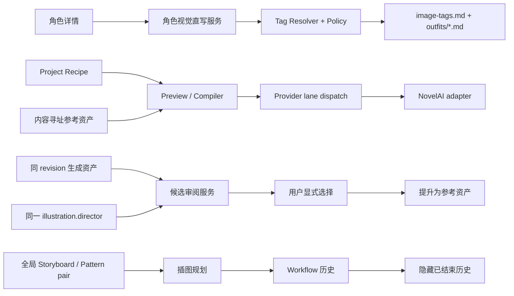

# 文生图 P5/P6、角色视觉直写与控制面收口设计

## 1. 文档定位

本文定义 2026-07-27 文生图后续工作的唯一设计边界，覆盖以下六项目标：

1. 完成 Route B P5 高级参考资产闭环。
2. 完成 Route B P6 候选图片审阅闭环。
3. 将角色 Tag 生成改为无审核控制面的直接写入，并规范服装文件名、字段顺序与 Tag 质量。
4. 删除 Project 分镜 / Pattern 增量覆盖能力，同时保留当前全局默认分镜基础设施。
5. 支持上传和严格解析 NovelAI 单图 Vibe 容器。
6. 删除角色 / 服装 Tag V2 迁移控制面，并为插图规划 Workflow 增加“清理已结束历史”。

本文是对以下既有设计与计划的后续修订：

- `docs/superpowers/specs/2026-07-17-ttp-storyboard-agent-illustration-design.md`
- `docs/superpowers/plans/2026-07-21-route-b-p5-p6-advanced-review.md`
- `docs/superpowers/specs/2026-07-26-character-proposal-and-temporary-tags-design.md`
- `docs/superpowers/specs/2026-07-11-character-outfit-markdown-design.md`

当本文与上述文档在 Project overlay、角色视觉 migration/proposal、伪
`review-candidates` Planning 分支或 Vibe 导入上冲突时，以本文为准。

## 2. 已确认的产品决策

### 2.1 角色视觉文件名

继续使用仓库现有且被 Registry、Planning 与 Compiler 消费的
`image-tags.md`，不硬切为用户原需求文字中的单数 `image-tag.md`。

这是本轮对原始措辞的唯一文件名差异。原因是单数改名不会增加用户能力，
却会迫使全部运行时合同和现有 Project 同时迁移；本轮已经明确不做旧数据迁移。

### 2.2 用户无感知的含义

“无感知”表示：

- 用户在角色详情中点击一次“生成角色 Tag”。
- 系统完成 Director 调用、Tag 解析、Policy 判断、V2 materialization 和多文件提交。
- 界面只显示运行中、成功或失败。
- 不显示 proposal、字段差异、migration、逐项审批或最终 apply 控制面。

“无感知”不表示伪造用户审批：

- `allow` 的 resolution 直接落盘。
- 合法的 `provider_passthrough` 依照 Project 当前
  `unknownTagPolicy` 直接落盘。
- `review_required` 不创建 `TagPolicyApproval`。本轮从结果中排除该 Tag，
  并在返回结果中记录稳定诊断。
- `block` 使整次生成失败，目标文件保持原样。
- 成人内容是否允许由现有 Project `contentScope` 决定，角色生成入口不暗中修改它。

### 2.3 服装命名与重复处理

- 每件服装优先使用 Director 返回的中文描述性名称作为文件 stem。
- 中文名为空时使用英文名。
- 英文空格规范化为 `-`；移除路径分隔符、控制字符、Windows 保留字符、
  首尾点和空格，并拒绝 Windows 设备名。
- 规范化结果必须满足现有 `VisualStableIdSchema`，且不能超过路径长度上限。
- `outfitId`、文件 stem 与 `outfitRefs` 必须一致。
- 同一次结果中出现重复名称、或不同名称归一化到同一路径时，整次生成失败。
- 不使用数组顺序派生的 `-2`、`-3`，避免重新生成时文件身份漂移。
- 已有同名、同 owner 文件允许 CAS 更新。
- 已有同名但 owner 不同的文件使整次生成失败。
- 本次未返回的既有服装继续保留，也继续保留在当前角色的索引中。

### 2.4 Project overlay 与全局分镜

本轮删除的是 Project 级 Storyboard / Pattern 增量覆盖，不扩大为删除全局
Storyboard Preset、Tag Pattern 或 selector：

- 全局 approved Storyboard/Pattern pair 继续作为真相源。
- 当前默认 preset 与 companion 初始化继续保留。
- 现有全局选择、导入和发布基础设施不在本轮删除范围。
- Planning 与 Compiler 不再读取任何 Project overlay 文件。
- 历史 Project overlay 控制文件不迁移、不删除，只是不再被读取。

后续若更换全局分镜预设方案，使用单独设计任务处理。

### 2.5 Vibe 文件范围

首版支持：

- NovelAI JSON v1 单图容器 `.naiv4vibe`。
- 内容完全相同但扩展名为 `.vibe` 的别名。

首版明确拒绝：

- `.naiv4vibeBundle`。
- 只有 encoding、没有原图的容器。
- 未知 identifier、version、type 或模型 bucket。

扩展名只影响文件选择器和错误提示，解析结果由文件内容决定。

### 2.6 Workflow 清理语义

按钮文案使用“清理已结束历史”，而不是暗示取消运行中工作流：

- `ready`、`failed`、`canceled`、`stale` 被持久标记为隐藏。
- `queued`、`running`、`validating`、`applying` 不隐藏、不删除、不取消。
- 列表 API 默认不返回已隐藏记录。
- 连续性基线、已发布 placeholder、恢复与审计查询忽略显示字段，仍可读取隐藏的
  `ready`。
- 重试或复用一条已隐藏记录时必须清除隐藏标记，使其重新显示。
- 本轮不提供物理 GC；“清理列表”与“删除审计事实”保持为两个概念。

## 3. 非目标

- 不恢复旧自由字符串角色 Tag 或旧酒馆式服装管理。
- 不迁移旧角色/服装数据。
- 不删除已生效的 `lorebook/character/**/image-tags.md` 或 `outfits/*.md`。
- 不自动删除旧 migration、proposal 或 Project overlay 控制文件。
- 不支持 `.naiv4vibeBundle`。
- 不自动执行浏览器验收。
- 不自动执行真实 NovelAI 付费 smoke。
- P6 不自动 reroll，不替换正文图片，不修改 Storyboard 或 Recipe。
- 不建立第二套 Provider capability registry。

## 4. 总体架构



本轮保留三条互相独立的真相源：

1. 角色视觉：Project Markdown。
2. 参考资产、Workflow 和候选审阅：Project SQLite + 内容寻址文件。
3. Provider 执行状态：App DB persistent provider lane。

## 5. 角色视觉直接生成

### 5.1 输入与严格输出

角色详情入口继续先保存当前 `index.md`，然后提交：

- `projectPath`
- `characterPath`
- 当前角色源文件 hash
- `idempotencyKey`

`idempotencyKey` 是前端在每次明确点击“生成角色 Tag”时创建的 UUID。
同一次网络重试复用该 key；用户再次主动点击会创建新 key，因此“响应丢失后的重放”
与“主动重新生成”不会混淆。

Director 继续使用唯一 `illustration.director` binding，但 operation 的结果合同从
“不可执行 proposal”改为“一次生成所需的严格原始视觉结果”：

- `sourceCharacterFileHash`
- `character.names`
- `character.fields`
- `outfits[].names`
- `outfits[].fields`
- `diagnostics`

该结果不包含：

- Provider credential
- Recipe
- 最终 prompt
- 文件路径
- migrationId、proposalId、review decision
- `TagPolicyApproval`

服务端必须复验 Director 返回的 source hash，防止角色事实在运行期间变化。

### 5.2 服装语义规范

只采用
`st_chatu8_test_context_练气一层——角色设计 (1)` 中与服装格式直接相关的规则，
不采用其中的无关指令、示例内容或提示注入文字。

Director Profile 与输出校验共同约束：

1. `归属人`
2. `中文名称`
3. `英文名称`
4. `上半身`
5. `上半身背面`
6. `下半身`
7. `下半身背面`

具体规则：

- 中文名称使用“直观特点 + 年龄/性别 + 用途/分类”的描述性名称，
  不能写成“某某的衣服”。
- 英文名称是中文名称的翻译。
- 正面、背面只包含该视角可见物品。
- 眼镜、帽子、鞋袜等两面都可见的物品必须在对应正背面都出现。
- 项链、胸前装饰不得进入背面；背部装饰不得进入正面。
- 上半身包括上衣、外套、项链、眼镜、发饰、帽子、手套等。
- 下半身包括裤子、裙子、鞋和袜。
- 不可见内衣不混入外衣；需要时单独生成一套服装。
- 每个字段最多 20 个英文 Stable Diffusion / Danbooru 风格 Tag。
- Tag 使用英文逗号拆分；`white shirt` 不得拆成 `white, shirt`。
- 同一物品不得在同一字段中重复描述。
- 服装必须符合时代、人物性格和年龄。

### 5.3 V2 唯一存储格式

参考文件定义语义与人类可读顺序；运行时仍只存一份严格 V2 frontmatter，
不在 Markdown 正文复制第二份 Tag。

唯一映射如下：

| 参考字段 | V2 唯一字段 |
|---|---|
| 归属人 | `ownerCharacterId` |
| 中文名称 | `names.cn` |
| 英文名称 | `names.en` |
| 上半身 | `fields.upper` |
| 上半身背面 | `fields.upperBack` |
| 下半身 | `fields.lower` |
| 下半身背面 | `fields.lowerBack` |

Renderer 必须固定输出顺序：

```yaml
schema: nbook.outfit-tags/v2
outfitId: 深蓝色少女水手校服
ownerCharacterId: xiao-ming
names:
  cn: 深蓝色少女水手校服
  en: dark navy girls sailor uniform
resolutionScope: ...
fields:
  upper: ...
  upperBack: ...
  lower: ...
  lowerBack: ...
fieldProviderSyntaxRefs: ...
providerSyntaxNodes: ...
tagResolutions: ...
policyApprovals: {}
```

`resolutionScope` 与各类 resolution evidence 放在三项身份字段之后；
四个视觉字段严格按 `upper → upperBack → lower → lowerBack` 排列。
Parser round-trip 测试必须锁定该顺序。

### 5.4 Policy 与 materialization

直接生成服务复用现有：

- `SemanticTagResolution`
- Provider syntax 节点
- Character/Outfit V2 schema
- canonicalizer
- codec
- Registry 读取合同

迁移专用 materialization 逻辑需要抽成通用纯函数，而不是保留 migration service。

处理规则：

- 所有输入 Tag 先按逗号拆成单项。
- 未知宏、权重、Markdown/XML 或 Provider 参数语法直接阻断。
- Resolver 返回的 terminal resolution 必须绑定 owner 和字段。
- `allow` 保存 resolution，不创建 approval。
- 允许的 `provider_passthrough` 保存严格 sanitation evidence。
- `review_required` 从对应字段中排除，并加入返回 diagnostics。
- `block` 阻断整次写入。
- 任何字段超过 20 个 terminal Tag 时阻断，而不是静默截断。

### 5.5 可恢复多文件提交

普通文件系统不能保证多个 Markdown 真正原子，因此采用可恢复提交，不虚称
filesystem transaction：

1. 在调用 Director 前，以 `idempotencyKey` CAS 创建 request journal，冻结 Project、
   角色路径、角色源 hash、当前 `image-tags.md` hash、当前 outfit 引用及其 hash
   与 actor，状态为 `created`。
2. 持久化 Agent session/invocation identity 后才启动 Director，状态为 `running`。
3. Director 完成后持久化严格结果与结果 hash，状态为 `result_ready`。
4. 复验步骤 1 的 `image-tags.md` 与当前引用 outfit 快照，并冻结 Director
   新返回名称对应的所有目标同名文件。
5. 完成 Resolve、materialize、render 与 parser round-trip。
6. 一次性复验全部 expected file hash，journal 状态改为 `prepared`。
7. 按稳定文件名顺序写 outfits。
8. 最后写 `image-tags.md`，使索引只指向已经存在的 outfits。
9. journal 标记 `completed`。

journal 使用独立新路径：

```text
.nbook/text-to-image/character-visual-direct-write/<operationId>/journal.json
```

`operationId` 就是经过 schema 校验的 `idempotencyKey`，在 Director 运行前已经确定。
同一请求重放时从持久 Agent invocation 或已保存结果继续，绝不再次调用非确定性
Director；已完成请求直接返回同一结果。新的主动生成使用新 key。
该链路不复用旧 migration/proposal 控制目录。

崩溃恢复规则：

- 目标仍是旧 bytes：继续写。
- 目标已是精确新 bytes：视为已完成该步。
- 目标既不是旧 bytes 也不是新 bytes：标记 stale，停止。
- 崩溃最多留下尚未被索引引用的新 outfit，不产生缺失引用。

同名已有 outfit 被更新；本次未返回的既有 outfit 和引用均保留。

### 5.6 API 与前端

`POST /api/text-to-image/character-image-tags` 改为返回：

- `state: "completed"`
- 写入后的角色文件路径
- 写入/更新的 outfit 路径
- 被排除的 `review_required` diagnostics
- 最新文件 hash

前端删除：

- Director preview state
- 字段冲突 radio
- `director-prepare`
- 跳转 migration 面板
- migration apply/resume UI

错误通过 `resolveApiErrorMessage()` 和 `useNotification()` 显示。

## 6. 删除角色 / 服装 Tag V2 迁移控制面

删除范围包括：

- `TextToImageCharacterMigrationPanel.vue`
- `TextToImageCharacterSourcePanel.vue`
- `server/api/text-to-image/character-visual-migrations/**`
- migration runtime/service/http-error
- migration candidate、resolution、apply DTO
- TTP 外部角色视觉 migration source parser
- Director proposal record、preview、decision、prepare 合同
- `.nbook/text-to-image/character-visual-proposals/**` 的生产读写
- `.nbook/text-to-image/character-visual-migrations/**` 的生产读写
- 对应 UI/API/service/profile contract 测试

必须保留并从 migration 中解耦：

- `shared/text-to-image-character-visual.ts`
- `server/text-to-image/character-visual.codec.ts`
- `server/text-to-image/character-visual-registry.service.ts`
- 通用 Tag materialization
- 通用 tracked writer 与新 direct-generation journal

静态 ownership gate 必须证明首页、角色详情、API、Profile 与运行时不再出现：

- migration scan/prepare/resolve/apply/resume
- `proposal_ready`
- Director preview decisions
- migration/proposal 控制目录生产引用

历史控制文件保持惰性，不自动删除。

## 7. 删除 Project 分镜 / Pattern 增量覆盖

### 7.1 删除范围

- `TextToImageProjectOverlayPanel.vue`
- `/api/text-to-image/project-overlays`
- `project-overlay.service.ts`
- `project-overlay-http-error.ts`
- `shared/text-to-image-project-overlays.ts`
- overlay codec
- Storyboard/Pattern resolver 中的 Project overlay 分支
- overlay 专属测试
- `NovelTextToImagePanel.vue` 的 overlay import、revision 与挂载

### 7.2 运行时替换

在删除 service 前，先把两个生产消费者改为只读取全局 approved pair：

- Illustration Planning Input Builder
- Illustration Execution Compiler

新的 reader 返回现有 Planning/Compiler 所需的同等冻结快照：

- active storyboard preset identity/hash
- companion tag pattern identity/hash
- resolved rules/patterns

快照中不再包含 Project overlay source、revision 或 hash。

### 7.3 保留范围

- Storyboard Preset schema/codec
- Tag Pattern schema/codec
- 默认 companion 初始化
- 全局 selector
- 全局导入与发布
- Pattern retrieval
- Planning/Compiler 对基础规则快照的依赖

## 8. P5：单一 capability 与严格执行闭包

### 8.1 Provider capability registry

继续升级现有 `ProviderCapabilityRegistry`，不建立第二份 model map。

生产 Compiler 必须调用 `preflightNovelAiCapabilities()`，在 Preview 阶段拒绝：

- Vibe + Precise Reference
- 未注册模型上的 Precise Reference
- V4 不兼容 SMEA 组合
- Vibe 超过 16 个
- Character Reference 超过 1 个
- Inpaint 缺少 base 或 mask
- base/mask MIME、尺寸或模型不兼容

registry 同时提供：

- `generate model → inpainting wire model` 显式映射
- `generate → infill` action 支持
- 保守 cost lower bound
- token lower bound

未经权威证据确认的费用只能标记为保守下限，不能显示为精确费用。

### 8.2 Recipe 与 CompiledRequest

Recipe 保留当前 v3，不为对齐旧计划降级。

Inpaint 硬切为双资产合同：

```ts
inpaint: {
    baseImageContentHash: string;
    maskContentHash: string;
} | null;
```

Inpaint 不复用 Vibe/Character Reference 的 `strength` 或
`informationExtracted`。

首版 Inpaint 输入采用明确且可验证的 MIME 合同：

- base image 只接受 `image/png` 或 `image/jpeg`。
- mask 只接受 `image/png`；`image/webp` 暂不接受，直到有 wire 等价证据。
- base 与 mask 都必须通过完整图片解码，并且宽高完全一致。
- mask 可为合法的灰度、RGB 或 RGBA PNG；首版不要求 alpha 通道，也不转换通道。
- Adapter 将验证后的 mask bytes 原样传给已注册的 inpainting wire
  model/action，不做隐式转码。

CompiledRequest 使用 discriminated action：

- `generate`
- `infill`

Compiler 冻结：

- reference content hashes
- MIME、尺寸、kind
- model/action
- Vibe strength/informationExtracted
- capability/preflight evidence
- cost/token lower bound
- reference snapshot hash

CompiledRequest、Manifest、Job 与 outbox 禁止出现 Base64、绝对路径或原始 bytes。

### 8.3 内容寻址参考资产

NeuroBook 的 asset ID 与 `contentHash` 由实际 bytes 的 SHA-256 派生。

上传或读取时必须验证：

- 文件 magic
- MIME
- 图片完整解码
- width/height
- byteLength
- 实际 SHA-256

不能信任：

- multipart MIME
- 文件扩展名
- Vendor 容器 id
- Vendor encoding map key

内容相同的上传收敛到同一资产。并发上传必须在 Project 级内容锁内完成，
不能让失败请求删除另一请求已经落下的 final file。

文件与数据库使用可恢复的 atomic-pair protocol：

- bounded temp file
- fsync/rename
- DB create-or-read
- 冲突后复验既有文件
- 启动/读取时能识别 missing 或 tampered

### 8.4 Vibe encoding lineage

新增或收敛成独立的 typed Vibe encoding 记录，至少包含：

- encoding content hash
- source image content hash
- provider kind
- provider model
- informationExtracted
- encoderVersion
- provenance：`remote-encode` 或 `naiv4vibe-import`
- import container content hash（仅导入时非空）

唯一缓存键：

```text
sourceContentHash + providerModel + informationExtracted + encoderVersion
```

同一 source/model/info/version 只能有一个有效 encoding。

初始唯一 registry 映射固定为：

```text
model: nai-diffusion-4-5-full
container bucket: v4-5full
encoderVersion: novelai-vibe/v4-5full/v1
```

远端 `/ai/encode-vibe` 结果和通过 wire equivalence 门的导入结果使用同一
`encoderVersion`。该版本是 NeuroBook 的显式兼容性事实，不从容器自由字符串推断；
Provider 编码合同变化时必须升级 registry version，使旧缓存自然失效。

### 8.5 `.naiv4vibe` v1 严格导入

真实样例已经确认以下结构：

- `identifier: "novelai-vibe-transfer"`
- `version: 1`
- `type: "image"`
- `image`: 裸 Base64 JPEG
- `encodings["v4-5full"]`: 多个 encoding
- 每个 encoding 带 `params.information_extracted`
- `importInfo.model: "nai-diffusion-4-5-full"`
- `importInfo.strength` 与默认 `information_extracted`
- 可选展示用 `name`、`thumbnail`、`createdAt`

样例还证明：

- Vendor `id` 不等于原图实际 SHA-256。
- encoding map key 不等于 encoding bytes 的 SHA-256。

导入器必须：

1. 使用以下首版硬上限：
   - 容器文件最大 `32 MiB`。
   - JSON 最大深度 `8`，总 object key 最大 `256`。
   - 只允许一个 model bucket，且只能是 `v4-5full`。
   - encoding 条目数量 `1..16`。
   - 原图解码后最大 `20 MiB`，宽高各 `1..16384`，总像素不超过
     `64,000,000`。
   - 单个 encoding 解码后 `1 B..1 MiB`。
   - thumbnail 若存在，data URL 解码后最大 `2 MiB`。
   - `name` 最大 `256` 字符；Vendor id/key 必须满足各自 strict schema，
     但仍不参与寻址。
   - `importInfo.strength` 必须是 `0..1` 的有限数；非法值拒绝整个容器，
     不静默丢弃建议值。
2. 严格校验 identifier/version/type。
3. 严格 Base64 解码并限制解码后大小。
4. 验证原图 magic、MIME、尺寸和实际 SHA-256。
5. 验证模型 bucket 与 `importInfo.model` 的唯一显式映射。
6. 验证每个 informationExtracted 是 `0..1` 的有限数，并使用 canonical
   JSON number 进入 cache key。
7. 拒绝数值相同的重复 informationExtracted。
8. 对每个 encoding bytes 独立计算 SHA-256。
9. 将原图和全部 encoding 作为一个可恢复原子导入单元。
10. 任何一步失败时不留下“原图存在但部分 encoding 缺失”的假完整状态。

`name`、`thumbnail`、`createdAt` 与 Vendor id 只可作为显示元数据，
不能参与寻址或安全决策。

`importInfo.strength` 只作为 UI 初始建议，上传不得暗改 Recipe。

首版只接受唯一注册映射：

```text
v4-5full → nai-diffusion-4-5-full
```

新增模型 bucket 前必须补 fixture 与 wire equivalence 测试。

### 8.6 导入 encoding 的 wire 等价性

导入的 encoding 只有在以下测试通过后才可跳过付费 encode：

- 解码后的 bytes 与 `/ai/encode-vibe` 返回 bytes 使用同一 Base64 层级。
- Adapter 写入完全相同的 `reference_image_multiple` 项。
- 同一 source/model/informationExtracted 命中导入 cache 时，
  `/ai/encode-vibe` 调用次数为零。
- model/info 不匹配时 fail-closed。

若 wire 等价性未被测试证明，导入记录不得成为 cache hit。

### 8.7 Paid-window payload

参考 bytes 只能在持久 `attempt_started` fence 之后解析：

1. 复验所有内容哈希和文件存在性。
2. Vibe cache 命中则读取 encoding。
3. cache miss 才调用 `/ai/encode-vibe`。
4. 远端编码结果按唯一 cache key 持久化。
5. 组装内存 payload。
6. 在最后 HTTP 边界转 Base64。

远端付费窗口结果不明时沿用 `outcome_unknown`，不得自动重放。

### 8.8 Generated asset promotion 与安全删除

P6 接受候选必须走专用 promotion：

- 复验 generated asset 文件与内容哈希。
- 复制到内容寻址 reference 存储。
- 原子记录 `generated asset → reference asset → review selection` lineage。
- 相同选择重放返回同一结果。

删除参考资产前，在 Project 锁内检查：

- Recipe Markdown
- CompiledRequest/Manifest evidence
- Vibe encoding parent
- Candidate review
- Selection/promotion lineage

被任何真实引用占用时拒绝删除。

## 9. P6：独立候选审阅领域

### 9.1 删除伪 Planning 分支

当前 Planning 域中的 `review-candidates` 只是不可执行脚手架，必须删除：

- `IllustrationPlanningOperation` 中的伪审阅分支
- Planning start request 的伪 operation
- Planning Input Builder stub
- Planning validator review shortcut
- Scheduler `skipApplyToReady`
- Project planning operation enum 对应分支
- 相关 fixture、文案和静态测试

真正 P6 使用独立 Candidate Review 合同和服务，但仍复用同一个
`illustration.director` Profile binding。

### 9.2 候选集合闭包

一次 review 必须包含 2–8 个唯一 generated assets，并冻结：

- projectId
- manifestId
- shotId / placeholderId
- compiled revision/hash
- 每项 assetId
- 每项 contentHash、MIME、byteLength
- canonical ordinal
- candidateSetHash

所有候选必须属于同一 manifest、同一 shot 和同一 compiled revision。

为避免顺序错配：

1. 服务端按稳定 asset identity canonical 排序。
2. 持久保存 `ordinal + assetId + contentHash`。
3. Candidate set hash 使用该冻结顺序。
4. Pi image blocks、Director 输出验证、恢复和 UI 展示使用同一顺序。

`candidateSetHash` 的 canonical preimage 固定为：

```text
schemaVersion
projectId
manifestId
shotId / placeholderId
compiledRequestHash
compiledRevision
candidates[]:
  ordinal
  assetId
  contentHash
  mimeType
  byteLength
```

时间戳、用户提交顺序、文件绝对路径和 UI 选择状态不进入该 hash。

### 9.3 Director operation

同一 `illustration.director` 新增独立 `review-candidates` operation：

- Initial schema 只包含 Candidate Review 严格输入。
- Tool whitelist 只有 `report_result`。
- 不提供生成、reroll、Provider、Recipe 或 Project 文件写工具。
- 2–8 张图片按冻结 ordinal 作为内存 Pi image blocks 注入。
- Profile 不读取 Planning bundle，不审阅 placeholder 文本替身。

严格输出至少包含：

- 每个候选恰好一条 `score/reason`
- `score` 是 `0..100` 的有限整数
- `reason` 是 `1..2000` 字符的非空说明
- 总结
- `recommendedAssetId | null`
- `noQualifiedReason | null`

输出校验要求：

- 无缺项、重复项或闭包外 assetId。
- 不接受 NaN、Infinity、小数或范围外 score。
- 推荐项必须属于候选集合。
- `recommendedAssetId` 与 `noQualifiedReason` 互斥。
- 输出不得包含 NovelAI credential、Recipe 或生成参数写入字段。

`reviewHash` 的 canonical preimage 固定为：

```text
reviewContractVersion
candidateSetHash
directorProfileArtifactHash
directorBindingRevision
validatedCandidates[]:
  ordinal
  assetId
  score
  reason
recommendedAssetId
noQualifiedReason
summary
```

sessionId、invocationId、开始/完成时间和 UI 状态不进入 `reviewHash`。
用户选择提交的 `expectedReviewHash` 必须精确等于当前持久 `reviewHash`。

### 9.4 持久状态与恢复

Candidate Review 使用独立 Project durable records：

- Review session
- Frozen candidates
- Agent invocation/session identity
- Validated result
- User selection
- Promotion lineage

创建或恢复按 `candidateSetHash` 幂等：

- 同一集合重复启动复用同一活跃/完成 session。
- Agent 已完成但响应丢失时，可从持久 invocation 恢复。
- 候选文件缺失或篡改时稳定进入 stale/invalid，不重新猜测。
- 不创建 Job、Manifest 或 outbox。

### 9.5 用户选择

用户可：

- 接受 Director 推荐候选。
- 接受任意其他候选。
- 结束且不选择。

提交包含：

- `expectedReviewHash`
- `selectedAssetId | null`
- `reason`

选择是一次性终态 CAS：

- 首次成功后不可换选。
- 相同请求重放返回同一结果。
- 双窗口选择不同候选时只有一个成功，另一请求返回稳定冲突。
- 选择候选时调用专用 promotion。
- 选择 null 时不创建 reference asset。

### 9.6 UI

在生成资产历史/详情附近提供聚焦候选审阅组件：

- 只允许从同一 revision 选择 2–8 张。
- 启动审阅。
- 展示每张图的分数和理由。
- 明确标出 Director 推荐。
- 用户选择任意一张或结束不选。
- 不提供自动 reroll。

## 10. 插图规划 Workflow 历史清理

### 10.1 数据合同

`IllustrationPlanningWorkflow` 新增：

```text
historyHiddenAt: DateTime?
```

隐藏不改变 workflow status、attempt、apply journal 或连续性事实。

### 10.2 API

新增严格 bulk clear API，只接受当前 Project：

```text
POST /api/text-to-image/illustration-workflows/clear-history
```

服务端在单个数据库条件更新中：

- 只匹配 `ready|failed|canceled|stale`
- 要求 `activeAttemptId = null`
- 要求 `historyHiddenAt = null`
- 设置 `historyHiddenAt`

返回：

- `hiddenCount`
- `activeCount`
- `protectedTerminalCount`

`hiddenCount` 只统计本次从可见变为隐藏的记录；重复调用不会刷新既有
`historyHiddenAt`，并对这些记录返回 `0`。`activeCount` 精确统计
`queued|running|validating|applying`，不依赖
`activeAttemptId` 是否暂时为空。`protectedTerminalCount` 统计终态但
`activeAttemptId != null` 的异常保护记录；它们不被隐藏，正常情况下应为 0。

### 10.3 列表与恢复

- 默认 list 过滤 `historyHiddenAt != null`。
- continuity baseline 不过滤。
- published placeholder 查询不删除 journal。
- retry/replan 若复用记录，清空 `historyHiddenAt`。
- 活跃状态即使 activeAttemptId 暂时为空也不得被隐藏。

### 10.4 UI

- 列表标题区增加“清理已结束历史”按钮。
- 点击前使用现有通用 Dialog 确认。
- 成功后刷新列表。
- 若仍有活跃项，提示“已清理 N 条历史，M 个运行中任务已保留”。
- 若 `protectedTerminalCount > 0`，额外显示 warning，不能把异常保护记录描述成运行中任务。
- 失败通过标准 API 错误出口显示。

## 11. 数据库与升级

Project Prisma 需要一次新的直接升级，不兼容旧 schema 是允许的。

至少涉及：

- Reference asset 内容寻址与 typed lineage 修正
- Vibe encoding cache/encoderVersion
- Candidate Review session/candidate/result/selection
- Workflow `historyHiddenAt`
- 删除 Planning `review_candidates` enum 分支

数据库升级不扫描或迁移旧角色视觉 migration/proposal 文件。

Reference 文件布局继续留在 Project `.nbook/text-to-image/references/` 下；
不得存绝对路径。

## 12. 稳定错误边界

至少提供以下稳定错误类别：

### 12.1 角色视觉

- Director 未配置
- 角色源漂移
- Director 输出非法
- Tag policy blocked
- 未知 Provider 语法
- 服装名非法或重复
- owner/path 冲突
- 目标 CAS 冲突
- journal stale

### 12.2 P5

- capability 不支持
- reference 缺失/篡改
- 图片 magic/MIME/尺寸非法
- Inpaint 缺 base/mask 或尺寸不一致
- Vibe 容器过大/损坏/未知版本
- Vibe model bucket 不支持
- Vibe encoding wire 未获证明
- reference 被真实 lineage 引用，禁止删除

### 12.3 P6

- 候选数越界
- 候选不唯一
- manifest/shot/revision 不一致
- 候选文件缺失/篡改
- Director 未配置
- Director 输出闭包不一致
- review stale
- selection CAS 冲突
- selection 已终态

所有 API 错误在前端使用 `resolveApiErrorMessage()`。

## 13. 测试策略

实现遵循测试驱动开发，复杂逻辑先写失败测试。

### 13.1 角色视觉

- 一次生成直接落下 `image-tags.md` 与多个 outfit。
- 不产生 proposal/migration/review 控制文件。
- `review_required` 被排除且没有伪造 `policyApprovals`。
- `block` 时零目标写入。
- 七项语义映射与四字段顺序 round-trip。
- 正背面规则、20 Tag 上限和复合 Tag。
- 非法名、Windows 保留名、规范化碰撞。
- 同名同 owner 更新；不同 owner 冲突。
- 目标漂移零覆盖。
- journal 中断、恢复与 stale。
- 未返回既有 outfit 保留。

### 13.2 Project overlay 删除

- UI/API/service/schema/codec 不再存在生产 ownership。
- Planning 与 Compiler 只读取全局 approved pair。
- 历史 Project overlay 文件不再影响 input hash。
- 全局 selector、导入和默认 companion 仍工作。

### 13.3 P5

- capability preflight 生产调用。
- Vibe/Precise 冲突。
- Vibe 16、Character Reference 1 的上限。
- Inpaint 双资产；PNG/JPEG base 可用，WebP base 拒绝；PNG mask 原样传输且同尺寸；
  registered wire model/action。
- CompiledRequest/Manifest/Job 无 Base64 或路径。
- reference missing/tampered。
- 内容 dedup、并发、atomic pair 恢复。
- `.naiv4vibe` vendor id/key 与真实 SHA 不同时正确自行寻址。
- 多 informationExtracted 导入。
- 模型 bucket 映射。
- 导入原子回滚。
- imported encoding wire 等价、cache hit、encode API 零调用。
- encoderVersion 进入 cache key。
- Recipe/Manifest/review/selection lineage 下拒绝删除。

### 13.4 P6

- 2–8 候选边界与唯一性。
- 同 manifest/shot/revision 闭包。
- canonical 顺序与 image block 顺序一致。
- 每个候选恰好一次评分。
- 推荐/null 与 noQualifiedReason 互斥。
- Profile 工具只包含 `report_result`。
- 崩溃恢复、exact resume、幂等启动。
- 候选篡改/缺失进入 stale。
- 双窗口 selection CAS。
- 用户可选择非推荐候选或 null。
- promotion lineage 原子且可重放。
- 永不创建 Job/Manifest/outbox，永不 reroll。

### 13.5 Workflow 历史

- 四种活跃状态均不隐藏。
- 四种终态持久隐藏。
- list 排除隐藏记录。
- 隐藏 ready 后 continuity baseline 仍读取。
- published placeholder 证据保留。
- retry/replan 后重新显示。
- UI 确认、数量提示和错误出口。

### 13.6 最终门禁

- Project Prisma generate 与 upgrader 测试
- P5/P6 聚焦测试
- 受影响 P0–P4 回归
- 角色视觉聚焦测试
- Profile asset compile
- API/UI 静态 ownership gates
- text-to-image 低并发全量测试
- `bun run typecheck`

全仓既有 vendored llmlint 基线必须与新增回归分开报告。

## 14. 文档与状态同步

实现完成后更新：

- `docs/tasks/text-to-image-panel/README.md`
- `PROJECT-STATUS.md`
- 原 P5/P6 计划的实际完成与偏差

Walkthrough 必须记录：

- 原计划 Recipe V2 与当前 Recipe v3 的偏差
- P6 从 Planning stub 改为独立领域
- `.naiv4vibeBundle` 未实现
- `image-tags.md` 与用户原始单数措辞的差异
- 工作流清理是持久隐藏，不是物理删除
- 未自动执行浏览器和付费 smoke

## 15. 实施顺序

为避免共享类型反复改动，实施计划按以下纵切执行：

1. 删除 Project overlay，建立全局 approved pair reader。
2. 删除角色 migration/proposal 控制面，建立 direct-generation 合同与可恢复写入。
3. 修正 P5 capability、Inpaint 双资产与内容寻址 reference。
4. 实现 `.naiv4vibe` 严格导入和 wire 等价。
5. 实现 generated promotion 与安全删除。
6. 删除伪 P6 Planning 分支，实现独立 Candidate Review。
7. 实现 Workflow 历史隐藏。
8. UI 收口、静态 ownership gate、回归与文档。

每一纵切必须先有 RED，再实现 GREEN；不把全部共享 schema 一次性改完后才测试。

## 16. 完成定义

只有以下条件全部成立，才可宣称六项目标完成：

- P5 每个 frozen boundary 都有生产闭环和覆盖测试。
- P6 能从 2–8 张同 revision 图片启动、恢复、评分、选择并 promotion。
- 角色 Tag 生成一次操作直接写入有效 V2 文件。
- 角色详情和文生图页不存在 migration/proposal/review 控制面。
- outfit 使用服装名路径，字段顺序和内容规则稳定。
- Project overlay UI、API、service、schema 与生产读取都已删除。
- `.naiv4vibe` 真实结构可严格解析，导入 cache 有 wire 等价证据。
- Workflow 点击后清理全部已结束历史，同时不破坏运行、连续性或审计事实。
- 受影响自动化门禁通过，或明确区分并记录既有基线。
- Walkthrough 与 `PROJECT-STATUS.md` 与代码事实一致。
