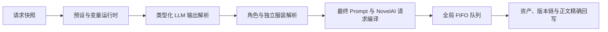

# chatu-8 预设完整兼容与统一图片后处理设计

> 状态：设计规格已完成，等待用户复核后进入施工计划
>
> 日期：2026-08-10
>
> 范围：Task 142 文生图工作台后续兼容施工

## 1. 目标

让 NeuroBook 在不复制 chatu-8 浏览器运行时、不引入第二套 Project 数据真相源的前提下，直接兼容用户提供的正文生图、角色设计、角色/服装展示和 Tag 修改预设，并完整走通：

1. 当前章节与同卷历史前文组装；
2. Lorebook、角色、角色所属服装和独立服装发送；
3. 跨预设条目的变量读写；
4. 角色设计、原创临时人物、角色调用和独立服装调用；
5. 分角色 Prompt、UC、坐标和分辨率到 NovelAI 的结构化请求；
6. 正文图片的历史切换、Tag 修改、单图 reroll 和局部重绘；
7. 所有 NovelAI 请求共用串行队列，并按配置间隔调度。

兼容目标是用户无需修改四份预设即可运行，而不是逐行移植 chatu-8 的 UI、localStorage 或其它 Provider 功能。

## 2. 已选方案

采用服务端统一结构化中间模型。正文生图、角色设计、角色/服装展示和 Tag 修改共享同一套请求快照、预设运行时、输出解析、调用解析与 NovelAI 编译能力。

未采用以下方案：

- 不为每份预设复制一条字符串拼装链路；这种方案短期快，但变量、角色调用、尺寸和 token 口径会继续漂移。
- 不整体移植 chatu-8 运行时；它依赖 SillyTavern 消息和浏览器状态，不符合 NeuroBook 的 Project 文件、安全路径和服务端真相源。
- 不创建持久化临时角色；原创人物只在当前 LLM 图片批次内复用内联 DNA。

## 3. 总体架构

各层职责如下：

- 请求快照固定 Project、请求类型、章节、历史、发送数据选择、附件、Provider、预设、配方和显式图片参数。界面之后的切换不能改变已发请求。
- 预设运行时只负责过滤启用条目、保持消息顺序和 role、执行变量、替换白名单占位符并组装附件。
- 输出解析器把多种兼容外壳转换为有类型的图片、角色和服装草稿，并产生逐块诊断。
- 调用解析器只负责角色/服装身份解析、视觉 DNA 展开、临时人物和歧义处理。
- 最终编译器完成分角色结构、配方合并、正负向去重、尺寸校验、token 参考统计和模型适配。
- 全局队列是所有 NovelAI 请求的唯一发送入口；资产服务负责不可变生成快照、版本链和正文 CAS 回写。

前端只负责选择、编辑、预览和显示状态，不自行拼接最终 NovelAI Prompt，也不重新实现 token 或角色调用算法。

### 3.1 Novel IDE 宿主边界

- 文生图入口挂在当前 Novel IDE 的 Activity Bar 与 Workbench 宿主中；它是 Novel Project 的项目能力，不是用户资产、账户或全局设置页面的独立数据源。
- 只有当前活动对象是已打开的 Novel Project 时，正文生图、角色、服装、Lorebook、章节和正文位置上下文才可用。切换到用户资产、账户或其它非 Project 工作区时，关闭文生图弹窗并清空项目级编辑上下文，不发起新的 Project 请求。
- 前端只提交当前 Project 的受控标识；Project Root、章节路径、Lorebook 路径和资产路径由服务端解析并执行 containment 校验，不能由浏览器直接拼接或越界读取。
- 宿主升级不改变文生图的请求快照、结构化编译、资产版本链和正文 CAS 合同；入口迁移只改变挂载位置，不产生第二套工作台状态。

## 4. 配置作用域与请求快照

### 4.1 全局配置

以下数据继续属于 Workspace Root 全局配置：

- LLM Provider、模型参数、请求类型绑定和上下文预设；
- NovelAI API 配置；
- 可保存的多组“画风串 + 模型参数”生图配方及当前生效配方；
- NovelAI 生图间隔。

LLM 设置新增历史前文回填深度，范围 `0–20`，默认 `1`。`0` 表示不回填历史。

LLM 设置中的 `maxTokens` 只表示允许 LLM 回复的最大输出 token，并映射到 Provider 对应的输出上限字段。它不是输入上下文容量，不得用于比较、裁剪或拒绝预设、历史、Lorebook 和图片附件。

NovelAI 生图间隔最低为 `15s`。缺失、非法或小于 `15s` 的旧值归一化为 `15s`。

### 4.2 Project 配置

文生图工作台新增“发送数据”分页。以下选择按 Current Project 持久保存，切换 Project 时不继承：

- 可发送的 Lorebook 条目；
- 可发送的角色；
- 可发送的独立服装。

每次 LLM 请求开始时固定这些选择及其内容、视觉资料和图片附件快照。后续勾选变化只影响下一次请求。

“发送数据”只接受 Project 内合法的 `lorebook/**/index.md` 内容节点和服务端返回的实体 ID，不接受任意绝对路径或前端提交的伪造正文。

## 5. 历史前文与发送数据

历史深度按当前章节之前、同一卷内的章节数计算。默认 `1` 表示紧邻上一章；本章是本卷第一章时上下文为空，禁止跨卷。选中多章时按从旧到新的正文顺序组装，再发送当前章节。

历史章节源 `.md` 始终只读。服务端只在构造发送给 LLM 的 `{{上下文}}` 副本时移除完整的 `<image>...</image>` 块，不清理、保存或改写上一章文件。当前章节使用编辑器请求时的正文快照填充 `{{正文}}`。

发送列表的兼容投影为：

- `{{角色启用列表}}`：Project 中本次选中的角色及其所属服装；
- `{{通用角色启用列表}}`：同一 Project 角色集合的兼容投影；渲染每条消息时，去除该消息的 `{{角色启用列表}}` 已经输出的同一角色，但不把角色跨消息永久消耗；
- `{{通用服装启用列表}}`：本次选中的 Project 独立服装；
- `{{世界书触发}}`：本次选中的 Lorebook 条目，按保存顺序组装。

角色所属服装和独立服装是两个不同入口。角色所属服装随角色条目发送；独立服装只进入通用服装列表。

图片附件同时受 Project 发送选择和 LLM Provider 的 `sendImages` 总开关控制。附件只允许读取受控 Project 资产；关闭 `sendImages` 时仍发送文本列表，但不附加图片。

## 6. 预设运行时与变量

导入预设时保留条目的 `id`、`name`、`role`、`enabled`、`content`、`triggerMode`、`triggerWords` 和原始顺序。`enabled=false` 的条目不参与请求，兼容处理不得将其重新启用。

选中预设拥有完整消息合同。服务端不得在其后再追加另一套固定 system/user 输出规则。请求类型绑定决定使用哪个 LLM Provider 和哪个预设；角色管理界面不再重复选择 LLM 模型。

运行时只替换已登记的 NeuroBook/chatu-8 变量和明确变量指令。普通 NovelAI 权重写法或未知 `{{...}}` 保留原文，并返回非阻塞警告。

变量分为两个请求级作用域：

- 普通变量；
- 世界书变量。

过滤后的启用条目按顺序执行，前一条目的 `setvar` 对后一条目的 `getvar` 可见；支持点路径。两个作用域都在单次请求结束后销毁，不跨请求、批次或 Project 保留。非法变量语法在调用 LLM 前报错；读取不存在的变量返回空字符串并记录警告。

## 7. LLM 输出兼容

共享输出解析器接受：

- `<images><image>...</image></images>`；
- 独立 `<image>...</image>`；
- 旧式 `image###...###`。

解析器只移除已识别的 `<thinking>`、`<tag_think>`、`<imgthink>`、`<disclaimer>` 等思考/说明外壳，不把整个 LLM 回复误当 JSON。

正文生图保留所有合法图片块；角色/服装展示和 Tag 修改取最后一个合法图片块，并在存在额外合法块时显示警告。单个坏块只使该项失败；根结构无法识别时才使整个批次失败。

角色设计兼容 `<角色设计>` 下的多个人物和多套服装。解析结果保留原始出现顺序、显式归属人和“位于哪两个人物之间”的隐式归属关系，支持：

- 单人人物及服装；
- 多人物及服装；
- 独立服装；
- 仅修改人物。

## 8. 角色、服装与原创人物

### 8.1 调用边界

角色/服装调用使用识别字符串、转义符和嵌套花括号的平衡扫描，提取完整 `${...}$`。外层花括号属于 JSON 对象边界，不能被截掉。解析错误必须返回完整调用片段位置和具体字段，不能再出现只剩 `"name":...` 的截断报错。

调用对象含 `angle` 时按角色处理；不含 `angle` 时按独立服装处理。

- 角色的 `upperBody`、`lowerBody` 接受 `sfw`、`nsfw`、`hidden`；
- 独立服装接受 `visible`、`hidden`；
- `angle` 原文保留给构图 Prompt，视觉正背面另行推导；标准化角度包含 `from behind`、`from back` 或 `back` 时选背面 DNA，其余选正面 DNA。

### 8.2 身份解析

稳定实体 ID、中文名、英文名和触发名属于同一身份。LLM 结果写入角色资料时，中文名自动加入别名集合；正文命中中文名、英文名或任一触发名都视为同一角色。

解析顺序为：

1. 稳定 ID；
2. 精确别名；
3. 唯一模糊匹配。

本次发送选择中的实体优先于 Project 全量实体。多个候选同样匹配时必须报歧义，不能任选第一项。

角色所属服装只能在该角色下解析。独立服装从 Project 独立服装索引解析，并继承最近一个角色调用的正背面；没有前置角色时默认正面。

### 8.3 原创临时人物

当 LLM 输出的是完整原创人物 DNA，而不是仅有名称的未解析调用时，服务端在当前 LLM 图片批次中建立内存映射。同名人物在该批次的后续图片中重复内联完全相同的 DNA；新批次重新生成。

原创临时人物不写文件、不创建 Project 角色、不进入发送选择，也不提供提升为正式角色的隐式操作。只有名称但没有完整 DNA 的未命中调用直接报错。完全没有人物的场景按纯场景图处理。

### 8.4 角色设计与展示

角色设计 LLM 结果先进入批次审核，确认前零持久化。每个人物和服装分别选择“新建／更新／跳过”，并选择是否加入当前 Project 的发送数据选择；同名实体不静默覆盖。最终确认采用原子提交，任何一项写入失败都不留下部分结果。

角色照片和独立服装照片均使用同一四步链路：LLM 生成展示 Prompt、用户编辑确认、NovelAI 出图、保存到对应视觉资料。删除视觉资料只删除 `visual.json` 及其登记照片，不删除原始角色 Markdown。

一个 Project 对用户只显示一个角色集合，不再提供角色分组新建、重命名和删除入口。旧 `groupId` 仅作为迁移输入。

## 9. 分角色结构与 NovelAI 编译

图片中间模型包含：

- 场景正向 Prompt 和场景 UC；
- 按顺序排列的 `character_1` 至 `character_4`；
- 每个角色的正向 Prompt、UC、中心坐标和来源信息；
- LLM 尺寸候选、最终配方和显式覆盖参数。

最多允许四名分区角色。`a–e` 和 `1–5` 坐标映射为 `0.1 / 0.3 / 0.5 / 0.7 / 0.9`；位于 `0–1` 闭区间的合法数值坐标原样接受。角色超过四名或坐标非法时返回结构错误，不静默丢弃角色。

NAI4/NAI4.5 把场景写入 `base_caption`，把每个角色的正向/负向内容和坐标写入对应角色结构。NAI3 不支持同等分区能力时降级为稳定顺序的扁平 Prompt，并返回可见兼容警告。

最终正向与负向 Prompt 分开编译，顺序为：角色/服装调用展开、场景与角色结构、画风串、固定串、质量串。去重只删除归一化后完全相同的 tag，保留权重、强调语法、角色作用域和先后顺序。

## 10. 分辨率合同

尺寸解析接受 `x`、`X`、`×`、空格、中文/英文标签及中文逗号分隔的多个候选；存在多个候选时取最后一个合法尺寸。

优先级固定为：

1. 统一后处理弹窗中的显式尺寸；
2. LLM 输出的合法尺寸；
3. 当前生图配方尺寸。

非法 LLM 尺寸返回警告并回退到当前配方；非法显式尺寸阻止本次提交，因为它代表用户直接选择。最终尺寸还需通过当前 NovelAI 模型能力校验，并作为 Job 不可变快照保存。

分辨率是可见高级参数，不使用隐藏长按手势。

## 11. Token 语义

服务端最终编译预览返回：

- 当前正向/负向 token：角色调用展开后、配方合并前；
- 最终正向/负向 token：配方合并和去重后；
- 各来源贡献的参考拆分。

NovelAI Prompt token 数量只用于提示可能的模型性能下降。超过任何建议范围都不得禁用按钮、拒绝入队、截断 Prompt、删除 tag 或重排结构，请求仍原样发送。

LLM 输入 token 如需显示，同样只作参考。LLM `maxTokens` 只控制回复最大输出，不得误用为输入或生图门禁。

只有 JSON、调用、尺寸、坐标或模型载荷等真实结构无效时，才能阻止构造请求。

## 12. 统一图片后处理

### 12.1 入口和布局

正文中已生成图片长按 `3s` 打开统一 `Dialog size="xl"`。按压期间显示进度；指针移动超过阈值或收到 `pointercancel` 时取消。现有可见图片动作、右键或键盘提供等价入口，`3s` 长按不是唯一入口。

弹窗使用现有 Novel IDE 主题变量和通用 Dialog，不引入独立硬编码主题。上方是固定比例的同位置历史预览，包含序号、总数和左右点击区域；下方是完整 Prompt、token 参考、可见分辨率/高级参数和操作栏。弹窗具备 dialog ARIA、焦点陷阱、初始焦点和关闭后的焦点恢复。

### 12.2 位置版本链

同一正文图片位置通过稳定、可往返保存的非可见位置锚点和 `sourceAnchorId` 建立版本链。打开弹窗时固定 Project、来源章节、位置锚点、预期当前资产和正文内容版本。

左右切换只更新弹窗预览。关闭弹窗后，最后选中的资产才通过服务端 CAS 写回打开时的原图片节点。相同图片路径在正文出现多次时只更新目标节点；匹配为零、重复锚点或正文版本冲突时不写文件，并显示冲突信息。

新生成、Tag 发送、reroll 和局部重绘资产继承同一 `sourceAnchorId`，追加到版本链并成为当前选中项。图片节点和正文段落位置始终不移动。若生成成功但正文 CAS 冲突，新资产仍保留在历史中，正文不被错误覆盖。

从全局历史页打开且没有正文来源上下文时，历史切换和新生成只管理资产，不具备正文写回权限。

### 12.3 四个操作

- “展开预设”：机械展开当前 Prompt 中的角色与服装调用并显示最终结构，不请求 LLM 或 NovelAI。
- “修改 Tag”：打开修改需求子面板，可带受控参考图；以当前完整 Prompt、修改需求、历史前文和本次 Project 发送数据快照调用 `tag_modify` LLM，取最后一个合法图片块回填主编辑器，不触发 NovelAI。
- “局部重绘”：在同一弹窗切换遮罩模式，以原图自然像素为目标，把 `object-contain` 实际画面区域、留白和设备像素比正确换算后再发送 mask。
- “发送”：把当前编辑器 Prompt 和可见参数快照提交 NovelAI。Prompt 未修改时就是单图 reroll。

四个操作维护独立的 loading/error 状态。修改 Tag 失败或取消不改变当前 Prompt，也不发送 NovelAI。

### 12.4 草稿关闭

Prompt 存在未发送修改时，关闭按钮、Esc 和遮罩关闭都进入同一放弃确认。取消关闭时弹窗、草稿和正文完全不变；确认放弃时丢弃草稿，并继续把最后选中的历史版本应用到原图片节点。任何未发送草稿都不得改写历史资产的 Prompt、参数或来源快照。

## 13. NovelAI 全局串行队列

正文生图、角色照片、独立服装照片、Tag 发送、单图 reroll、局部重绘及后续接入的所有 NovelAI 调用共用一个 FIFO 队列，同时最多一个上游请求。

第一个可执行任务在没有剩余冷却时立即发送。NovelAI 返回成功、`429` 或其它错误后开始计算配置间隔；下一个排队任务等待剩余时间后发送。

`429` 是当前 Job 的终态失败，不自动重试。对应按钮恢复为可点击，弹窗、Prompt 草稿和历史选择保持原状；用户再次点击时创建一个新 Job。队列中已经存在的后续任务仍按 FIFO 和剩余间隔继续。

其它 Provider 错误采用同样恢复原则：不创建伪资产、不改正文、不丢草稿。Prompt token 超过建议范围不影响入队。

## 14. 数据迁移

- 缺少历史深度的旧 LLM 配置补为 `1`；既有合法值保留。
- 缺少 NovelAI 间隔或间隔小于 `15s` 时归一化为 `15s`。
- 旧画风串和模型参数迁移为一组当前生效配方，保留后续创建多组配方的能力。
- 旧角色分组迁移为 Project 单一角色集合，保留稳定 ID、视觉资料、所属服装和照片。重名实体不合并、不覆盖，后续调用时显示歧义。
- 角色所属服装保持所属关系，不自动提升为独立服装。
- `sourceAnchorId` 为空的旧资产不触发全库或全文批量改写；从正文首次打开时按准确节点懒迁移，无法确定位置时只显示当前资产。
- 旧 Job 和资产快照保持只读，不用新编译规则反向改写历史结果。

## 15. 错误与可观测性

错误按阶段分类：请求快照、预设条目、变量、LLM 输出块、角色/服装调用、分角色结构、尺寸、NovelAI Provider、队列和正文 CAS。

面向用户的错误应说明哪个条目、图片块或字段无效，以及可以采取的恢复动作。可恢复页面保留当前草稿和选择。服务端使用结构化日志记录阶段、请求类型和实体 ID，不记录 API Key、完整小说正文、完整 Prompt、图片内容或未经脱敏的请求体。

Job 保存足以复核的配置和编译摘要，但不因失败写入不存在的资产。角色设计批次提交和正文位置切换都必须具备原子性或 CAS 保护。

## 16. 测试与验收

### 16.1 自动化测试

单元和合同测试覆盖：

- 同卷历史计数、第一章空上下文和仅发送副本移除 `<image>`；
- Project 发送数据往返、Lorebook 路径边界、附件开关；
- 消息顺序、禁用条目、白名单占位符、普通/世界书变量及点路径；
- 三种图片外壳、思考块剥离、逐块失败与多人角色设计；
- 平衡 `${...}$` 扫描、角色/独立服装分流、别名、歧义和批次内临时 DNA；
- 四角色结构、坐标、分辨率、NAI3/NAI4/NAI4.5 载荷；
- 配方合并、正负向去重、token 参考不拦截和 `maxTokens` 输出语义；
- 图片版本链、精确 CAS、Tag 修改预览、发送/reroll 和 mask 坐标；
- 全局 FIFO、从返回时计间隔、`429` 不重试和按钮恢复。

### 16.2 预设兼容样本

以下四份用户提供的预设作为验收样本，测试夹具只保留获准提交且不含凭据、小说正文或受限第三方内容的最小合同数据：

- `st_chatu8_test_context_（DS_GLM）NAI正文变量生图.json`；
- `st_chatu8_test_context_小克角色_服装展示 (1).json`；
- `st_chatu8_test_context_小克角色和服装设计 (2).json`；
- `st_chatu8_test_context_xgh生图改插入图片数量容易版修改彩蛋2.8xhxx修改tag.json`。

验收必须分别走通：角色设计批次审核、角色展示、独立服装展示、同卷历史正文生图、跨条目变量、分角色 NovelAI 请求、Tag 修改预览后发送、单图 reroll、局部重绘和同位置历史回写。

### 16.3 证据分层

自动测试使用可控 Provider 验证确定性合同；浏览器人工走查验证真实界面状态和正文位置；真实 LLM 与真实 NovelAI 验证外部兼容性。三类证据分别记录，任何一类都不能替代另一类。

真实 Provider 验收遇到 `429` 时按产品合同记录当前任务失败，不在测试脚本中无限重试。再次测试必须由新的显式操作创建请求。

## 17. 完成条件

满足以下条件才视为施工完成：

1. 四份预设无需人工改写即可被导入并进入对应工作流；
2. 历史、Lorebook、角色、服装、变量和附件实际进入 LLM 请求快照；
3. 角色设计与所有图片输出均经过统一结构化解析；
4. 分角色 Prompt、UC、坐标和最终尺寸按模型正确写入 NovelAI 请求；
5. token 超建议范围仍可正常入队，LLM `maxTokens` 只限制回复输出；
6. 所有 NovelAI 调用经过同一 FIFO，并从每次上游返回后计算至少 `15s` 的间隔；
7. `429` 不自动重试，失败后界面可重新发起；
8. 图片历史切换和新图生成只更新原始正文节点，不改变插图位置；
9. 聚焦测试、文生图回归、typecheck 和生成步骤分别通过；
10. 浏览器走查与真实 Provider 结果按实际状态记录，未执行的项目明确标注未验证。

### 17.1 需求闭合矩阵

| 已确认需求 | 本规格的闭合合同 | 验收证据 |
| --- | --- | --- |
| LLM 历史前文回填深度，默认 `1` | §4.1、§5：按同卷章节回填，本卷第一章为空，发送副本移除 `<image>` | 配置迁移、第一章和上一章副本测试 |
| “发送数据”选择 Lorebook、角色和服装 | §4.2、§5：Project 级选择，按请求建立不可变快照 | 选择往返、路径边界、附件开关测试 |
| 跨条目变量 | §6：普通变量与世界书变量按消息顺序执行，支持点路径 | 条目顺序、禁用条目、set/get 测试 |
| 原创临时人物 | §8.3：只在当前 LLM 图片批次复用完整 DNA，不持久化 | 同批次重复与新批次隔离测试 |
| 完整角色调用与中文名触发 | §8.1、§8.2：平衡扫描、稳定 ID、中文/英文/触发名统一解析 | 截断 JSON、别名、歧义测试 |
| 独立服装调用 | §5、§8.1、§8.2：角色所属服装与 Project 独立服装分流 | 角色服装/独立服装/正背面继承测试 |
| 分角色结构与模型兼容 | §9：角色槽位、UC、坐标和 NAI3/4/4.5 适配 | 四角色、坐标和模型载荷测试 |
| 分辨率兼容 | §10：显式参数、LLM 候选、配方的优先级与模型校验 | 尺寸解析、回退和显式错误测试 |
| 多组画风串与模型参数 | §4.1、§14：配方是独立组合，当前生效组进入 Job 快照 | 配方切换、迁移和 Job 快照测试 |
| 角色照片使用展示链路 | §8.4：角色展示/服装展示统一经过展示 LLM → 编辑确认 → NovelAI | 展示预设与照片资产测试 |
| 视觉资料删除不删除原始角色 | §8.4、§14：只删视觉登记和照片，原始 `.md` 保留 | 删除后重生成测试 |
| 无命中角色的正文图片 | §8.3：完整 DNA 建立临时人物；仅有名称且无 DNA 时报告结构错误；无人物则纯场景 | 临时人物、未命中和纯场景测试 |
| 正文图片预览与原位置 | §12.2：历史切换关闭后才 CAS 回写，沿用 `sourceAnchorId`，不移动节点 | 历史切换、重复路径和 CAS 冲突测试 |
| Tag 修改、重 roll、局部重绘 | §12.3：修改 Tag 不直接生图；发送当前 Prompt 即 reroll；局部重绘复用同一位置版本链 | 后处理操作和 mask 坐标测试 |
| NovelAI 去重与 token 统计 | §9、§11：最终正负向分别去重；token 只作参考，不阻塞生图 | 权重去重、正负向隔离和超限入队测试 |
| 全局串行队列与 429 | §13：所有 NovelAI 共用 FIFO；每次返回后计间隔；429 终态失败，重新点击才新建 Job | FIFO、间隔、429 不重试和按钮恢复测试 |

## 18. 明确不在范围内

- 跨卷历史回填；
- 持久化原创临时人物或自动提升为正式角色；
- 角色分组 CRUD；
- chatu-8 的其它图像、视频、ComfyUI 或 Banana Provider 菜单；
- Tag 锁定、聊天消息标签状态和翻译菜单；
- NovelAI `429` 自动重试；
- 因 token 数量截断、拒绝或阻止生图；
- 整体复制 SillyTavern/chatu-8 的 localStorage 和消息数据模型。
> Implementation status: construction in progress; current implementation and verification evidence are tracked in Task 142.
