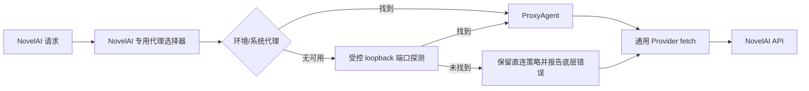

# NovelAI 请求自动代理发现设计

> 状态：待用户复核
>
> 日期：2026-08-10
>
> 范围：NovelAI 发收请求的后端代理选择

## 1. 目标

让后端在发送 NovelAI 请求时自动发现并使用可用的 HTTP/HTTPS 代理端口，解决桌面进程未继承代理环境变量时直连 `image.novelai.net:443` 超时的问题。

代理只作用于目标为 NovelAI 的请求，不改变 LLM、模型发现、项目文件、队列和资产读写的网络行为。

## 2. 请求边界

以下请求显式使用 NovelAI 专用代理 dispatcher：

- `/ai/generate-image`；
- `/ai/encode-vibe`；
- 未来新增且由 NovelAI 生图服务发收的同类端点。

LLM 的 `/chat/completions`、`/models` 和其它 Provider 请求继续使用各自现有网络配置。通用 Provider fetch 层不自动切换全局代理，只接受调用方传入的 dispatcher。

## 3. 代理发现顺序

NovelAI 请求首次发送前按以下顺序选择代理：

1. `HTTPS_PROXY`、`https_proxy`、`HTTP_PROXY`、`http_proxy`、`ALL_PROXY`、`all_proxy` 中的第一个合法 `http:`/`https:` URL；
2. Windows 用户代理配置和 WinHTTP 代理配置中的 HTTP/HTTPS 地址；
3. 受控的本机端口候选：`127.0.0.1:7897`、`7890`、`10809`、`1080`、`8080`、`20170`、`2080`；
4. 如果调用方通过 `NEURO_BOOK_NOVELAI_PROXY_PORTS` 提供逗号分隔端口，则使用该列表替换默认候选列表。

候选只允许 loopback 地址和合法端口，不扫描全部端口，不自动使用 SOCKS 代理。每个候选先执行无凭据的 HTTP `CONNECT image.novelai.net:443` 探测，只有收到代理成功响应才构造 `ProxyAgent`。

## 4. 生命周期与安全

- 代理选择器在进程内缓存成功的代理 dispatcher；后续 NovelAI 请求复用它。
- 失败候选不缓存为成功代理；已缓存代理连接失败时清除缓存，下一次 NovelAI 请求重新发现一次。
- 探测请求不携带 NovelAI Token、正文 Prompt、图片或其它用户数据。
- 错误信息只暴露代理协议、主机、端口和底层错误码，不输出 API Token、完整 Authorization 头或请求正文。
- 代理发现失败时保留 `UND_ERR_CONNECT_TIMEOUT`、DNS 或连接拒绝等底层原因；不再统一隐藏成无法诊断的“Provider 连接失败”。

## 5. 数据流

通用 fetch 仍负责 URL、DNS、重定向和私有网络策略；NovelAI 入口负责选择并传入 dispatcher。这样既能复用出站安全合同，又不会把代理意外施加到 LLM。

## 6. 验证

至少补充以下自动化验证：

- 环境变量优先于系统代理和端口候选；
- 端口候选只接受 loopback、合法端口和 HTTP/HTTPS 代理；
- 探测请求不包含 Authorization；
- 找到 `7897` 时 NovelAI 请求使用该 dispatcher；
- LLM fetch 不会读取或使用 NovelAI 专用代理选择器；
- 代理连接超时时错误保留 `UND_ERR_CONNECT_TIMEOUT`；
- 当前已有 URL、重定向、私网 DNS、队列和 NovelAI 请求测试继续通过。

## 7. 非目标

- 不为 LLM Provider 新增代理端口自动发现；
- 不做全端口扫描或 SOCKS 协议适配；
- 不把代理端口保存到全局 NovelAI 生图参数；
- 不改变 NovelAI 请求队列、15 秒最小间隔、429 失败退出或资产写回合同。
